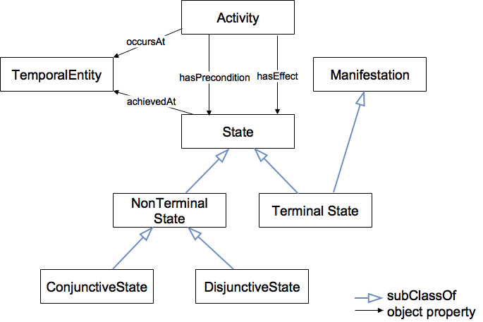

# 

 Graphical representation

__Diagram__ 

# 

 General description

|  |  |
| --- | --- |
|  Name:  |  ActivitySpecification  |
|  Submitted by:  | [MeganKatsumi](../User/MeganKatsumi "User:MeganKatsumi")  |
|  Also Known As:  |  Activity Specification OP  |
|  Intent:  |  This work is concerned with supporting a correct and meaningful representation of activities on the Semantic Web, with the potential to support tasks such as activity recognition and reasoning about causation. This requires an ontology capable of more than simply documenting and annotating individual activity occurrences; definitions of activity specifications are required.  Current representations of activities in OWL do not meet the basic requirements for activity specifications. Detailed definitions of an activity's preconditions and effects are lacking, in particular with respect to a consideration of change over time.This pattern leverages existing work to fill this void with an ontology design pattern for activity specifications in OWL.  |
|  Domains:  | [Event Processing](../Community/Event_Processing "Community:Event Processing")  , [General](../Community/General "Community:General")  |
|  Competency Questions:  | <li>       What are the preconditions (effects) of a given activity?      </li><li>       Is/are the precondition(s) true at some time t?      </li><li>       Is/are the effect(s) true at some time t?      </li><li>       If we observe some state      </li><li>       what activity may have caused it?      </li> |
|  Solution description:  |  The proposed solution adopts a view of causality similar to the Event Calculus [Kowalski, 1986], employing the concept of manifestations to describe the states (fluents).  |
|  Reusable OWL Building Block:  | [http://ontology.eil.utoronto.ca/icity/ActivitySpecification](http://ontologydesignpatterns.org/wiki/index.php?title=Special:ClickHandler&link=http://ontology.eil.utoronto.ca/icity/ActivitySpecification&message=OWL building block&from_page_id=4394&update=)  (536)  |
|  Consequences:  |  (-) Requires a temporal representation of the domain -- specifically using the Logical OP for change -- which results in a larger, more complex representation.  (+) However, given that the concepts are preconditions and effects of an activity, they should be subject to change and so the resulting representation is (though larger) more appropriate and more accurate.  |
|  Scenarios:  |  This pattern is applicable for a wide range of scenarios. In essence, for the formalization of any activity precondition/effect. For example: -My car must have gas (an manifestation of a specific vehicle should have gas) before I can drive to work (the manifestation should exist at some time before the drive to work activity occurs) -An effect of my driving to work is that I am at work and so is my car.  |
|  Known Uses:  | [http://ontology.eil.utoronto.ca/icity/UrbanSystem](http://ontology.eil.utoronto.ca/icity/UrbanSystem "http://ontology.eil.utoronto.ca/icity/UrbanSystem")  |
|  Web References:  |  |
|  Other References:  |  |
|  Examples (OWL files):  |  |
|  Extracted From:  | <li><a class="external free" href="http://ontology.eil.utoronto.ca/icity/Activity/1.1/" rel="nofollow" title="http://ontology.eil.utoronto.ca/icity/Activity/1.1/">        http://ontology.eil.utoronto.ca/icity/Activity/1.1/       </a></li> |
|  Reengineered From:  |  |
|  Has Components:  | <li><a class="new" href="http://ontologydesignpatterns.org/wiki/Special:AddData/Content OP Proposal Form/Submissions:Http://ontology.eil.utoronto.ca/icity/Change/" title="Submissions:Http://ontology.eil.utoronto.ca/icity/Change/ (not yet written)">        Submissions:http://ontology.eil.utoronto.ca/icity/Change/       </a></li> |
|  Specialization Of:  |  |
|  Related CPs:  | <li><a class="new" href="http://ontologydesignpatterns.org/wiki/index.php?title=Submissions:Http://ontologydesignpatterns.org/wiki/Submissions:Change_of_Time_Varying_Entities&amp;action=edit&amp;redlink=1" title="Submissions:Http://ontologydesignpatterns.org/wiki/Submissions:Change of Time Varying Entities (not yet written)">        Submissions:http://ontologydesignpatterns.org/wiki/Submissions:Change_of_Time_Varying_Entities       </a></li> |

  

# 

 Elements

_The
 __ActivitySpecification__ 
 Content OP locally defines the following ontology elements:_ 

# 

 Additional information

# 

 Scenarios

__Scenarios about ActivitySpecification__ 

 No scenario is added to this Content OP.
 

# 

 Reviews

__Reviews about ActivitySpecification__ 

 There is no review about this proposal.
This revision (revision ID
 __13639__ 
 ) takes in account the reviews: none
 

 Other info at
 [evaluation tab](http://ontologydesignpatterns.org/wiki/index.php?title=Submissions:ActivitySpecification&action=evaluation "http://ontologydesignpatterns.org/wiki/index.php?title=Submissions:ActivitySpecification&action=evaluation") 

  

# 

 Modeling issues

__Modeling issues about ActivitySpecification__ 

 There is no Modeling issue related to this proposal.
 

  

# 

 References