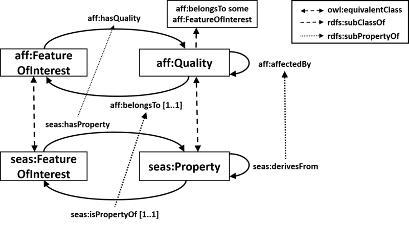

# 

 Graphical representation

__Diagram__ 
_(this article has no graphical representation)_ 

# 

 General description

|  |  |
| --- | --- |
|  Name:  |  AffectedBy  |
|  Submitted by:  | [IKERESNAOLA-GONZALEZ](../User/IKERESNAOLA-GONZALEZ "User:IKERESNAOLA-GONZALEZ")  |
|  Also Known As:  |  |
|  Intent:  |  To represent properties/qualities that may affect the status of a feature of interest.  |
|  Domains:  | [Building and Construction](../Community/Building_and_Construction "Community:Building and Construction")  , [General](../Community/General "Community:General")  |
|  Competency Questions:  | <li>       CQ1: What are the properties/qualities that influence a feature of interest?      </li><li>       CQ2: What are the properties/qualities that affect a given property of a feature of interest?      </li><li>       CQ3: Which feature of interest does a given property/quality belongs to?      </li> |
|  Solution description:  |  The AffectedBy ODP consists of two classes aff:FeatureOfInterest and aff:Quality; and three properties aff:influencedBy, aff:belongsTo, and aff:affectedBy.  This ODP is a reengineering of the SEAS Feature of Interest ontology ( [https://ci.mines-stetienne.fr/seas/FeatureOfInterestOntology-1.0](https://ci.mines-stetienne.fr/seas/FeatureOfInterestOntology-1.0 "https://ci.mines-stetienne.fr/seas/FeatureOfInterestOntology-1.0")  ). The constraint on the property seas:derivesFrom to be symmetric is unnecessary and sometimes innapropriate. For instance, the temperature of a room may derive from the occupancy of the room; however, it is not necessary that the occupancy derives from the temperature of the room. A new property aff:affectedBy (released from the symmetric constraint) is defined in the AffectedBy ODP to replace the role of the property seas:derivesFrom. It can be asserted that seas:derivesFrom is sub property of aff:affectedBy. The class aff:FeatureOfInterest is equivalent to seas:FeatureOfInterest, and the class seas:Property is sub class of aff:Quality. Moreover, seas:hasProperty is sub property of aff:influencedBy, and seas:isPropertyOf is sub property of aff:belongsTo. Furthermore, aff:belongsTo is defined to be functional, to support the notion that a quality is intrinsic to the feature of interest (i.e., an entity) to which it belongs (according to the conceptualization in DUL); and it is asserted that every quality belongs to a feature of interest (aff:Quality rdfs:subClassOf aff:belongsTo some aff:FeatureOfInterest).  Finally, the object chain axiom aff:influencedBy o aff:affectedBy rdfs:subPropertyOf aff:influencedBy is asserted.  |
|  Reusable OWL Building Block:  | [https://w3id.org/affectedBy](http://ontologydesignpatterns.org/wiki/index.php?title=Special:ClickHandler&link=https://w3id.org/affectedBy&message=OWL building block&from_page_id=4464&update=)  (0)  |
|  Consequences:  |  A quality cannot exist without the feature of interest to which it belongs. A quality is intrinsic to the feature of interest to which it belongs. For example, the temperature of room X cannot exist without the room X, and it is a different quality to the temperature of a different room Y.  A quality can affect another quality, but not necessarily the other way around. For example, a quality Z may affect the quality W, but the quality W does not need to affect quality Z.  |
|  Scenarios:  |  A room (feature of interest) has a temperature (quality) and this temperature is affected by the air conditioner status, by the number of people in the room, and by the sun radiation that passes through the room’s windows. A basement (feature of interest) has a temperature (quality) that is affected by the air conditioner status, by level of the basement’s relative humidity, and by the quality of the thermal insulation of the walls. Room temperature and basement temperature are different qualities, although both could be individuals of a Temperature subclass of Quality class.  |
|  Known Uses:  | [https://w3id.org/eepsa](https://w3id.org/eepsa "https://w3id.org/eepsa")  , [https://w3id.org/seas/](https://w3id.org/seas/ "https://w3id.org/seas/")  |
|  Web References:  |  |
|  Other References:  |  |
|  Examples (OWL files):  | <li><a class="external free" href="https://raw.githubusercontent.com/iesnaola/AffectedBy/master/examples/example1.ttl" rel="nofollow" title="https://raw.githubusercontent.com/iesnaola/AffectedBy/master/examples/example1.ttl">        https://raw.githubusercontent.com/iesnaola/AffectedBy/master/examples/example1.ttl       </a></li> |
|  Extracted From:  |  |
|  Reengineered From:  | <li><a class="external free" href="https://ci.mines-stetienne.fr/seas/FeatureOfInterestOntology-1.0" rel="nofollow" title="https://ci.mines-stetienne.fr/seas/FeatureOfInterestOntology-1.0">        https://ci.mines-stetienne.fr/seas/FeatureOfInterestOntology-1.0       </a></li> |
|  Has Components:  |  |
|  Specialization Of:  |  |
|  Related CPs:  |  |

  

# 

 Elements

_The
 __AffectedBy__ 
 Content OP locally defines the following ontology elements:_ 

__FeatureOfInterest__ 
 (owl:Class) A feature of interest is an abstraction of a real world phenomena (object, event, etc). A feature of interest is then described in terms of its properties or qualities, which are qualifiable, quantifiable, observable or operable qualities of the feature of interest.
 

_[FeatureOfInterest](../Submissions/AffectedBy/FeatureOfInterest "Submissions:AffectedBy/FeatureOfInterest") 
 page_ 

__Quality__ 
 (owl:Class) A quality of a feature of interest. An aspect of a feature of interest that is intrinsec to and cannot exist without the feature of interest. Every quality belongs to the feature of interest it is intrinsic to.
 

_[Quality](../Submissions/AffectedBy/Quality "Submissions:AffectedBy/Quality") 
 page_ 

__affectedBy__ 
 (owl:ObjectProperty) A relation between qualities. A quality is affected by another quality if the value of the latter affects the value of the former.
 

_[affectedBy](../Submissions/AffectedBy/affectedBy "Submissions:AffectedBy/affectedBy") 
 page_ 

__belongsTo__ 
 (owl:ObjectProperty) A relation between qualities and features of interest. Every quality belongs to the feature of interest it is intrinsic to.
 

_[belongsTo](../Submissions/AffectedBy/belongsTo "Submissions:AffectedBy/belongsTo") 
 page_ 

[Submissions:AffectedBy/influencedBy](http://ontologydesignpatterns.org/wiki/Special:AddData/Ontology Element Form/Submissions:AffectedBy/influencedBy "Submissions:AffectedBy/influencedBy (not yet written)") 

_[influencedBy](http://ontologydesignpatterns.org/wiki/Special:AddData/Ontology Element Form/Submissions:AffectedBy/influencedBy "Submissions:AffectedBy/influencedBy (not yet written)") 
 page_ 

# 

 Additional information

 Insert non-formatted text here
 

# 

 Scenarios

__Scenarios about AffectedBy__ 

 No scenario is added to this Content OP.
 

# 

 Reviews

__Reviews about AffectedBy__ 

 There is no review about this proposal.
This revision (revision ID
 __13592__ 
 ) takes in account the reviews: none
 

 Other info at
 [evaluation tab](http://ontologydesignpatterns.org/wiki/index.php?title=Submissions:AffectedBy&action=evaluation "http://ontologydesignpatterns.org/wiki/index.php?title=Submissions:AffectedBy&action=evaluation") 

  

# 

 Modeling issues

__Modeling issues about AffectedBy__ 

 There is no Modeling issue related to this proposal.
 

  

# 

 References

  

|  |  Submission to event [9th Workshop on Ontology Design and Patterns - WOP2018](http://ontologydesignpatterns.org/wiki/index.php?title=9th_Workshop_on_Ontology_Design_and_Patterns_-_WOP2018&action=edit&redlink=1 "9th Workshop on Ontology Design and Patterns - WOP2018 (not yet written)")  |
| --- | --- |