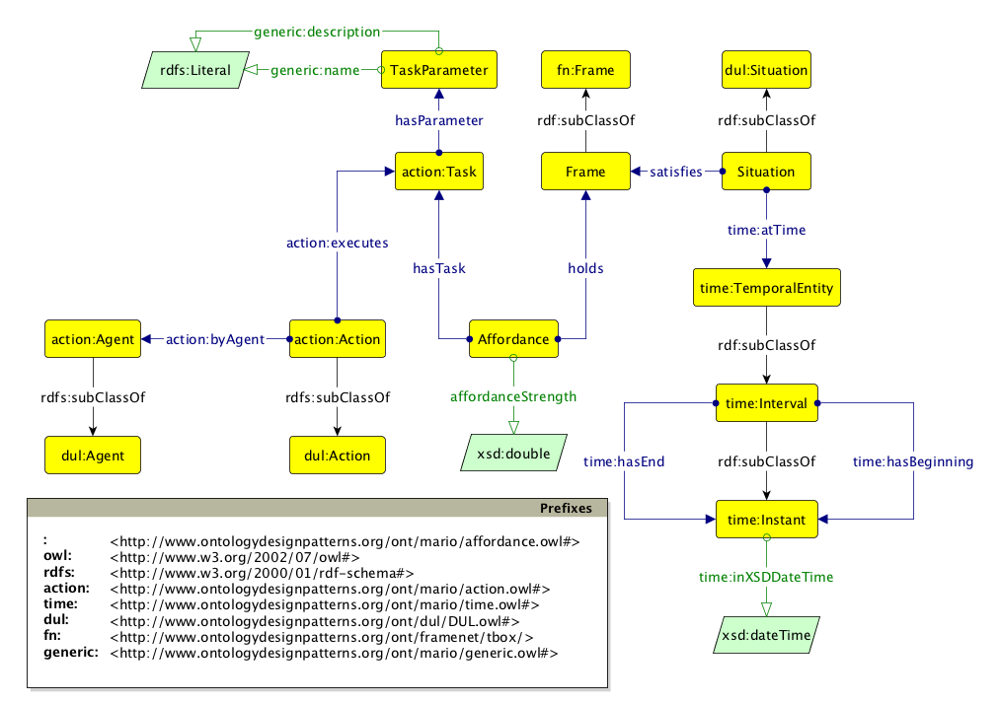

#  Graphical representation

__Diagram__

#  General description

|  |  |
| --- | --- |
|  Name: |  Affordance |
|  Submitted by: | [AndreaNuzzolese](../User/AndreaNuzzolese.md "User:AndreaNuzzolese") |
|  Also Known As: |  |
|  Intent: |  To represent the model for supporting the action selection mechanism. |
|  Domains: |  |
|  Competency Questions: | <li> Which is the strength of an Affordance?</li>Which tasks are afforded in a certain situation?How should an agent behave in a certain situation?Which are the parameters involved in certain task? |
|  Solution description: |  The Afforndance ODP relies on the descriptions and situations ODP, and is combined with a frame-based representation scheme. This allows to extend the notion of affordance not only to physical objects, but also complex situations afford actions. |
|  Reusable OWL Building Block: | [http://www.ontologydesignpatterns.org/ont/mario/affordance.owl](http://ontologydesignpatterns.org/wiki/index.php?title=Special:ClickHandler&link=http://www.ontologydesignpatterns.org/ont/mario/affordance.owl&message=OWL building block&from_page_id=4130&update=) (581) |
|  Consequences: |  |
|  Scenarios: |  |
|  Known Uses: |  |
|  Web References: |  |
|  Other References: |  |
|  Examples (OWL files): |  |
|  Extracted From: | <li><a class="external free" href="http://www.ontologydesignpatterns.org/ont/dul/DUL.owl" rel="nofollow" title="http://www.ontologydesignpatterns.org/ont/dul/DUL.owl">http://www.ontologydesignpatterns.org/ont/dul/DUL.owl</a></li> |
|  Reengineered From: |  |
|  Has Components: |  |
|  Specialization Of: |  |
|  Related CPs: |  |

  

#  Elements

_The __Affordance__ Content OP locally defines the following ontology elements:_

 __hasParameter__ (owl:ObjectProperty) It associates the Task with its parameters. 
  _[hasParameter](./Affordance/hasParameter.md "Submissions:Affordance/hasParameter") page_
 __hasTask__ (owl:ObjectProperty) It associates an Affordance to the Task it refers to. 
  _[hasTask](./Affordance/hasTask.md "Submissions:Affordance/hasTask") page_
 __holds__ (owl:ObjectProperty) It associates an Affordance with the Frame in which it holds. 
  _[holds](./Affordance/holds.md "Submissions:Affordance/holds") page_
 __isHeldBy__ (owl:ObjectProperty) It associates a Frame with the Affordance it enables. 
  _[isHeldBy](./Affordance/isHeldBy.md "Submissions:Affordance/isHeldBy") page_
 __affordanceStrength__ (owl:DatatypeProperty) It encodes the strength of the Affordance. 
  _[affordanceStrength](./Affordance/affordanceStrength.md "Submissions:Affordance/affordanceStrength") page_
 __Affordance__ (owl:Class) An affordance is modelled in DnS fashion and is an n-ary that relates state of the world (i.e., situations) to tasks according to specific weights or affordance strengths. 
  _[Affordance](./Affordance.md "Submissions:Affordance/Affordance") page_
 __Frame__ (owl:Class) 
  _[Frame](./Affordance/Frame.md "Submissions:Affordance/Frame") page_
 __Situation__ (owl:Class) A state of the world. 
  _[Situation](../DescriptionAndSituation/DescriptionAndSituation.md "Submissions:Affordance/Situation") page_
 __TaskParameter__ (owl:Class) A parameter of a task. 
  _[TaskParameter](./Affordance/TaskParameter.md "Submissions:Affordance/TaskParameter") page_
#  Additional information

#  Scenarios

__Scenarios about Affordance__
No scenario is added to this Content OP.

#  Reviews

__Reviews about Affordance__
There is no review about this proposal.
This revision (revision ID __12749__) takes in account the reviews: none

Other info at [evaluation tab](http://ontologydesignpatterns.org/wiki/index.php?title=Submissions:Affordance&action=evaluation "http://ontologydesignpatterns.org/wiki/index.php?title=Submissions:Affordance&action=evaluation")

  

#  Modeling issues

__Modeling issues about Affordance__
There is no Modeling issue related to this proposal.

  

#  References