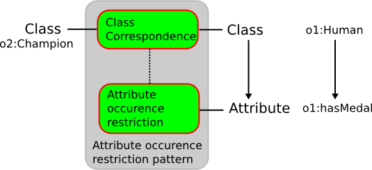

# 

 Graphical representation


__Diagram__ 


[](../Image/Class-by-attribute-occurence.png.md "Image:Class-by-attribute-occurence.png")


# 

 General information


|  |  |
| --- | --- |
|  Name  |  Class by attribute occurence  |
|  Also known as  |  |
|  Author(s)  |  François Scharffe  |
|  SubmittedBy  | [FrancoisScharffe](../User/FrancoisScharffe.md "User:FrancoisScharffe")  |


  


# 

 Description


|  |  |
| --- | --- |
|  Domain (if applicable)  | [General](http://ontologydesignpatterns.org/wiki/index.php?title=General&action=edit&redlink=1 "General (not yet written)")  |
|  Alignment problem addressed  |  A class in one ontology is aligned to a class in the other ontology. However, only those instances for which a value is given to particular attribute are aligned. This pattern is agnostic as to whether the correspondence is unidirectional or bidirectional, direction of the correspondence can be achieved through combination of the pattern with the equivalentClassCorrespondence or subClassCorrespondence  pattern.  |
|  Alignment solution  |  This pattern establishes a mapping between a class/attribute combination in one  ontology and a class in another.  |
|  Alignment workflow  |  |
|  Reusable component  |  |


  


# 

 Example


|  |  |
| --- | --- |
|  Problem example  |  |
|  Solution example  |  <Cell> ``` <entity1>  <Class>   <and>    <Class rdf:about="o1:Human">   </and>   <and>    <AttributeOccurenceCondition>     <onAttribute>      <Property rdf:about="o1:hasMedal"/>     </onAttribute>    </AttributeOccurenceCondition>   </and>  </Class> </entity1> <entity2>  <Class rdf:about="o2:Champion"/> </entity2></Cell>``` |
|  Consequences  |  |


  


# 

 Reference


|  |  |
| --- | --- |
|  Origin  |  |
|  Known use  |  |
|  Reference  |  |
|  Related to  | [Submissions:Class equivalence](../Class_equivalence/Class_equivalence.md "Submissions:Class equivalence")  , [Submissions:Class subsumption](../Class_subsumption/Class_subsumption.md "Submissions:Class subsumption")  |
|  Test  |  |


  


# 

 Scenarios


__Scenarios about Class by attribute occurence__ 


 No scenario is added to this Content OP.
 


# 

 Reviews


__Reviews about Class by attribute occurence__ 


 There is no review about this proposal.
This revision (revision ID
 __8580__ 
 ) takes in account the reviews: none
 


 Other info at
 [evaluation tab](http://ontologydesignpatterns.org/wiki/index.php?title=Submissions:Class_by_attribute_occurence&action=evaluation "http://ontologydesignpatterns.org/wiki/index.php?title=Submissions:Class_by_attribute_occurence&action=evaluation") 


  


# 

 Modeling issues


__Modeling issues about Class by attribute occurence__ 


 There is no Modeling issue related to this proposal.
 


  


# 

 References