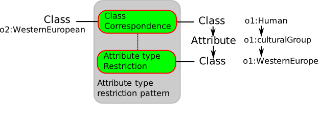

# 

 Graphical representation


__Diagram__ 


[](../Image/Class-by-attribute-type.png "Image:Class-by-attribute-type.png")


# 

 General information


|  |  |
| --- | --- |
|  Name  |  Class by attribute type  |
|  Also known as  |  |
|  Author(s)  |  Francois Scharffe  |
|  SubmittedBy  | [FrancoisScharffe](../User/FrancoisScharffe "User:FrancoisScharffe")  |


  


# 

 Description


|  |  |
| --- | --- |
|  Domain (if applicable)  |  |
|  Alignment problem addressed  |  A class in one ontology is aligned to a class in the other ontology. However, only those instances for which an attribute value corresponding to a certain type (subclass of the attribute range) is given are aligned.  |
|  Alignment solution  |  This pattern establishes a mapping between a class/attribute combination in one  ontology and a class in another. In many cases this pattern will be used many times to fully cover the range of the attribute over various classes of the other ontology.  |
|  Alignment workflow  |  |
|  Reusable component  |  |


  


# 

 Example


|  |  |
| --- | --- |
|  Problem example  |  |
|  Solution example  |  <Cell> ``` <entity1>  <Class>   <and>    <Class rdf:about="o1:Human"/>   </and>   <and>    <AttributeTypeCondition>     <onAttribute>      <Relation rdf:about="o1:culturalGroup"/>     </onAttribute>     <value><Instance rdf:about="o1:WesternEurope"></value>    </AttributeTypeCondition>   </and>  </Class> </entity1> <entity2>  <Class rdf:about="o2:WesternEuropean"/> </entity2></Cell>``` |
|  Consequences  |  |


  


# 

 Reference


|  |  |
| --- | --- |
|  Origin  |  |
|  Known use  |  |
|  Reference  |  |
|  Related to  |  |
|  Test  |  |


  


# 

 Scenarios


__Scenarios about Class by attribute type__ 


 No scenario is added to this Content OP.
 


# 

 Reviews


__Reviews about Class by attribute type__ 


 There is no review about this proposal.
This revision (revision ID
 __8655__ 
 ) takes in account the reviews: none
 


 Other info at
 [evaluation tab](http://ontologydesignpatterns.org/wiki/index.php?title=Submissions:Class_by_attribute_type&action=evaluation "http://ontologydesignpatterns.org/wiki/index.php?title=Submissions:Class_by_attribute_type&action=evaluation") 


  


# 

 Modeling issues


__Modeling issues about Class by attribute type__ 


 There is no Modeling issue related to this proposal.
 


  


# 

 References