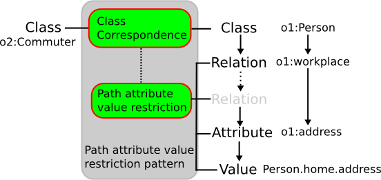

# 

 Graphical representation


__Diagram__ 


[](../Image/Class-by-path-attribute-value.png "Image:Class-by-path-attribute-value.png")


# 

 General information


|  |  |
| --- | --- |
|  Name  |  Class by path attribute value  |
|  Also known as  |  |
|  Author(s)  |  Francois Scharffe  |
|  SubmittedBy  | [FrancoisScharffe](../User/FrancoisScharffe "User:FrancoisScharffe")  |


  


# 

 Description


|  |  |
| --- | --- |
|  Domain (if applicable)  | [General](http://ontologydesignpatterns.org/wiki/index.php?title=General&action=edit&redlink=1 "General (not yet written)")  |
|  Alignment problem addressed  |  A class in one ontology is aligned to a class in another ontology and the criteria  for membership in the class are specified by an attribute value at the end of a path.  |
|  Alignment solution  |  The two classes in two ontologies are provided along with a statement involving  either one class or both classes. This statement is a precondition for the correspondence. This pattern is agnostic to whether the correspondence is unidirectional or bidirectional. However, if the correspondence is bidirectional (equivalence relation), the same precondition applies for both directions.  |
|  Alignment workflow  |  |
|  Reusable component  |  |


  


# 

 Example


|  |  |
| --- | --- |
|  Problem example  |  |
|  Solution example  |  Example correspondence: ```<Cell> <entity1>  <Class>   <and>    <Class rdf:about="o1 :Person"/>    <AttributeValueCondition>     <onAttribute>       <Property>        <first>        <Relation rdf:about="o1 :workplace"/>       </first>       <next>        <Property>         <first>          <Relation rdf:about="o1 :address"/>         </first>         <next>          <Property rdf:about="o1 :city"/></next>         </next>        </Property>       </next>      </Property>     </onAttribute>     <comparator rdf:resource="xsd:not-equal"/>     <value>      <Property>       <first>        <Relation rdf:about="o1 :address"/>       </first>       <next>        <Property rdf:about="o1 :city"/>       </next>      </Property>     </value>    </AttributeValueCondition>   </and>  </Class>   </entity1> <entity2>   <Class rdf:about="o2 :Commuter"> </entity2></Cell>``` |
|  Consequences  |  |


  


# 

 Reference


|  |  |
| --- | --- |
|  Origin  |  |
|  Known use  |  |
|  Reference  |  |
|  Related to  |  |
|  Test  |  |


  


# 

 Scenarios


__Scenarios about Class by path attribute value__ 


 No scenario is added to this Content OP.
 


# 

 Reviews


__Reviews about Class by path attribute value__ 


 There is no review about this proposal.
This revision (revision ID
 __8500__ 
 ) takes in account the reviews: none
 


 Other info at
 [evaluation tab](http://ontologydesignpatterns.org/wiki/index.php?title=Submissions:Class_by_path_attribute_value&action=evaluation "http://ontologydesignpatterns.org/wiki/index.php?title=Submissions:Class_by_path_attribute_value&action=evaluation") 


  


# 

 Modeling issues


__Modeling issues about Class by path attribute value__ 


 There is no Modeling issue related to this proposal.
 


  


# 

 References