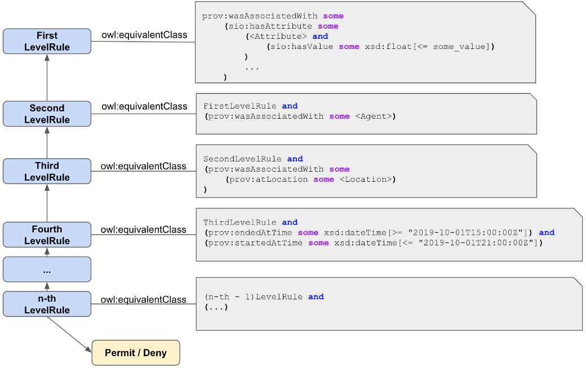

#  Graphical representation

__Diagram__

#  General description

|  |  |
| --- | --- |
|  Name: |  Computable Policy |
|  Submitted by: | [Henrique Santos](../User/HenriqueSantos.md "User:HenriqueSantos") |
|  Also Known As: | OWL+PROV |
|  Intent: |  To represent machine-interpetrable and computable policies, supporting automated policy decisions using OWL reasoners. |
|  Domains: | Domain-agnostic |
|  Competency Questions: | <li> What is the effect of a policy?</li><li> Which are the applicable policies during a given timeframe/instant?</li><li> Which are the application policies in a specific geo-location?</li><li> Which policy rule has priority during evaluation?</li> |
|  Solution description: |  OWL+PROV is novel ontology design pattern for representing policies and guidelines using the OWL and PROV semantic web W3C standards. The pattern advocates for the creation of a class hierarchy, which incrementally appends the policy's rules to support the explanation of policy evaluation results. |
|  Reusable OWL Building Block: | [Example 1](owl+prov.ttl) |
|  Consequences: |  Ontologies created following this pattern extend domain knowledge graphs to include the encoding of the policy's rules in class equivalencies, expressed as OWL restrictions over domain entities. |
|  Scenarios: |  Umbria Jazz is a collection of events, which all take place in July and in the Italian region of Umbria, and has the musical genre jazz as a topic. Its events recur at regular time periods, i.e. annually. |
|  Known Uses: | Radio Spectrum Sharing [Link 1](https://link.springer.com/chapter/10.1007/978-3-030-62466-8_30) [Link 2](https://arxiv.org/abs/2011.04085), Diabetes Guidelines |
|  Web References: |  |
|  Other References: |  |
|  Examples (OWL files): |  |
|  Extracted From: |  |
|  Reengineered From: |  |
|  Has Components: |  |
|  Specialization Of: |  |
|  Related CPs: |  |

  

#  Elements

#  Additional information

#  Scenarios

#  Reviews

#  Modeling issues

#  References