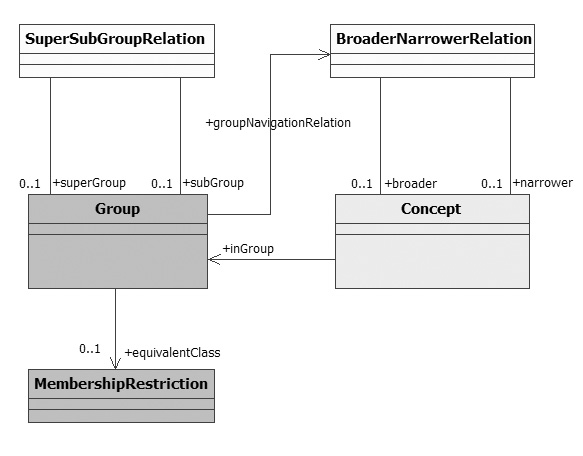

#  Graphical representation

__Diagram__

#  General description

|  |  |
| --- | --- |
|  Name: |  ConceptGroup |
|  Submitted by: | [Pierre-YvesVandenbussche](../User/Pierre-YvesVandenbussche.md "User:Pierre-YvesVandenbussche") |
|  Also Known As: |  |
|  Intent: |  This CP allows designers to represent concept group defined by intention (all concepts satisfying group membership condition) or by extension (all concepts referring a group). |
|  Domains: | [Parts and Collections](../Community/Parts_and_Collections.md "Community:Parts and Collections"), [Vocabulary](../Community/Vocabulary.md "Community:Vocabulary") |
|  Competency Questions: |  |
|  Solution description: |  How a group entity stands alone?, How to represent either a vocabulary subset, a cross vocabulary subset or a whole vocabulary?, How to represent group concept members? |
|  Reusable OWL Building Block: | [http://sites.google.com/site/pierreyvesvandenbussche/resources/ConceptGroup.owl](http://ontologydesignpatterns.org/wiki/index.php?title=Special:ClickHandler&link=http://sites.google.com/site/pierreyvesvandenbussche/resources/ConceptGroup.owl&message=OWL building block&from_page_id=1663&update=) (1143) |
|  Consequences: |  |
|  Scenarios: |  Used to describe whole vocabulary entity or vocabulary concepts subset. Compliant with RefSets in SNOMED-CT or themes in GEMET. |
|  Known Uses: |  |
|  Web References: |  |
|  Other References: |  |
|  Examples (OWL files): |  |
|  Extracted From: |  |
|  Reengineered From: | <li> SNOMED-CT Reference Sets specification: <a class="external free" href="http://www.ihtsdo.org/fileadmin/user_upload/Docs_01/Technical_Docs/reference_sets.pdf" rel="nofollow" title="http://www.ihtsdo.org/fileadmin/user_upload/Docs_01/Technical_Docs/reference_sets.pdf">http://www.ihtsdo.org/fileadmin/user_upload/Docs_01/Technical_Docs/reference_sets.pdf</a></li> |
|  Has Components: |  |
|  Specialization Of: |  |
|  Related CPs: |  |

  

#  Elements

_The __ConceptGroup__ Content OP locally defines the following ontology elements:_

#  Additional information

#  Scenarios

__Scenarios about ConceptGroup__
No scenario is added to this Content OP.

#  Reviews

__Reviews about ConceptGroup__

| Review article | [Posted on](../Property/CreationDate.md "Property:CreationDate") | [About revision (current is 9701)](../Property/ReviewAboutVersion.md "Property:ReviewAboutVersion") |
| --- | --- | --- |
| [MathieuDAquin about ConceptGroup](../Reviews/MathieuDAquin_about_ConceptGroup.md "Reviews:MathieuDAquin about ConceptGroup") | 24550838 September 2009 | 56605,660 |
| [FrancoisScharffe about ConceptGroup](../Community/FrancoisScharffe_about_ConceptGroup.md "Community:FrancoisScharffe about ConceptGroup") | 245508611 September 2009 | 57995,799 |
| [FrancoisScharffe about ConceptGroup](../Reviews/FrancoisScharffe_about_ConceptGroup.md "Reviews:FrancoisScharffe about ConceptGroup") | 245508611 September 2009 | 57995,799 |
| [AldoGangemi about ConceptGroup](../Reviews/AldoGangemi_about_ConceptGroup.md "Reviews:AldoGangemi about ConceptGroup") | 245508712 September 2009 | 58075,807 |

This revision (revision ID __9701__) takes in account the reviews: none

Other info at [evaluation tab](http://ontologydesignpatterns.org/wiki/index.php?title=Submissions:ConceptGroup&action=evaluation "http://ontologydesignpatterns.org/wiki/index.php?title=Submissions:ConceptGroup&action=evaluation")

  

#  Modeling issues

__Modeling issues about ConceptGroup__
There is no Modeling issue related to this proposal.

  

#  References

  

|  |  Submission to event[WOP:2009](../WOP/2009.md "WOP:2009") |
| --- | --- |