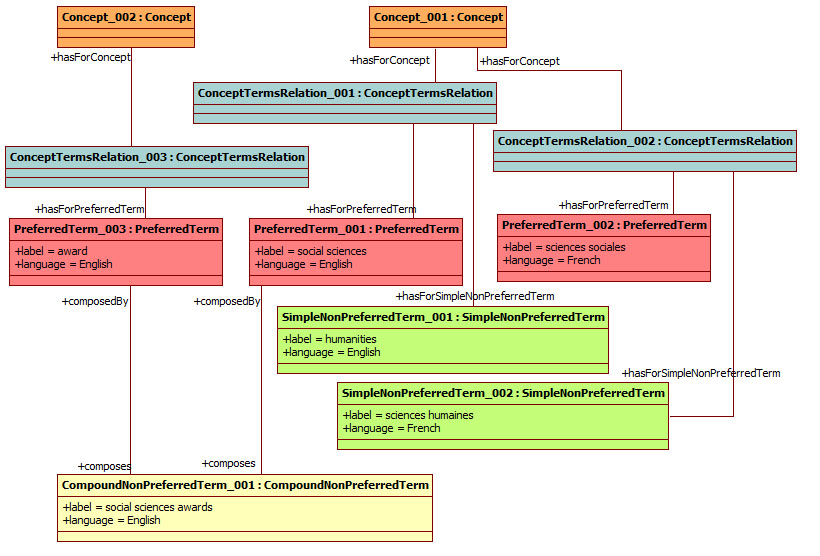

__Description:__ 
 This ontology contains an example ABox for the ConceptTerms CP available at
 [http://sites.google.com/site/pierreyvesvandenbussche/resources/ConceptTerms.owl](http://sites.google.com/site/pierreyvesvandenbussche/resources/ConceptTerms.owl "http://sites.google.com/site/pierreyvesvandenbussche/resources/ConceptTerms.owl") 
 This ontology describes example coming from Eurovoc(
 [http://europa.eu/eurovoc/](http://europa.eu/eurovoc/ "http://europa.eu/eurovoc/") 
 ) where a concept has a preferred term "social sciences" in english and a simple non preferred term (i.e. synonyms) "humanities" in the same language whereas the same concept has a preferred term "sciences sociales" in french and a simple non preferred term "sciences humaines" in this language. We consider a second preferred term in english "award" which names a concept. In this particular information retrieval context, we define a coumpound non preferred term "social sciences awards" which is related to preferred terms "social sciences" and "award".
 __Diagram__ 

__OWL file:__ 
[http://sites.google.com/site/pierreyvesvandenbussche/resources/ConceptTermsEurovocExample.owl](http://sites.google.com/site/pierreyvesvandenbussche/resources/ConceptTermsEurovocExample.owl "http://sites.google.com/site/pierreyvesvandenbussche/resources/ConceptTermsEurovocExample.owl")