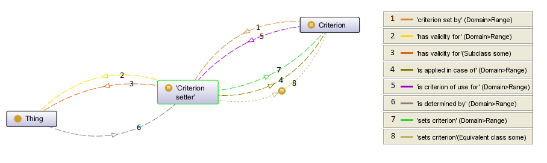

# 

 Graphical representation

__Diagram__ 

# 

 General description

|  |  |
| --- | --- |
|  Name:  |  CriterionSetter  |
|  Submitted by:  | [PiotrNowara](../User/PiotrNowara "User:PiotrNowara")  |
|  Also Known As:  |  |
|  Intent:  |  The purpose of this pattern is to provide a broader context for criteria modeling. Possible specializations could introduce new kinds of criteria setters representing criteria in detailed contexts (for example: a pattern for describing the success/failure condition for some actions). Possible criteria setters may include requirements, recommendations, constraints etc.  |
|  Domains:  | [General](../Community/General "Community:General")  |
|  Competency Questions:  | <li>       What defines this criterion?      </li><li>       Are there any criterion setters that determine this thing (or this domain)?      </li><li>       What criterion is defined by given criterion setter?      </li><li>       What domains (and/or domain objects) are affected by a given criterion setter (for example by a requirement)?      </li> |
|  Solution description:  |  This is a specialization of criterion pattern. The criterion setter can be used as an abstract container for requirements, recommendations, constraints etc. The owl file linked below contains a simple example of how this pattern could be implemented for modeling a requirement (see 'Examples').  |
|  Reusable OWL Building Block:  | [http://criteria-modeling.googlecode.com/svn/trunk/criterion\_setter.owl](http://ontologydesignpatterns.org/wiki/index.php?title=Special:ClickHandler&link=http://criteria-modeling.googlecode.com/svn/trunk/criterion_setter.owl&message=OWL building block&from_page_id=3034&update=)  (1500)  |
|  Consequences:  |  |
|  Scenarios:  |  |
|  Known Uses:  |  |
|  Web References:  |  |
|  Other References:  |  |
|  Examples (OWL files):  | <li><a class="external free" href="http://criteria-modeling.googlecode.com/svn/trunk/criterion_example_1.owl" rel="nofollow" title="http://criteria-modeling.googlecode.com/svn/trunk/criterion_example_1.owl">        http://criteria-modeling.googlecode.com/svn/trunk/criterion_example_1.owl       </a></li> |
|  Extracted From:  |  |
|  Reengineered From:  |  |
|  Has Components:  |  |
|  Specialization Of:  | <li><a href="Submissions%253ACriterion.html" title="Submissions:Criterion">        Submissions:Criterion       </a></li> |
|  Related CPs:  | <li><a href="Submissions%253ADescriptionAndSituation.html" title="Submissions:DescriptionAndSituation">        Submissions:DescriptionAndSituation       </a></li> |

  

# 

 Elements

_The
 __CriterionSetter__ 
 Content OP locally defines the following ontology elements:_ 

# 

 Additional information

 See also:
 [http://code.google.com/p/requirement-ontology/](http://code.google.com/p/requirement-ontology/ "http://code.google.com/p/requirement-ontology/") 

# 

 Scenarios

__Scenarios about CriterionSetter__ 

 No scenario is added to this Content OP.
 

# 

 Reviews

__Reviews about CriterionSetter__ 

 There is no review about this proposal.
This revision (revision ID
 __10866__ 
 ) takes in account the reviews: none
 

 Other info at
 [evaluation tab](http://ontologydesignpatterns.org/wiki/index.php?title=Submissions:CriterionSetter&action=evaluation "http://ontologydesignpatterns.org/wiki/index.php?title=Submissions:CriterionSetter&action=evaluation") 

  

# 

 Modeling issues

__Modeling issues about CriterionSetter__ 

 There is no Modeling issue related to this proposal.
 

  

# 

 References