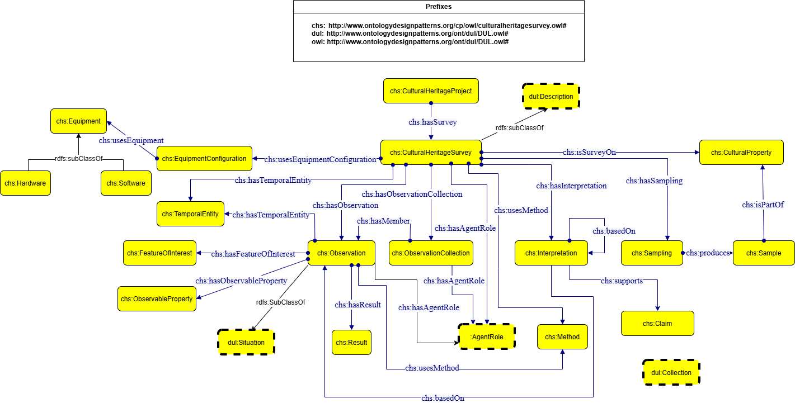

# CulturalHeritageSurvey Ontology Design Pattern

## Description

The Cultural Heritage Survey ODP models the structure of scientific survey activities performed on cultural heritage entities. It represents the relationships between surveys, observations, methods, equipment configurations, and interpretation processes.

## Schema Diagram

## Formalization

The ontology formalization is available here:

[CulturalHeritageSurvey.ttl](CulturalHeritageSurvey.ttl)
