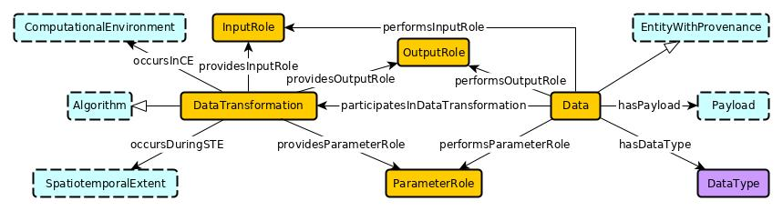

#  Graphical representation

__Diagram__

#  General description

|  |  |
| --- | --- |
|  Name: |  DataTransformationPattern |
|  Submitted by: | [CoganShimizu](../User/CoganShimizu.md "User:CoganShimizu") |
|  Also Known As: |  |
|  Intent: |  TBD |
|  Domains: |  |
|  Competency Questions: |  |
|  Solution description: |  TBD |
|  Reusable OWL Building Block: | [https://raw.githubusercontent.com/cogan-shimizu-wsu/DataTransformationPattern/master/DataTransformationPattern.owl](http://ontologydesignpatterns.org/wiki/index.php?title=Special:ClickHandler&link=https://raw.githubusercontent.com/cogan-shimizu-wsu/DataTransformationPattern/master/DataTransformationPattern.owl&message=OWL building block&from_page_id=4663&update=) (0) |
|  Consequences: |  |
|  Scenarios: |  |
|  Known Uses: |  |
|  Web References: |  |
|  Other References: |  |
|  Examples (OWL files): |  |
|  Extracted From: |  |
|  Reengineered From: |  |
|  Has Components: |  |
|  Specialization Of: |  |
|  Related CPs: |  |

  

#  Elements

_The __DataTransformationPattern__ Content OP locally defines the following ontology elements:_

 __executedIn__ (owl:ObjectProperty) 
  _[executedIn](./DataTransformationPattern/executedIn.md "Submissions:DataTransformationPattern/executedIn") page_
 __hasDataType__ (owl:ObjectProperty) 
  _[hasDataType](./DataTransformationPattern/hasDataType.md "Submissions:DataTransformationPattern/hasDataType") page_
 __hasPayload__ (owl:ObjectProperty) 
  _[hasPayload](./DataTransformationPattern/hasPayload.md "Submissions:DataTransformationPattern/hasPayload") page_
 __implements__ (owl:ObjectProperty) 
  _[implements](./DataTransformationPattern/implements.md "Submissions:DataTransformationPattern/implements") page_
 __occursIn__ (owl:ObjectProperty) 
  _[occursIn](./DataTransformationPattern/occursIn.md "Submissions:DataTransformationPattern/occursIn") page_
 __performsInputRole__ (owl:ObjectProperty) 
  _[performsInputRole](./DataTransformationPattern/performsInputRole.md "Submissions:DataTransformationPattern/performsInputRole") page_
 __performsOutputRole__ (owl:ObjectProperty) 
  _[performsOutputRole](./DataTransformationPattern/performsOutputRole.md "Submissions:DataTransformationPattern/performsOutputRole") page_
 __performsParameterRole__ (owl:ObjectProperty) 
  _[performsParameterRole](./DataTransformationPattern/performsParameterRole.md "Submissions:DataTransformationPattern/performsParameterRole") page_
 __providesInputDataRole__ (owl:ObjectProperty) 
  _[providesInputDataRole](./DataTransformationPattern/providesInputDataRole.md "Submissions:DataTransformationPattern/providesInputDataRole") page_
 __providesOutputDataRole__ (owl:ObjectProperty) 
  _[providesOutputDataRole](./DataTransformationPattern/providesOutputDataRole.md "Submissions:DataTransformationPattern/providesOutputDataRole") page_
 __providesParameterRole__ (owl:ObjectProperty) 
  _[providesParameterRole](./DataTransformationPattern/providesParameterRole.md "Submissions:DataTransformationPattern/providesParameterRole") page_
 __Algorithm__ (owl:Class) 
  _[Algorithm](./DataTransformationPattern/Algorithm.md "Submissions:DataTransformationPattern/Algorithm") page_
 __ComputationalEnvironment__ (owl:Class) 
  _[ComputationalEnvironment](../ComputationalEnvironment/ComputationalEnvironment.md "Submissions:DataTransformationPattern/ComputationalEnvironment") page_
 __DataTransformation__ (owl:Class) 
  _[DataTransformation](./DataTransformationPattern/DataTransformation.md "Submissions:DataTransformationPattern/DataTransformation") page_
 __DataType__ (owl:Class) 
  _[DataType](./DataTransformationPattern/DataType.md "Submissions:DataTransformationPattern/DataType") page_
 __EntityWithProvenance__ (owl:Class) 
  _[EntityWithProvenance](./DataTransformationPattern/EntityWithProvenance.md "Submissions:DataTransformationPattern/EntityWithProvenance") page_
 __InputDataRole__ (owl:Class) 
  _[InputDataRole](./DataTransformationPattern/InputDataRole.md "Submissions:DataTransformationPattern/InputDataRole") page_
 __OutputDataRole__ (owl:Class) 
  _[OutputDataRole](./DataTransformationPattern/OutputDataRole.md "Submissions:DataTransformationPattern/OutputDataRole") page_
 __ParameterRole__ (owl:Class) 
  _[ParameterRole](./DataTransformationPattern/ParameterRole.md "Submissions:DataTransformationPattern/ParameterRole") page_
 __Payload__ (owl:Class) 
  _[Payload](./DataTransformationPattern/hasPayload.md "Submissions:DataTransformationPattern/Payload") page_
 __SpatiotemporalExtent__ (owl:Class) 
  _[SpatiotemporalExtent](./DataTransformationPattern/SpatiotemporalExtent.md "Submissions:DataTransformationPattern/SpatiotemporalExtent") page_
 __aData__ (owl:Class) 
  _[aData](./DataTransformationPattern/aData.md "Submissions:DataTransformationPattern/aData") page_
#  Additional information

#  Scenarios

__Scenarios about DataTransformationPattern__
No scenario is added to this Content OP.

#  Reviews

__Reviews about DataTransformationPattern__
There is no review about this proposal.
This revision (revision ID __13874__) takes in account the reviews: none

Other info at [evaluation tab](http://ontologydesignpatterns.org/wiki/index.php?title=Submissions:DataTransformationPattern&action=evaluation "http://ontologydesignpatterns.org/wiki/index.php?title=Submissions:DataTransformationPattern&action=evaluation")

  

#  Modeling issues

__Modeling issues about DataTransformationPattern__
There is no Modeling issue related to this proposal.

  

#  References