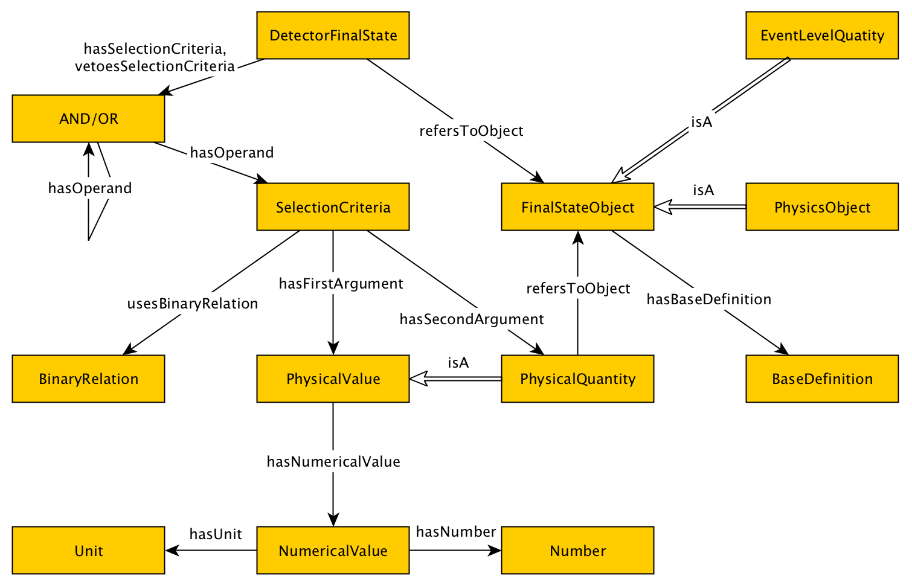

#  Graphical representation

__Diagram__

#  General description

|  |  |
| --- | --- |
|  Name: |  DetectorFinalState |
|  Submitted by: | [AdilaKrisnadhi](../User/AdilaKrisnadhi.md "User:AdilaKrisnadhi") |
|  Also Known As: |  |
|  Intent: |  This pattern represent schematic model for high-energy physics experiment data. |
|  Domains: | [Physics](../Community/Physics.md "Community:Physics") |
|  Competency Questions: | <li> Retrieve all analyses that veto extra leptons.</li>Retrieve all analyses that used jets in the final state.Retrieve all analyses requireing particles to have an invariant mass near the Z pole.Retrieve all analyses requiring large missing energy. |
|  Solution description: |  This pattern represent schematic model for data obtained from results of high-energy physics experiments, such as ones ran in the CERN's Large Hadron Collider. Specifically, this pattern models the notion of Detector Final State, a composition obatined by a selection of some target characteristics concerning physics measurements and parameters of experiments. |
|  Reusable OWL Building Block: | [https://www.dropbox.com/s/uy0bh33wsdzx6bp/dectectorfinalstate.owl?dl=0](http://ontologydesignpatterns.org/wiki/index.php?title=Special:ClickHandler&link=https://www.dropbox.com/s/uy0bh33wsdzx6bp/dectectorfinalstate.owl?dl=0&message=OWL building block&from_page_id=3953&update=) (0) |
|  Consequences: |  |
|  Scenarios: |  |
|  Known Uses: |  |
|  Web References: |  |
|  Other References: |  |
|  Examples (OWL files): |  |
|  Extracted From: |  |
|  Reengineered From: |  |
|  Has Components: |  |
|  Specialization Of: |  |
|  Related CPs: |  |

  

#  Elements

_The __DetectorFinalState__ Content OP locally defines the following ontology elements:_

#  Additional information

#  Scenarios

__Scenarios about DetectorFinalState__
No scenario is added to this Content OP.

#  Reviews

__Reviews about DetectorFinalState__
There is no review about this proposal.
This revision (revision ID __12326__) takes in account the reviews: none

Other info at [evaluation tab](http://ontologydesignpatterns.org/wiki/index.php?title=Submissions:DetectorFinalState&action=evaluation "http://ontologydesignpatterns.org/wiki/index.php?title=Submissions:DetectorFinalState&action=evaluation")

  

#  Modeling issues

__Modeling issues about DetectorFinalState__
There is no Modeling issue related to this proposal.

  

#  References