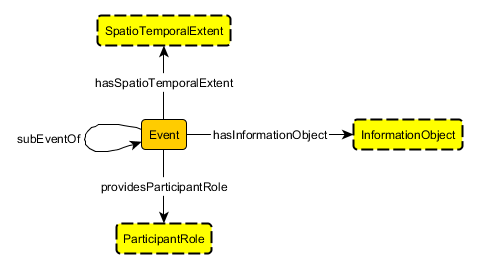

# 

 Graphical representation

__Diagram__ 

# 

 General description

|  |  |
| --- | --- |
|  Name:  |  EventCore  |
|  Submitted by:  | [AdilaKrisnadhi](../User/AdilaKrisnadhi.md "User:AdilaKrisnadhi")  |
|  Also Known As:  |  |
|  Intent:  |  The purpose of this pattern is to provide a minimalistic model of event where it is not always possible to separate its spatial and the temporal aspects, thus can model events that move or possess discontinuous temporal extent. Events according to this model has at least one participant, attached via a participant-role, and may have additional descriptive information through its information object.  |
|  Domains:  | [General](../Community/General.md "Community:General")  , [Event Processing](../Community/Event_Processing.md "Community:Event Processing")  |
|  Competency Questions:  | <li>       Where and when did the 1990 World Chess Championship Match take place?      </li><li>       Who were involved in the 1990 World Chess Championship Match?      </li> |
|  Solution description:  |  See Adila Krisnadhi; Pascal Hitzler : A Core Pattern for Events. Under review at WOP 2016  |
|  Reusable OWL Building Block:  | [http://krisnadhi.github.io/onto/event.owl](http://ontologydesignpatterns.org/wiki/index.php?title=Special:ClickHandler&link=http://krisnadhi.github.io/onto/event.owl&message=OWL building block&from_page_id=4117&update=)  (712)  |
|  Consequences:  |  This pattern can model moving events and events with discontinuous temporal extents, provided an appropriate spatiotemporal extent model is used. This pattern, however, does not facilitate modeling complex relationships between events, such as causality, provenance, or correlation  |
|  Scenarios:  |  The 1990 World Chess Championship Match takes place in New York from October 8 to November 7, 1990, and in Lyons, France, from November 26 to December 30, 1990.  |
|  Known Uses:  |  |
|  Web References:  |  |
|  Other References:  |  |
|  Examples (OWL files):  |  |
|  Extracted From:  |  |
|  Reengineered From:  |  |
|  Has Components:  |  |
|  Specialization Of:  |  |
|  Related CPs:  | <li><a href="../SpatioTemporalExtent/SpatioTemporalExtent.md" title="Submissions:SpatioTemporalExtent">        Submissions:SpatioTemporalExtent       </a></li><li><a href="../ParticipantRole/ParticipantRole.md" title="Submissions:ParticipantRole">        Submissions:ParticipantRole       </a></li><li><a href="../AgentRole/AgentRole.md" title="Submissions:AgentRole">        Submissions:AgentRole       </a></li><li><a href="../Objectrole/Objectrole.md" title="Submissions:Objectrole">        Submissions:Objectrole       </a></li><li><a href="../Information_realization/Information_realization.md" title="Submissions:Information realization">        Submissions:Information realization       </a></li><li><a href="../InformationObjectsAndRepresentationLanguages/InformationObjectsAndRepresentationLanguages.md" title="Submissions:InformationObjectsAndRepresentationLanguages">        Submissions:InformationObjectsAndRepresentationLanguages       </a></li><li><a class="new" href="http://ontologydesignpatterns.org/wiki/index.php?title=Submissions:InformationObject&amp;action=edit&amp;redlink=1" title="Submissions:InformationObject (not yet written)">        Submissions:InformationObject       </a></li><li><a href="../EventProcessing/EventProcessing.md" title="Submissions:EventProcessing">        Submissions:EventProcessing       </a></li> |

  

# 

 Elements

_The
 __EventCore__ 
 Content OP locally defines the following ontology elements:_ 

__DASE\_RULE__ 
 (owl:AnnotationProperty) Attached to an axiom, this annotation property provides information on the original (SWRL) rule from which the axiom was obtained through translation.
 

_[DASE\_RULE](./EventCore/DASE_RULE.md "Submissions:EventCore/DASE RULE") 
 page_ 

__freshProp1__ 
 (owl:ObjectProperty) This property is artificially generated in order to express the following rule in OWL:  :Event(?x) ^ :providesParticipantRole(?x,?p) ^ :subEventOf(?x,?y) -> :providesParticipantRole(?y,?p).
 
 The rule is translated into two axioms:
 

 1. :Event SubClassOf: :freshProp1 some Self
 

 2. inverse (:subEventOf) o :freshProp1 o :providesParticipantRole SubPropertyOf: : :providesParticipantRole
 

_[freshProp1](./EventCore/freshProp1.md "Submissions:EventCore/freshProp1") 
 page_ 

__freshProp2__ 
 (owl:ObjectProperty) This property is artificially generated in order to express the following rule in OWL:  :Event(?x) ^ :hasSpatioTemporalExtent(?x,?w) ^ :subEventOf(?x,?y) ^ :Event(?y) ^ :hasSpatioTemporalExtent(?y,?z) -> :subSpatioTemporalExtentOf(?w,?z).
 
 The rule is translated into two axioms:
 

 1. :Event SubClassOf: :freshProp2 some Self
 

 2. inverse (:hasSpatioTemporalExtent) o :freshProp2 o :subEventOf o :freshProp2 o :hasSpatioTemporalExtent SubPropertyOf: :subSpatioTemporalExtentOf
 

_[freshProp2](./EventCore/freshProp2.md "Submissions:EventCore/freshProp2") 
 page_ 

__hasInformationObject__ 
 (owl:ObjectProperty) Property relating Event to InformationObject in this pattern. The domain of this property is not restricted to Event since it is possible that non-event to have an information object. The range is always InformationObject since it makes no sense to have a property named hasInformationObject to point to anything other than information object.
 

_[hasInformationObject](./EventCore/hasInformationObject.md "Submissions:EventCore/hasInformationObject") 
 page_ 

__hasSpatioTemporalExtent__ 
 (owl:ObjectProperty) Property relating Event to SpatioTemporalExtent in this pattern. The range is always SpatioTemporalExtent (globally) since it makes no sense to have a property named hasSpatioTemporalExtent to point to anything other than spatiotemporal extent. Tthe domain is not set to Event as non-Event may also have spatiotemporal extent.
 

_[hasSpatioTemporalExtent](./EventCore/hasSpatioTemporalExtent.md "Submissions:EventCore/hasSpatioTemporalExtent") 
 page_ 

__providesParticipantRole__ 
 (owl:ObjectProperty) Property relating Event to ParticipantRole in this pattern. The range is always ParticipantRole since it makes no sense to have a property named as providesParticipantRole not to point to a participant role. The domain is not set to Event as non-Event may also provide a participant role.
 

_[providesParticipantRole](./EventCore/providesParticipantRole.md "Submissions:EventCore/providesParticipantRole") 
 page_ 

__subEventOf__ 
 (owl:ObjectProperty) Property expressing partonomic relation between two events. Domain and range are always Event.
 

_[subEventOf](./EventCore/subEventOf.md "Submissions:EventCore/subEventOf") 
 page_ 

__subSpatioTemporalExtentOf__ 
 (owl:ObjectProperty) Property indicating partonomic relation between two spatiotemporal extents. The Event pattern only assumes that this is given by the spatiotemporal extent pattern actually used. Thus, domain and range are not explicitly stated and this property is included in axioms resulted by OWL translation of the following rule: :Event(?x) ^ :hasSpatioTemporalExtent(?x,?w) ^ :subEventOf(?x,?y) ^ :Event(?y) ^ :hasSpatioTemporalExtent(?y,?z) -> :subSpatioTemporalExtentOf(?w,?z)
 

_[subSpatioTemporalExtentOf](./EventCore/subSpatioTemporalExtentOf.md "Submissions:EventCore/subSpatioTemporalExtentOf") 
 page_ 

__Event__ 
 (owl:Class) Represents any kind of events. An event possesses a spatiotemporal extent, provides at least one participant-role, which is performed by some entity (agents or otherwise), and may be a sub-event of another event. An event may also have additional descriptive information, which is consolidated through an information object.
 

_[Event](../CommunicationEvent/CommunicationEvent.md "Submissions:EventCore/Event") 
 page_ 

__InformationObject__ 
 (owl:Class) An entity that encapsulates all descriptive or non-defining information of the corresponding event, e.g., names, additional identifiers, textual descriptions, etc. Should normally be aligned to a separate Information Object pattern.
 

_[InformationObject](./EventCore/hasInformationObject.md "Submissions:EventCore/InformationObject") 
 page_ 

__ParticipantRole__ 
 (owl:Class) Every ParticipantRole represents a reified relationship between an event and one of its participants. Should normally be aligend to a separate Participant-Role pattern.
 

_[ParticipantRole](../ParticipantRole/ParticipantRole.md "Submissions:EventCore/ParticipantRole") 
 page_ 

__SpatioTemporalExtent__ 
 (owl:Class) Hook to a complex notion representing a unified spatial and temporal extent. Intended to cover non-static or discontinuous spatiotemporal extent. Should be aligned to a separate Spatiotemporal Extent pattern.
 

_[SpatioTemporalExtent](../SpatioTemporalExtent/SpatioTemporalExtent.md "Submissions:EventCore/SpatioTemporalExtent") 
 page_ 

# 

 Additional information

# 

 Scenarios

__Scenarios about EventCore__ 

 No scenario is added to this Content OP.
 

# 

 Reviews

__Reviews about EventCore__ 

 There is no review about this proposal.
This revision (revision ID
 __12751__ 
 ) takes in account the reviews: none
 

 Other info at
 [evaluation tab](http://ontologydesignpatterns.org/wiki/index.php?title=Submissions:EventCore&action=evaluation "http://ontologydesignpatterns.org/wiki/index.php?title=Submissions:EventCore&action=evaluation") 

  

# 

 Modeling issues

__Modeling issues about EventCore__ 

 There is no Modeling issue related to this proposal.
 

  

# 

 References

  

|  |  Submission to event [WOP:2016](../WOP/2016.1.md "WOP:2016")  |
| --- | --- |