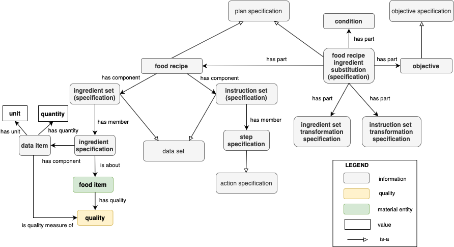

# 

 Graphical representation

__Diagram__ 

# 

 General description

|  |  |
| --- | --- |
|  Name:  |  Food Recipe Ingredient Substitution Ontology Design Pattern  |
|  Submitted by:  | [AgnieszkaLawrynowicz](../User/AgnieszkaLawrynowicz.md "User:AgnieszkaLawrynowicz")  , [AnnaWroblewska](http://ontologydesignpatterns.org/wiki/index.php?title=User:AnnaWroblewska&action=edit&redlink=1 "User:AnnaWroblewska (not yet written)")  , [WeronikaAdrian](../User/WeronikaAdrian.md "User:WeronikaAdrian")  , [AnnaGramza](http://ontologydesignpatterns.org/wiki/index.php?title=User:AnnaGramza&action=edit&redlink=1 "User:AnnaGramza (not yet written)")  , [BartoszKulczynski](http://ontologydesignpatterns.org/wiki/index.php?title=User:BartoszKulczynski&action=edit&redlink=1 "User:BartoszKulczynski (not yet written)")  |
|  Also Known As:  |  |
|  Intent:  |  To model substitutes for ingredients in food recipes. Essential aspects of modelling substitutes are their quantity in a recipe, the constraints and the qualitative and quantitative conditions for the substitutions, and other nutrition values, e.g. containing a number of calories or technological effects, and substitution objectives.  The pattern should allow to represent different types of food substitutes in recipes, and recipe process, and overall notion of food substitution.  |
|  Domains:  | [General](../Community/General.md "Community:General")  , [Event Processing](../Community/Event_Processing.md "Community:Event Processing")  , [Food](http://ontologydesignpatterns.org/wiki/Special:AddData/Domain Form/Community:Food "Community:Food (not yet written)")  |
|  Competency Questions:  | <li><ul></ul></li>- What ingredient is being replaced with another ingredient or a set of ingredients?- What are the dietary features of the ingredient?- What are the food technology features of the ingredient?- What are nutrition values the ingredient has?- What is the quantity of the ingredient being processed in the recipe? What is the unit of the quantity?- What is the objective of ingredient substitution?- What conditions (dietary and technological) are specified for selecting the target ingredient?- How is the ingredient processed in the given recipe?- What is the ratio for substitution of one ingredient into another?- What ingredient substitutions are possible in the recipe?- What ingredient substitutions are available in the recipe given dietary constraints?- What are available substitutes for a given food item? What are substitutes for the ingredient in the recipe? |
|  Solution description:  |  The substitute ingredients ontology design pattern provides a building block for modelling substitutions in recipes where one or more ingredients are processed to prepare a dish (the effect of the recipe). The ingredients, substitutes, and the effected dish have dietary constraints, effects, and other features.  The need for substitutions occurs when there are constraints in a person diet due to health issues or other reasons.  |
|  Reusable OWL Building Block:  | [http://www.cs.put.poznan.pl/alawrynowicz/food\_recipe\_ingredient\_substitute\_ODP.owl](http://ontologydesignpatterns.org/wiki/index.php?title=Special:ClickHandler&link=http://www.cs.put.poznan.pl/alawrynowicz/food_recipe_ingredient_substitute_ODP.owl&message=OWL building block&from_page_id=4942&update=)  (91)  |
|  Consequences:  |  The pattern allows to represent different types of food substitutes in recipes, and recipe process, and overall notion of food substitution.  |
|  Scenarios:  |  When preparing a dish based on a given recipe, the cook can make a substitution because he/she has no such particular ingredient at hand, or has any dietary constraints due to health issues or other preferences. (The diet often implies specific nutrition intake for health or weight management or other reasons such as personal tastes or ethics.) For example a cooker is a vegetarian and what to cook a dish similar to minced meatballs but with vegan ingredients. The cooker can substitute the meat in the meatballs recipe with soya tofu. However, it should be done with proper proportions and cooking conditions. Also the dietary effect such as nutrition values or technological effect are different. ; __Scenario 1__  : substitution due to lack of product. __Objective__  : In this scenario, the substitute must replicate nutritional value, i.e. also be a good source of fibre. __Description__  : Persona X decided to prepare risotto. However, when preparing the dish, she found that she had run out of brown rice. The recipe she used did not provide any information on the ingredient(s) with which the rice could be replaced. Furthermore, Persona X has decided to eat healthily and wonders which possible rice substitute would meet her expectations, i.e. would not only be technologically suitable but above all would be a good source of dietary fibre. __Scenario 2__  : substitution due to the need to exclude a particular product for health reasons. __Objective__  : In this scenario, the substitute must meet health requirements. __Description__  : Persona Y decided to make a dairy dessert with fruit for a birthday party. However, it turned out that one of the guests had a diagnosed allergy to cow’s milk protein and nuts. In order not to completely abandon the idea of preparing a sweet snack, Persona Y decided to replace the milk with another ingredient. Unfortunately, she has no idea which product would make a good substitute for milk. Her husband has given her the idea that it could be an almond drink. However, she is not convinced thatit would be a suitable replacement as the guest has a diagnosed nut allergy. __Scenario 3__  : substitution due to the need to exclude a specific product for health reasons. __Objective__  : In this scenario, the substitute must meet the technological requirements, i.e.it must give the same sweetness to the dish as sugar. __Description__  : Persona Z is in the process of preparing baked cookies for a family gathering. However, she finds out that one of the participants will be her grandmother -type 2 diabetes. Therefore, she decided not to use added sugar in the baked goods.Unfortunately, the younger guests would not appreciate cookies without sugar ’s sweet taste. So Persona Z wondered what she could do to replace the sugar in the cookies to keep them sweet. Admittedly, her sister has suggested that erythritol is a popularsugar substitute in recent times. However, two doubts remained to be resolved: (1) will erythritol not lose its sweetness during baking, (2) in what ratio to replace sugar with erythritol to get similar sweetness?  |
|  Known Uses:  |  |
|  Web References:  |  |
|  Other References:  |  |
|  Examples (OWL files):  |  |
|  Extracted From:  |  |
|  Reengineered From:  |  |
|  Has Components:  | <li><a class="new" href="http://ontologydesignpatterns.org/wiki/Special:AddData/Content OP Proposal Form/Submissions:Recipe_model_proposed_to_be_included_in_FoodOn_%28http://www.semantic-web-journal.net/content/food-process-ontology-requirements%29" title="Submissions:Recipe model proposed to be included in FoodOn (http://www.semantic-web-journal.net/content/food-process-ontology-requirements) (not yet written)">        Submissions:Recipe model proposed to be included in FoodOn (http://www.semantic-web-journal.net/content/food-process-ontology-requirements)       </a></li> |
|  Specialization Of:  |  |
|  Related CPs:  | <li><a href="../ActivitySpecification/ActivitySpecification.md" title="Submissions:ActivitySpecification">        Submissions:ActivitySpecification       </a></li><li><a href="../Sequence/Sequence.md" title="Submissions:Sequence">        Submissions:Sequence       </a></li><li><a href="../EventProcessing/EventProcessing.md" title="Submissions:EventProcessing">        Submissions:EventProcessing       </a></li> |

  

# 

 Elements

_The
 __Food Recipe Ingredient Substitution Ontology Design Pattern__ 
 Content OP locally defines the following ontology elements:_ 

# 

 Additional information

# 

 Scenarios

__Scenarios about Food Recipe Ingredient Substitution Ontology Design Pattern__ 

 No scenario is added to this Content OP.
 

# 

 Reviews

__Reviews about Food Recipe Ingredient Substitution Ontology Design Pattern__ 

 There is no review about this proposal.
This revision (revision ID
 __14309__ 
 ) takes in account the reviews: none
 

 Other info at
 [evaluation tab](http://ontologydesignpatterns.org/wiki/index.php?title=Submissions:Food_Recipe_Ingredient_Substitution_Ontology_Design_Pattern&action=evaluation "http://ontologydesignpatterns.org/wiki/index.php?title=Submissions:Food_Recipe_Ingredient_Substitution_Ontology_Design_Pattern&action=evaluation") 

  

# 

 Modeling issues

__Modeling issues about Food Recipe Ingredient Substitution Ontology Design Pattern__ 

 There is no Modeling issue related to this proposal.
 

  

# 

 References