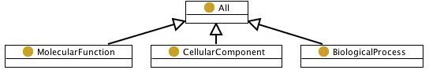

# 

 Graphical representation

__Diagram__ 

# 

 General description

|  |  |
| --- | --- |
|  Name:  |  Gene Ontology Top Level  |
|  Submitted by:  | [AldoGangemi](../User/AldoGangemi "User:AldoGangemi")  |
|  Also Known As:  |  |
|  Intent:  |  To represent types of gene-related entities and their parts.  |
|  Domains:  | [Biology](../Community/Biology "Community:Biology")  |
|  Competency Questions:  | <li>       What are the possible most general supertypes for any type from the gene-related domain?      </li><li>       What entity is part of another entity in the gene-related domain?      </li> |
|  Solution description:  |  -  |
|  Reusable OWL Building Block:  | [http://www.ontologydesignpatterns.org/cp/owl/gotop.owl](http://ontologydesignpatterns.org/wiki/index.php?title=Special:ClickHandler&link=http://www.ontologydesignpatterns.org/cp/owl/gotop.owl&message=OWL building block&from_page_id=315&update=)  (655)  |
|  Consequences:  |  It allows to categorize gene-related types into three main types.  It allows to represent parts of gene-related entities (transitively).It does not allow to represent the relationships between entities of different types.It does not say anything about disjointness of categories.  |
|  Scenarios:  |  A 'template for synthesis of G-rich strand of telomere DNA activity' must be part of a 'telomerase activity', All 'templates for synthesis of G-rich strand of telomere DNA activity' are 'molecular functions'  |
|  Known Uses:  |  |
|  Web References:  |  |
|  Other References:  |  |
|  Examples (OWL files):  |  |
|  Extracted From:  | <li><a class="external free" href="http://purl.org/obo/owl/gene_ontology_edit" rel="nofollow" title="http://purl.org/obo/owl/gene_ontology_edit">        http://purl.org/obo/owl/gene_ontology_edit       </a></li> |
|  Reengineered From:  | <li><a class="external free" href="http://purl.org/obo/owl/gene_ontology_edit" rel="nofollow" title="http://purl.org/obo/owl/gene_ontology_edit">        http://purl.org/obo/owl/gene_ontology_edit       </a></li> |
|  Has Components:  |  |
|  Specialization Of:  |  |
|  Related CPs:  | <li><a href="../Submissions/PartOf" title="Submissions:PartOf">        Submissions:PartOf       </a></li> |

  

# 

 Elements

_The
 __GO Top__ 
 Content OP locally defines the following ontology elements:_ 

__Cellular component__ 
 (owl:Class) The part of a cell or its extracellular environment in which a gene product is located. A gene product may be located in one or more parts of a cell and its location may be as specific as a particular macromolecular complex, that is, a stable, persistent association of macromolecules that function together.
 

_[CellularComponent](../Submissions/GO_Top/CellularComponent "Submissions:GO Top/CellularComponent") 
 page_ 

__Molecular function__ 
 (owl:Class) Elemental activities, such as catalysis or binding, describing the actions of a gene product at the molecular level. A given gene product may exhibit one or more molecular functions.
 

_[MolecularFunction](../Submissions/GO_Top/MolecularFunction "Submissions:GO Top/MolecularFunction") 
 page_ 

__Biological process__ 
 (owl:Class) Those processes specifically pertinent to the functioning of integrated living units: cells, tissues, organs, and organisms. A process is a collection of molecular events with a defined beginning and end.
 

_[BiologicalProcess](../Submissions/GO_Top/BiologicalProcess "Submissions:GO Top/BiologicalProcess") 
 page_ 

__part of__ 
 (owl:ObjectProperty) Transitive part of relation from obo2owl in the gene ontology
 

_[partOf](../Submissions/GO_Top/partOf "Submissions:GO Top/partOf") 
 page_ 

# 

 Additional information

 This pattern is peculiar to the biomolecular domain, where types of entities, rather than specific instances, are the main focus of interest. As a result, the Gene Ontology, based on this top-level categories, is a huge TBox.
 [Part of](../Submissions/PartOf "Submissions:PartOf") 
 can have this pattern as a specialization, if the three gene-related categories are considered as owl:subClassOf
 [Entity](../Submissions/PartOf/Entity "Submissions:PartOf/Entity") 
 .
 

# 

 Scenarios

__Scenarios about GO Top__ 

 No scenario is added to this Content OP.
 

# 

 Reviews

__Reviews about GO Top__ 

 There is no review about this proposal.
This revision (revision ID
 __9268__ 
 ) takes in account the reviews: none
 

 Other info at
 [evaluation tab](http://ontologydesignpatterns.org/wiki/index.php?title=Submissions:GO_Top&action=evaluation "http://ontologydesignpatterns.org/wiki/index.php?title=Submissions:GO_Top&action=evaluation") 

  

# 

 Modeling issues

__Modeling issues about GO Top__ 

 There is no Modeling issue related to this proposal.
 

  

# 

 References

* The Gene Ontology website [Documentation](http://www.geneontology.org "http://www.geneontology.org")  | [reference page](../Community/References/Gene_ontology "Community:References/Gene ontology")