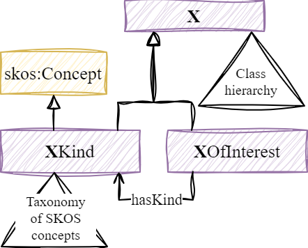
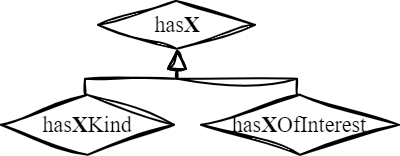

# Kind of X and X of Interest 

Architectural Design Pattern “Kinds of X and X of Interest”, and its extension “has X” as submitted to the 15th Workshop on Ontology Design and Patterns: https://openreview.net/pdf?id=nWTpluoDrh

## Abstract

Several Web of Thing (WoT) ontologies defined by different standard organizations share common
objectives: describing measurements and possible actions. Unfortunately, their modelling seems quite
similar but not easy to align. This article proposes the pattern “Kind of X and X of Interest”. It conciliates
two ways of modelling proposed in those ontologies to clarify their understanding and possibly integrate
them. The paper illustrates the reuse of the pattern in the ontology of the CoSWoT project, which
aims to extend the Semantic Web of Things (SWoT) to constrained devices. We also showcase possible
generalization tracks to reuse the pattern in other projects addressing domains other than WoT, such as
the European project Omega-X

## Pattern: Kind of X and X of Interest

We propose a design pattern that we call “Kinds of X and X of Interest”, shown in the figure below, which uses the chowlk notation.



The pattern has an extension "has X" show in the figure below, which uses the chowlk notation.



The class X (e.g. Feature, Property, Device) represents the class of entities whose type is
indeterminate (neither generic nor specific). It can be specialized in a class hierarchy. The class
X is equivalent to the disjoint union of XKind and XOfInterest, which represent respectively
the class of archetypes of X and specific X. XKind is a subclass of skos:Concept, and these
instances are organized into a SKOS model using the skos:broader and skos:narrower properties.
Local restrictions on XKind force more specific and more generic concepts to also be of type
XKind.

The hasKind property binds a specific entity to its archetypes. A local restriction on
XOfInterest forces any object of the hasKind property to be of archetype XKind. Additionally,
hasKind is a superproperty of the property chain hasKind ∘ skos:broader, so that an instance of
XOfInterest “inherits” the more generic archetype XKind. The hasKind property being “non-
simple”7 by this axiom, it should not be subject to cardinality restrictions. We can nevertheless
add a local existential restriction XOfInterest⊑ ∃hasKind.XKind, and a universal restriction
XKind⊑ ∀hasKind.⊥. This last restriction prohibits the use of hasKind on instances of type
XKind.

When a subclass of X is defined, it is possible, but not mandatory, to use the same architectural
design pattern. For example, the classes Sensor, SensorKind, and SensorOfInterest, will have
respectively subclasses Device, DeviceKind, and DeviceOfInterest.

Finally, it is common to model that an instance of the pattern for Y refers to an instance of the
pattern for X. A XOfInterest will be specific to a unique YOfInterest. For example, a property
of interest is specific to an entity of interest. The pattern therefore proposes an extension “has
X” which defines six properties: hasX, isXOf, hasXKind, isXKindOf, hasXOfInterest, and
isXOfInterestOf, the latter being functional. Three axioms of type subPropertyChainOf allow
us to infer the types:


- skos:broader ∘ hasXKind ⊑ hasXKind
- hasKind ∘ hasXKind ⊑ hasXKind
- hasXOfInterest ∘ hasKind ⊑ hasXKind


Even if hasXKind is non-simple, the class XOfInterest can receive a local restriction of
cardinality = 1 on isXOfInterestOf without violating the global restrictions of OWL 2 DL.
This pattern facilitates the separation of concerns: ontology developers will favour the
definition of X subclasses; thesauri developers or online catalogs managers will favour the in-
stantiation of XKind classes; application developers will favour the instantiation of XOfInterest
classes.

## How to cite

```
@inproceedings{lefranccois2024kind,
  title={Kind of X and X of Interest: An Ontology Design Pattern to Reconcile Web of Thing Ontologies},
  author={Lefran{\c{c}}ois, Maxime and Roussey, Catherine and Hannou, Fatma-Zohra and Charpenay, Victor and Zimmermann, Antoine},
  booktitle={15th Workshop on Ontology Design and Patterns},
  note={submitted},
  url={https://openreview.net/pdf?id=nWTpluoDrh},
  year={2024}
}
```