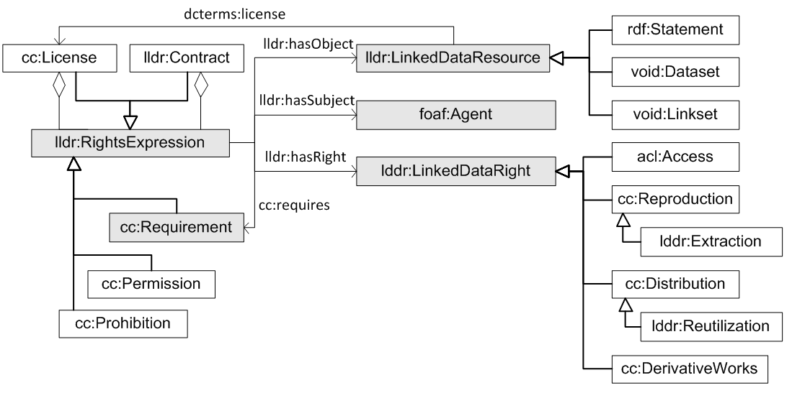

# 

 Graphical representation

__Diagram__ 

# 

 General description

|  |  |
| --- | --- |
|  Name:  |  LicenseLinkedDataResources  |
|  Submitted by:  | [VictorRodriguezDoncel](../User/VictorRodriguezDoncel "User:VictorRodriguezDoncel")  , [MariCarmenSuarezFigueroa](../User/MariCarmenSuarezFigueroa "User:MariCarmenSuarezFigueroa")  , [AsuncionGomezPerez](../User/AsuncionGomezPerez "User:AsuncionGomezPerez")  , [MariaPoveda](../User/MariaPoveda "User:MariaPoveda")  |
|  Also Known As:  |  |
|  Intent:  |  To provide a pattern for expressing rights on Linked Data Resources, understood as RDF triples, datasets or mappings.  These rights include intellectual property rights, database rights and the right of access, which can be limited by personal data protection laws and others.Rights expressions may assert, waive and license the rights, either conditionally or inconditionally, either to the public or to agents in particular.  |
|  Domains:  | [Linked Data](http://ontologydesignpatterns.org/wiki/Special:AddData/Domain Form/Community:Linked_Data "Community:Linked Data (not yet written)")  , [Lincense](http://ontologydesignpatterns.org/wiki/Special:AddData/Domain Form/Community:Lincense "Community:Lincense (not yet written)")  |
|  Competency Questions:  |  |
|  Solution description:  |  -Adhere to the underlying structure present in other Rights Expression Languages  -Be able to represent existing known licenses (i.e. Creative Commons licenses etc.)  -Support database rights: extraction and re-utilization  -Support privacy law (personal data handling) and the right to access  -Support the intellectual property law rights: reproduction, distribution, transformation  -Support these right declarations: Unconditionally waiving rights, Restating that some rights are reserved, Licensing rights subject to conditions  -Supporting existing licensing practices for RDF resources  -Supporting these business models: Open data business models, Non open data business models, Hybrid models.  |
|  Reusable OWL Building Block:  | [http://purl.oclc.org/NET/lldr/ns#](http://ontologydesignpatterns.org/wiki/index.php?title=Special:ClickHandler&link=http://purl.oclc.org/NET/lldr/ns#&message=OWL building block&from_page_id=3611&update=)  (0)  |
|  Consequences:  |  A more precise attribution of rights expression to Linked Data  |
|  Scenarios:  |  Declaring rights on both Linked Open Data and Linked Closed Data  |
|  Known Uses:  |  |
|  Web References:  |  |
|  Other References:  |  |
|  Examples (OWL files):  |  |
|  Extracted From:  |  |
|  Reengineered From:  |  |
|  Has Components:  |  |
|  Specialization Of:  | <li><a class="new" href="http://ontologydesignpatterns.org/wiki/Special:AddData/Content OP Proposal Form/Submissions:Http://ontologydesignpatterns.org/wiki/Submissions:N-Ary_Relation_Pattern_%28OWL_2%29?alt_form[0]=Content OP Form" title="Submissions:Http://ontologydesignpatterns.org/wiki/Submissions:N-Ary Relation Pattern (OWL 2) (not yet written)">        Submissions:http://ontologydesignpatterns.org/wiki/Submissions:N-Ary_Relation_Pattern_(OWL_2)       </a></li> |
|  Related CPs:  |  |

  

# 

 Elements

_The
 __LicenseLinkedDataResources__ 
 Content OP locally defines the following ontology elements:_ 

[Submissions:LicenseLinkedDataResources/http://vocab.deri.ie/void](http://ontologydesignpatterns.org/wiki/Special:AddData/Ontology Element Form/Submissions:LicenseLinkedDataResources/http://vocab.deri.ie/void "Submissions:LicenseLinkedDataResources/http://vocab.deri.ie/void (not yet written)") 

_[http://vocab.deri.ie/void#](http://ontologydesignpatterns.org/wiki/Special:AddData/Ontology Element Form/Submissions:LicenseLinkedDataResources/http://vocab.deri.ie/void "Submissions:LicenseLinkedDataResources/http://vocab.deri.ie/void (not yet written)") 
 page_ 

[Submissions:LicenseLinkedDataResources/http://xmlns.com/foaf/0.1/](http://ontologydesignpatterns.org/wiki/Special:AddData/Ontology Element Form/Submissions:LicenseLinkedDataResources/http://xmlns.com/foaf/0.1/ "Submissions:LicenseLinkedDataResources/http://xmlns.com/foaf/0.1/ (not yet written)") 

_[http://xmlns.com/foaf/0.1/](http://ontologydesignpatterns.org/wiki/Special:AddData/Ontology Element Form/Submissions:LicenseLinkedDataResources/http://xmlns.com/foaf/0.1/ "Submissions:LicenseLinkedDataResources/http://xmlns.com/foaf/0.1/ (not yet written)") 
 page_ 

[Submissions:LicenseLinkedDataResources/http://creativecommons.org/ns](http://ontologydesignpatterns.org/wiki/Special:AddData/Ontology Element Form/Submissions:LicenseLinkedDataResources/http://creativecommons.org/ns "Submissions:LicenseLinkedDataResources/http://creativecommons.org/ns (not yet written)") 

_[http://creativecommons.org/ns#](http://ontologydesignpatterns.org/wiki/Special:AddData/Ontology Element Form/Submissions:LicenseLinkedDataResources/http://creativecommons.org/ns "Submissions:LicenseLinkedDataResources/http://creativecommons.org/ns (not yet written)") 
 page_ 

[Submissions:LicenseLinkedDataResources/http://purl.org/dc/terms/](http://ontologydesignpatterns.org/wiki/Special:AddData/Ontology Element Form/Submissions:LicenseLinkedDataResources/http://purl.org/dc/terms/ "Submissions:LicenseLinkedDataResources/http://purl.org/dc/terms/ (not yet written)") 

_[http://purl.org/dc/terms/](http://ontologydesignpatterns.org/wiki/Special:AddData/Ontology Element Form/Submissions:LicenseLinkedDataResources/http://purl.org/dc/terms/ "Submissions:LicenseLinkedDataResources/http://purl.org/dc/terms/ (not yet written)") 
 page_ 

[Submissions:LicenseLinkedDataResources/http://purl.org/dc/elements/1.1/](http://ontologydesignpatterns.org/wiki/Special:AddData/Ontology Element Form/Submissions:LicenseLinkedDataResources/http://purl.org/dc/elements/1.1/ "Submissions:LicenseLinkedDataResources/http://purl.org/dc/elements/1.1/ (not yet written)") 

_[http://purl.org/dc/elements/1.1/](http://ontologydesignpatterns.org/wiki/Special:AddData/Ontology Element Form/Submissions:LicenseLinkedDataResources/http://purl.org/dc/elements/1.1/ "Submissions:LicenseLinkedDataResources/http://purl.org/dc/elements/1.1/ (not yet written)") 
 page_ 

# 

 Additional information

# 

 Scenarios

__Scenarios about LicenseLinkedDataResources__ 

 No scenario is added to this Content OP.
 

# 

 Reviews

__Reviews about LicenseLinkedDataResources__ 

|  Review article  | [Posted on](../Property/CreationDate "Property:CreationDate")  | [About revision (current is 11654)](../Property/ReviewAboutVersion "Property:ReviewAboutVersion")  |
| --- | --- | --- |
| [TimLebo about LicenseLinkedDataResources](../Reviews/TimLebo_about_LicenseLinkedDataResources "Reviews:TimLebo about LicenseLinkedDataResources")  |  2456507  2 August 2013  |  11654  11,654  |
| [KarlHammar about LicenseLinkedDataResources](../Reviews/KarlHammar_about_LicenseLinkedDataResources "Reviews:KarlHammar about LicenseLinkedDataResources")  |  2456510  5 August 2013  |  11657  11,657  |
| [JoseEmilioLabraGayo about LicenseLinkedDataResources](../Reviews/JoseEmilioLabraGayo_about_LicenseLinkedDataResources "Reviews:JoseEmilioLabraGayo about LicenseLinkedDataResources")  |  2456513  8 August 2013  |  11657  11,657  |

 This revision (revision ID
 __11654__ 
 ) takes in account the reviews: none
 

 Other info at
 [evaluation tab](http://ontologydesignpatterns.org/wiki/index.php?title=Submissions:LicenseLinkedDataResources&action=evaluation "http://ontologydesignpatterns.org/wiki/index.php?title=Submissions:LicenseLinkedDataResources&action=evaluation") 

  

# 

 Modeling issues

__Modeling issues about LicenseLinkedDataResources__ 

 There is no Modeling issue related to this proposal.
 

  

# 

 References

  

|  |  Submission to event [WOP:2013](../WOP/2013 "WOP:2013")  |
| --- | --- |

  

|  |  Submission to event  |
| --- | --- |