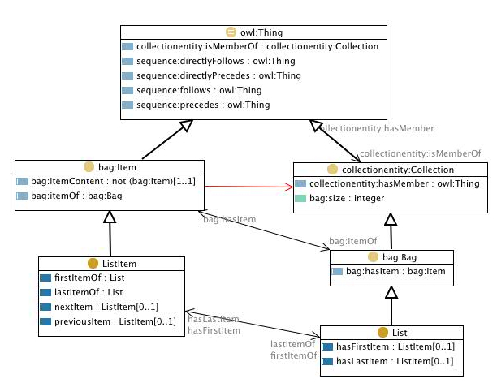

# 

 Graphical representation

__Diagram__ 

# 

 General description

|  |  |
| --- | --- |
|  Name:  |  List  |
|  Submitted by:  | [EvaBlomqvist](../User/EvaBlomqvist "User:EvaBlomqvist")  |
|  Also Known As:  |  |
|  Intent:  |  To represent ordered collections, i.e. lists.  |
|  Domains:  |  |
|  Competency Questions:  | <li>       What are the items (elements) in this list?      </li><li>       What is the length (size) of this list?      </li><li>       What is the first/last item in this list?      </li><li>       What resource does this list item contain?      </li><li>       What it the next/previous item in the list?      </li> |
|  Solution description:  |  Representing ordered lists, through a specialization of the bag pattern, where each resource in the bag is referred through an item, so that the same item can occur in several places. The usual properties of lists are also there, i.e. the sequence of elements, and references to the first and last item.  |
|  Reusable OWL Building Block:  | [http://www.ontologydesignpatterns.org/cp/owl/list.owl](http://ontologydesignpatterns.org/wiki/index.php?title=Special:ClickHandler&link=http://www.ontologydesignpatterns.org/cp/owl/list.owl&message=OWL building block&from_page_id=3038&update=)  (879)  |
|  Consequences:  |  |
|  Scenarios:  |  |
|  Known Uses:  |  |
|  Web References:  |  |
|  Other References:  |  |
|  Examples (OWL files):  |  |
|  Extracted From:  | <li><a class="external free" href="http://swan.mindinformatics.org/ontologies/1.2/collections.owl" rel="nofollow" title="http://swan.mindinformatics.org/ontologies/1.2/collections.owl">        http://swan.mindinformatics.org/ontologies/1.2/collections.owl       </a></li> |
|  Reengineered From:  | <li><a class="external free" href="http://swan.mindinformatics.org/ontologies/1.2/collections.owl" rel="nofollow" title="http://swan.mindinformatics.org/ontologies/1.2/collections.owl">        http://swan.mindinformatics.org/ontologies/1.2/collections.owl       </a></li> |
|  Has Components:  | <li><a href="Submissions%253ASequence.html" title="Submissions:Sequence">        Submissions:Sequence       </a></li><li><a href="Submissions%253ACollectionEntity.html" title="Submissions:CollectionEntity">        Submissions:CollectionEntity       </a></li> |
|  Specialization Of:  | <li><a href="Submissions%253ASequence.html" title="Submissions:Sequence">        Submissions:Sequence       </a></li><li><a href="Submissions%253ABag.html" title="Submissions:Bag">        Submissions:Bag       </a></li> |
|  Related CPs:  | <li><a href="Submissions%253ABag.html" title="Submissions:Bag">        Submissions:Bag       </a></li><li><a href="Submissions%253ASet.html" title="Submissions:Set">        Submissions:Set       </a></li> |

  

# 

 Elements

_The
 __List__ 
 Content OP locally defines the following ontology elements:_ 

__ListItem__ 
 (owl:Class) ListItem - Element belonging to a list
 

_[ListItem](../Submissions/List/ListItem "Submissions:List/ListItem") 
 page_ 

__List__ 
 (owl:Class) List - An ordered array of items, that can be present in multiple copies
 

_[List](../Submissions/List/List "Submissions:List/List") 
 page_ 

__lastItemOf__ 
 (owl:ObjectProperty)
 

_[lastItemOf](../Submissions/List/lastItemOf "Submissions:List/lastItemOf") 
 page_ 

__hasLastItem__ 
 (owl:FunctionalProperty) last item - The link to the last item of the list
 

_[hasLastItem](../Submissions/List/hasLastItem "Submissions:List/hasLastItem") 
 page_ 

__firstItemOf__ 
 (owl:ObjectProperty)
 

_[firstItemOf](../Submissions/List/firstItemOf "Submissions:List/firstItemOf") 
 page_ 

__nextItem__ 
 (owl:FunctionalProperty) next item - The link to the next item in a list (ordered collection)
 

_[nextItem](../Submissions/List/nextItem "Submissions:List/nextItem") 
 page_ 

__previousItem__ 
 (owl:FunctionalProperty) previous item - The link to the previous item in a list (ordered collection)
 

_[previousItem](../Submissions/List/previousItem "Submissions:List/previousItem") 
 page_ 

__hasFirstItem__ 
 (owl:FunctionalProperty) first item - The link to the first item of the list
 

_[hasFirstItem](../Submissions/List/hasFirstItem "Submissions:List/hasFirstItem") 
 page_ 

# 

 Additional information

 The collections ontology (part of the SWAN ontologies) that this pattern is based on was created by Paolo Ciccarese - Massachusetts General Hospital/Harvard Medical School, and Marco Ocana - Balboa Systems Inc. The original ontologies, and related information, are available under a
 [Creative Commons License](http://creativecommons.org/licenses/by/1.0/ "http://creativecommons.org/licenses/by/1.0/") 
 .
 

# 

 Scenarios

__Scenarios about List__ 

 No scenario is added to this Content OP.
 

# 

 Reviews

__Reviews about List__ 

 There is no review about this proposal.
This revision (revision ID
 __10369__ 
 ) takes in account the reviews: none
 

 Other info at
 [evaluation tab](http://ontologydesignpatterns.org/wiki/index.php?title=Submissions:List&action=evaluation "http://ontologydesignpatterns.org/wiki/index.php?title=Submissions:List&action=evaluation") 

  

# 

 Modeling issues

__Modeling issues about List__ 

 There is no Modeling issue related to this proposal.
 

  

# 

 References