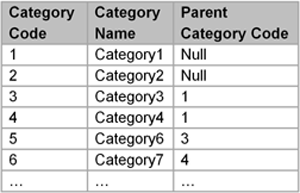

# 

 Graphical representation

__Diagram__ 

# 

 General information

|  |  |
| --- | --- |
|  Name  |  List  |
|  Also known as  |  |
|  Author(s)  |  David Carral, Pascal Hitzler, Hilmar Lapp, Sebastian Rudolph  |
|  SubmittedBy  | [David Carral](http://ontologydesignpatterns.org/wiki/index.php?title=User:David_Carral&action=edit&redlink=1 "User:David Carral (not yet written)")  |

  

# 

 Description

|  |  |
| --- | --- |
|  Motivation  |  |
|  Aim  |  The list pattern just cited provides basic building blocks for a simple tree pattern. However, we opt to change the names of the properties: It seems to be more appropriate to use "hasChild" and "hasDescendant" rather than "directlyPrecedes" and "precedes _, and to use "hasParent" and "hasAncestor"' rather than "directlyFollows" and "follows."_  |
|  Solution description  |  |
|  Elements  |  |
|  Implementation  | [http://daselab.cs.wright.edu/data/ODP-List.owl](http://daselab.cs.wright.edu/data/ODP-List.owl "http://daselab.cs.wright.edu/data/ODP-List.owl")  |
|  Reusable component  |  |
|  Component type  |  |

  

# 

 Example

|  |  |
| --- | --- |
|  Problem example  |  |
|  Pattern solution example  |  |
|  Consequences  |  |

  

# 

 Pattern reference

|  |  |
| --- | --- |
|  Origin  |  |
|  Known use  |  |
|  Reference  |  |
|  Related ODP  | [http://ontologydesignpatterns.org/wiki/Submissions:Tree\_Pattern](http://ontologydesignpatterns.org/wiki/index.php?title=Http://ontologydesignpatterns.org/wiki/Submissions:Tree_Pattern&action=edit&redlink=1 "Http://ontologydesignpatterns.org/wiki/Submissions:Tree Pattern (not yet written)")  |
|  Used in combination with  | [http://ontologydesignpatterns.org/wiki/Submissions:Tree\_Pattern](http://ontologydesignpatterns.org/wiki/index.php?title=Http://ontologydesignpatterns.org/wiki/Submissions:Tree_Pattern&action=edit&redlink=1 "Http://ontologydesignpatterns.org/wiki/Submissions:Tree Pattern (not yet written)")  |
|  Test  |  |

# 

 Additional information

# 

 Scenarios

__Scenarios about List 2__ 

 No scenario is added to this Content OP.
 

# 

 Reviews

__Reviews about List 2__ 

 There is no review about this proposal.
This revision (revision ID
 __13248__ 
 ) takes in account the reviews: none
 

 Other info at
 [evaluation tab](http://ontologydesignpatterns.org/wiki/index.php?title=Submissions:List_2&action=evaluation "http://ontologydesignpatterns.org/wiki/index.php?title=Submissions:List_2&action=evaluation") 

  

# 

 Modeling issues

__Modeling issues about List 2__ 

 There is no Modeling issue related to this proposal.
 

  

# 

 References

  

|  |  Submission to event [WOP 2017](http://ontologydesignpatterns.org/wiki/index.php?title=WOP_2017&action=edit&redlink=1 "WOP 2017 (not yet written)")  |
| --- | --- |