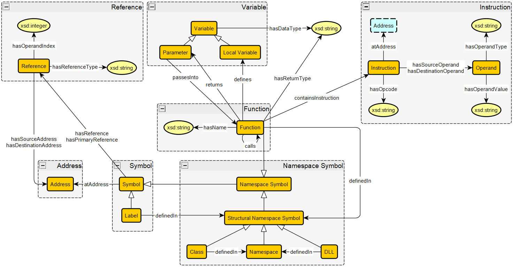

# MalwareAnalysisGhidraExecutables Ontology Design Pattern

## Description
The MalwareAnalysisGhidraExecutables ODP models the symbol table of an executable provided from Ghidra's analysis of an executable.

The pattern distinguishes between the different symbols from an executable like functions, labels, DLLs, classes, and namespaces, and how they connect within the executable. It also represents the assembly level through instructions and signifies the list of instructions contained in each function.
|  |  |
| --- | --- |
|  Name: |  MalwareAnalysisGhidraExecutables |
|  Submitted by: | Emily Miller [(22lavonne)](https://github.com/22lavonne) and Cogan Shimizu [(cogan-shimzu)](https://github.com/cogan-shimizu) |
|  Competency Questions: | Can the ontology detect malicious persistent API calls within the executable? Is there any suspicious networking activity within the executable? Are there any indirect control flow patterns in the executable file indicating vulnerable code? Can sections of entropy be detected through the ratio of unique opcodes and total number of instructions in a function? Can patterns of self referential decode loops be found to detect data obfuscation? Can the ontology detect file system abuse? Are there any suspicious jumps into memory in the executable? Are there any other suspicious API calles contained in the executable file? Is there cryptographic activity within the executable, that can indicate encryption to hide parts of the program? What percentage of the functions in the binary file are imported (are external)? |
|  Reusable OWL Building Block: | [MalwareAnalysisGhidraExecutables.ttl](MalwareAnalysisGhidraExecutables.ttl) |
|  Consequences: | Symbols have varying subclasses based on their structure, where functions are namespace symbols since they act as a namespace for variables, and classes, namespaces, and DLLs are structural namespace symbols because they act as a namespace for functions and other symbols. The ontology can be used to represent both EXE and ELF executable formats, as well as both x86 and ARM architectures.|
|  Scenarios: | The executable X contains a symbol Y. A symbol X has a primary reference Y, and can have other non-primary references. A symbol X is associated with a memory address Y. A class or DLL X is defined in a namespace Y. A label X is defined in a structural namespace symbol Y. A function X is defined in a structural namespace symbol Y. A function X contains an assembly instruction Y. A function X can define a local Variable Y. A function X can have a passed in parameter Y, and returns a parameter Z. |

## Schema Diagram
The diagram follows the [Modular Ontology Modeling methodology notation](https://journals.sagepub.com/doi/10.3233/SW-222886). 

