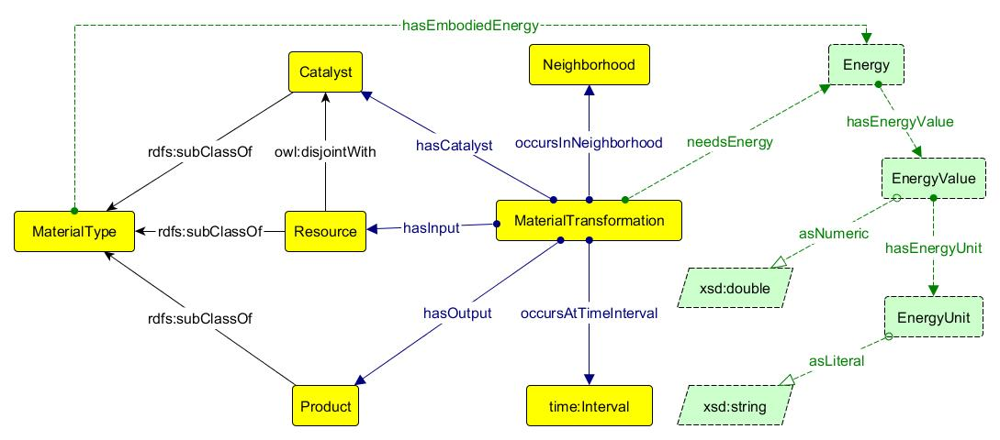

# 

 Graphical representation

__Diagram__ 

# 

 General description

|  |  |
| --- | --- |
|  Name:  |  Material Transformation  |
|  Submitted by:  | [AdilaKrisnadhi](../User/AdilaKrisnadhi.md "User:AdilaKrisnadhi")  |
|  Also Known As:  |  |
|  Intent:  |  To contextualize the transformation process from raw components and the required equipment to a final manufactured artifact.  |
|  Domains:  | [Manufacturing](../Community/Manufacturing.md "Community:Manufacturing")  , [Chemistry](../Community/Chemistry.md "Community:Chemistry")  , [Workflow](../Community/Workflow.md "Community:Workflow")  , [Ecology](../Community/Ecology.md "Community:Ecology")  |
|  Competency Questions:  | <li>       What material resources were required to produce a product?      </li><li>       Where did the transformation take place?      </li><li>       What was the time necessary for the transformation?      </li><li>       What other materials or conditions were necessary for the transformation process to occur?      </li><li>       What materials change during the transformation?      </li> |
|  Solution description:  |  The pattern models a material transformation as something that has inputs and catalysts, and produces some outputs. All inputs, catalysts and outputs are material, and within them, embodied energy may be described.  |
|  Reusable OWL Building Block:  | [https://raw.githubusercontent.com/Vocamp/MaterialTransformation/master/owl/MaterialTransformationPattern.owl](http://ontologydesignpatterns.org/wiki/index.php?title=Special:ClickHandler&link=https://raw.githubusercontent.com/Vocamp/MaterialTransformation/master/owl/MaterialTransformationPattern.owl&message=OWL building block&from_page_id=3715&update=)  (0)  |
|  Consequences:  |  This is not a very generic pattern describing a change of states. It may not be applicable to broader types of transformation, like change of money, or change of political affiliations, etc. However, an instance of this pattern may be chained with another instance of this pattern or an instance of semantic trajectory.  |
|  Scenarios:  |  A pile of wood is transformed into ash by burning. Emboddied energy involved in the process of mixing aggregate, water, cement and other binders to create concrete. Materials required to construct a manufactured artifact such as a window (glass, wood, aluminum).  |
|  Known Uses:  |  |
|  Web References:  |  |
|  Other References:  |  |
|  Examples (OWL files):  |  |
|  Extracted From:  |  |
|  Reengineered From:  |  |
|  Has Components:  |  |
|  Specialization Of:  |  |
|  Related CPs:  |  |

  

# 

 Elements

_The
 __Material Transformation__ 
 Content OP locally defines the following ontology elements:_ 

__hasCatalyst__ 
 (owl:ObjectProperty)
 

_[hasCatalyst](./Material_Transformation/hasCatalyst.md "Submissions:Material Transformation/hasCatalyst") 
 page_ 

__hasEmbodiedEnergy__ 
 (owl:ObjectProperty)
 

_[hasEmbodiedEnergy](./Material_Transformation/hasEmbodiedEnergy.md "Submissions:Material Transformation/hasEmbodiedEnergy") 
 page_ 

__hasEnergyUnit__ 
 (owl:ObjectProperty)
 

_[hasEnergyUnit](./Material_Transformation/hasEnergyUnit.md "Submissions:Material Transformation/hasEnergyUnit") 
 page_ 

__hasEnergyValue__ 
 (owl:ObjectProperty)
 

_[hasEnergyValue](./Material_Transformation/hasEnergyValue.md "Submissions:Material Transformation/hasEnergyValue") 
 page_ 

__hasInput__ 
 (owl:ObjectProperty)
 

_[hasInput](./Material_Transformation/hasInput.md "Submissions:Material Transformation/hasInput") 
 page_ 

__hasOutput__ 
 (owl:ObjectProperty)
 

_[hasOutput](./Material_Transformation/hasOutput.md "Submissions:Material Transformation/hasOutput") 
 page_ 

__needsEnergy__ 
 (owl:ObjectProperty)
 

_[needsEnergy](./Material_Transformation/needsEnergy.md "Submissions:Material Transformation/needsEnergy") 
 page_ 

__occursAtTimeInterval__ 
 (owl:ObjectProperty)
 

_[occursAtTimeInterval](./Material_Transformation/occursAtTimeInterval.md "Submissions:Material Transformation/occursAtTimeInterval") 
 page_ 

__occursInNeighborhood__ 
 (owl:ObjectProperty)
 

_[occursInNeighborhood](./Material_Transformation/occursInNeighborhood.md "Submissions:Material Transformation/occursInNeighborhood") 
 page_ 

__asLiteral__ 
 (owl:DatatypeProperty)
 

_[asLiteral](./Material_Transformation/asLiteral.md "Submissions:Material Transformation/asLiteral") 
 page_ 

__asNumeric__ 
 (owl:DatatypeProperty)
 

_[asNumeric](./Material_Transformation/asNumeric.md "Submissions:Material Transformation/asNumeric") 
 page_ 

__Catalyst__ 
 (owl:Class)
 

_[Catalyst](./Material_Transformation/Catalyst.md "Submissions:Material Transformation/Catalyst") 
 page_ 

__Energy__ 
 (owl:Class)
 

_[Energy](./Material_Transformation/Energy.md "Submissions:Material Transformation/Energy") 
 page_ 

__EnergyUnit__ 
 (owl:Class)
 

_[EnergyUnit](./Material_Transformation/EnergyUnit.md "Submissions:Material Transformation/EnergyUnit") 
 page_ 

__EnergyValue__ 
 (owl:Class)
 

_[EnergyValue](./Material_Transformation/EnergyValue.md "Submissions:Material Transformation/EnergyValue") 
 page_ 

__MaterialTransformation__ 
 (owl:Class)
 

_[MaterialTransformation](./Material_Transformation/MaterialTransformation.md "Submissions:Material Transformation/MaterialTransformation") 
 page_ 

__MaterialType__ 
 (owl:Class)
 

_[MaterialType](./Material_Transformation/MaterialType.md "Submissions:Material Transformation/MaterialType") 
 page_ 

__Neighborhood__ 
 (owl:Class)
 

_[Neighborhood](./Material_Transformation/Neighborhood.md "Submissions:Material Transformation/Neighborhood") 
 page_ 

__Product__ 
 (owl:Class)
 

_[Product](./LCA_Pattern/Product.md "Submissions:Material Transformation/Product") 
 page_ 

__Resource__ 
 (owl:Class)
 

_[Resource](./AquaticResourceObservation/AquaticResource.md "Submissions:Material Transformation/Resource") 
 page_ 

# 

 Additional information

 There are two axioms that we need in this pattern but not expressible in OWL. 
The first says that there is at least one of the input that is not in the output of the transformation, which cannot be expressed in FOL as the formula:
ALL x.( MaterialTransformation(x) IMPLIES Exists y.(hasInput(x,y) AND NOT hasOutput(x,y) ) )
The second states that there is at least one of the output that is not part of the input of the transformation:
ALL x.( MaterialTransformation(x) IMPLIES Exists y.(hasOutput(x,y) AND NOT hasInput(x,y) ) )
Thus, this OWL encoding does not contain any axiom expressing the above two.
 

 A full description of the pattern can be found in the SWJ publication "An Ontology Design Pattern and Its Use Case for Modeling Material Transformation".
 [http://www.semantic-web-journal.net/content/ontology-design-pattern-and-its-use-case-modeling-material-transformation-1](http://www.semantic-web-journal.net/content/ontology-design-pattern-and-its-use-case-modeling-material-transformation-1 "http://www.semantic-web-journal.net/content/ontology-design-pattern-and-its-use-case-modeling-material-transformation-1") 

# 

 Scenarios

__Scenarios about Material Transformation__ 

 No scenario is added to this Content OP.
 

# 

 Reviews

__Reviews about Material Transformation__ 

 There is no review about this proposal.
This revision (revision ID
 __13251__ 
 ) takes in account the reviews: none
 

 Other info at
 [evaluation tab](http://ontologydesignpatterns.org/wiki/index.php?title=Submissions:Material_Transformation&action=evaluation "http://ontologydesignpatterns.org/wiki/index.php?title=Submissions:Material_Transformation&action=evaluation") 

  

# 

 Modeling issues

__Modeling issues about Material Transformation__ 

 There is no Modeling issue related to this proposal.
 

  

# 

 References

* Semantic Web Journal Paper [Journal Paper](http://www.semantic-web-journal.net "http://www.semantic-web-journal.net")  | [reference page](../Community/References/SWJ_Paper.md "Community:References/SWJ Paper")* Material Transformation Peer Reviewed SWJ Paper "An Ontology Design Pattern and Its Use Case for Modeling Material Transformation" [Journal Paper](http://www.semantic-web-journal.net/content/ontology-design-pattern-and-its-use-case-modeling-material-transformation-1 "http://www.semantic-web-journal.net/content/ontology-design-pattern-and-its-use-case-modeling-material-transformation-1")  | [reference page](../Community/References/SWJ_Paper_2.md "Community:References/SWJ Paper 2")

  

|  |  Submission to event [WOP 2014](http://ontologydesignpatterns.org/wiki/index.php?title=WOP_2014&action=edit&redlink=1 "WOP 2014 (not yet written)")  |
| --- | --- |