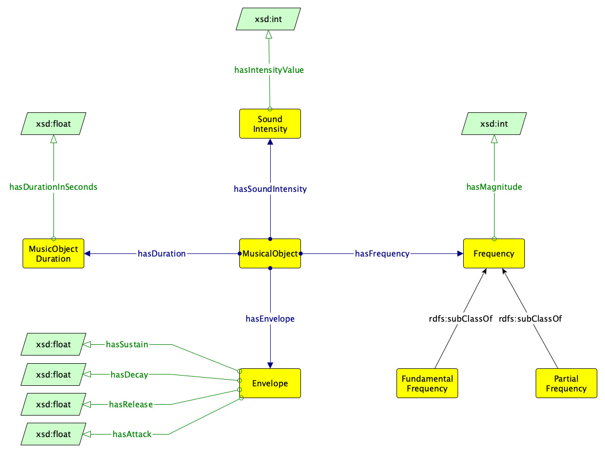

# 

 Graphical representation

__Diagram__ 

# 

 General description

|  |  |
| --- | --- |
|  Name:  |  musicalobject  |
|  Submitted by:  | [AndreaPoltronieri](../User/AndreaPoltronieri "User:AndreaPoltronieri")  |
|  Also Known As:  |  |
|  Intent:  |  This content ODP models the acoustic features of a music note played in a performance.  |
|  Domains:  | [Music](../Community/Music "Community:Music")  |
|  Competency Questions:  | <li>       what is the fundamental frequency of a musical object?      </li><li>       what are the different frequencies that make up the spectrum of a musical object?      </li><li>       what is the duration in seconds of a musical object      </li><li>       in a given performance?      </li><li>       how is the envelope of a musical object shaped?      </li> |
|  Solution description:  |  The pattern models the physical characteristics that can be extracted from the sound wave produced by an instrument playing a musical note. The MusicalObject class is connected to four classes that describe these physical characteristics, namely duration, sound intensity, frequency and envelope. The MusicObjectDuration class expresses the duration in seconds of the musical object, by means of the object property hasDurationInSeconds. In the same way, the musical intensity is modelled via the SoundIntensity class. Frequency is modelled by means of the class Frequency and its sub-classes FundamentalFrequency and PartialFrequency. For each expressed frequency, the magnitude of the frequency is also indicated using the hasFrequencyMagnitude object property. Finally, the Envelope class is connected to four object properties that describe the envelope of the waveform according to the ADSR model, namely hasAttack, hasSustain, hasDecay and hasRelease.  |
|  Reusable OWL Building Block:  | [https://purl.org/andreapoltronieri/musicalobject](http://ontologydesignpatterns.org/wiki/index.php?title=Special:ClickHandler&link=https://purl.org/andreapoltronieri/musicalobject&message=OWL building block&from_page_id=4791&update=)  (0)  |
|  Consequences:  |  |
|  Scenarios:  |  |
|  Known Uses:  |  |
|  Web References:  |  |
|  Other References:  |  |
|  Examples (OWL files):  |  |
|  Extracted From:  |  |
|  Reengineered From:  |  |
|  Has Components:  |  |
|  Specialization Of:  |  |
|  Related CPs:  | <li><a class="new" href="http://ontologydesignpatterns.org/wiki/index.php?title=Submissions:Http://ontologydesignpatterns.org/wiki/Submissions:Notepattern&amp;action=edit&amp;redlink=1" title="Submissions:Http://ontologydesignpatterns.org/wiki/Submissions:Notepattern (not yet written)">        Submissions:http://ontologydesignpatterns.org/wiki/Submissions:Notepattern       </a></li><li><a class="new" href="http://ontologydesignpatterns.org/wiki/index.php?title=Submissions:Submissions:http://ontologydesignpatterns.org/wiki/Submissions:Scorepart&amp;action=edit&amp;redlink=1" title="Submissions:Submissions:http://ontologydesignpatterns.org/wiki/Submissions:Scorepart (not yet written)">        Submissions:Submissions:http://ontologydesignpatterns.org/wiki/Submissions:Scorepart       </a></li> |

  

# 

 Elements

_The
 __Musicalobject__ 
 Content OP locally defines the following ontology elements:_ 

__Envelope__ 
 (owl:Class) The envelope of a musical object's soundwave. In physics and engineering, the envelope of an oscillating signal is a smooth curve outlining its extremes.
 

_[Envelope](../Submissions/Musicalobject/Envelope "Submissions:Musicalobject/Envelope") 
 page_ 

__Frequency__ 
 (owl:Class) The frequency of a musical object.
 

_[Frequency](../Submissions/Musicalobject/Frequency "Submissions:Musicalobject/Frequency") 
 page_ 

__FundamentalFrequency__ 
 (owl:Class) The foundamental frequency of a musical object. The fundamental frequency is defined as the frequency of the lowest constituing partial of a signal.
 

_[FundamentalFrequency](../Submissions/Musicalobject/FundamentalFrequency "Submissions:Musicalobject/FundamentalFrequency") 
 page_ 

__PartialFrequency__ 
 (owl:Class) A frequency other than the foundamental Frequencyuency.
 

_[PartialFrequency](../Submissions/Musicalobject/PartialFrequency "Submissions:Musicalobject/PartialFrequency") 
 page_ 

__MusicalObject__ 
 (owl:Class) A musical object is the result of the realisation of a set of instructions that the musician or a computer system uses to realise a piece of music (e.g. music notation).
 

_[MusicalObject](../Submissions/Musicalobject/MusicalObject "Submissions:Musicalobject/MusicalObject") 
 page_ 

__MusicalObjectDuration__ 
 (owl:Class) The duration of a musical object.
 

_[MusicalObjectDuration](../Submissions/Musicalobject/MusicalObjectDuration "Submissions:Musicalobject/MusicalObjectDuration") 
 page_ 

__SoundIntensity__ 
 (owl:Class) The intensity of the sound produced by a musical object.
 

_[SoundIntensity](../Submissions/Musicalobject/SoundIntensity "Submissions:Musicalobject/SoundIntensity") 
 page_ 

__hasDuration__ 
 (owl:ObjectProperty) Connects a musical object to its duration.
 

_[hasDuration](../Submissions/Musicalobject/hasDuration "Submissions:Musicalobject/hasDuration") 
 page_ 

__hasEnvelope__ 
 (owl:ObjectProperty) Connects a musical object to the envelope of the soundwave it produces.
 

_[hasEnvelope](../Submissions/Musicalobject/hasEnvelope "Submissions:Musicalobject/hasEnvelope") 
 page_ 

__hasFrequency__ 
 (owl:ObjectProperty) Connects a musical object to the frequencies it produces.
 

_[hasFrequency](../Submissions/Musicalobject/hasFrequency "Submissions:Musicalobject/hasFrequency") 
 page_ 

__hasSoundIntensity__ 
 (owl:ObjectProperty) Connects a musical object to the sound intensity produced.
 

_[hasSoundIntensity](../Submissions/Musicalobject/hasSoundIntensity "Submissions:Musicalobject/hasSoundIntensity") 
 page_ 

__isDurationOf__ 
 (owl:ObjectProperty) Inverse of hasDuration. Connects the duration of a musical event to the musical event itself.
 

_[isDurationOf](../Submissions/Musicalobject/isDurationOf "Submissions:Musicalobject/isDurationOf") 
 page_ 

__isEnvelopeOf__ 
 (owl:ObjectProperty) Inverse of hasEvelope. Connects the envelope of a musical event to the musical event itself.
 

_[isEnvelopeOf](../Submissions/Musicalobject/isEnvelopeOf "Submissions:Musicalobject/isEnvelopeOf") 
 page_ 

__isFrequencyOf__ 
 (owl:ObjectProperty) Inverse of hasFrequency. Connects the frequency of a musical event to the musical event itself.
 

_[isFrequencyOf](../Submissions/Musicalobject/isFrequencyOf "Submissions:Musicalobject/isFrequencyOf") 
 page_ 

__isSoundIntensityOf__ 
 (owl:ObjectProperty) Inverse of hasSoundIntensity. Connects the sound intensity of a musical event to the musical event itself.
 

_[isSoundIntensityOf](../Submissions/Musicalobject/isSoundIntensityOf "Submissions:Musicalobject/isSoundIntensityOf") 
 page_ 

__hasAttack__ 
 (owl:DatatypeProperty) Describes the attack time (expressed in seconds) of the soundwave's envelope, according to the ADSR model.
 

_[hasAttack](../Submissions/Musicalobject/hasAttack "Submissions:Musicalobject/hasAttack") 
 page_ 

__hasDecay__ 
 (owl:DatatypeProperty) Describes the decay time (epressed in seconds) of the soundwave's envelope, according to the ADSR model.
 

_[hasDecay](../Submissions/Musicalobject/hasDecay "Submissions:Musicalobject/hasDecay") 
 page_ 

__hasDurationInSeconds__ 
 (owl:DatatypeProperty) Expresses the duration in seconds of a musical object.
 

_[hasDurationInSeconds](../Submissions/Musicalobject/hasDurationInSeconds "Submissions:Musicalobject/hasDurationInSeconds") 
 page_ 

__hasFrequencyMagnitude__ 
 (owl:DatatypeProperty) The amplitude of a frequency component of a complex sound.
 

_[hasFrequencyMagnitude](../Submissions/Musicalobject/hasFrequencyMagnitude "Submissions:Musicalobject/hasFrequencyMagnitude") 
 page_ 

__hasIntensityValue__ 
 (owl:DatatypeProperty) The value of the sound intensity of a musical object.
 

_[hasIntensityValue](../Submissions/Musicalobject/hasIntensityValue "Submissions:Musicalobject/hasIntensityValue") 
 page_ 

__hasRelease__ 
 (owl:DatatypeProperty) Describes the release time (epressed in seconds) of the soundwave's envelope, according to the ADSR model.
 

_[hasRelease](../Submissions/Musicalobject/hasRelease "Submissions:Musicalobject/hasRelease") 
 page_ 

__hasSustain__ 
 (owl:DatatypeProperty) Describes the sustain time (epressed in seconds) of the soundwave's envelope, according to the ADSR model.
 

_[hasSustain](../Submissions/Musicalobject/hasSustain "Submissions:Musicalobject/hasSustain") 
 page_ 

# 

 Additional information

# 

 Scenarios

__Scenarios about Musicalobject__ 

 No scenario is added to this Content OP.
 

# 

 Reviews

__Reviews about Musicalobject__ 

 There is no review about this proposal.
This revision (revision ID
 __14258__ 
 ) takes in account the reviews: none
 

 Other info at
 [evaluation tab](http://ontologydesignpatterns.org/wiki/index.php?title=Submissions:Musicalobject&action=evaluation "http://ontologydesignpatterns.org/wiki/index.php?title=Submissions:Musicalobject&action=evaluation") 

  

# 

 Modeling issues

__Modeling issues about Musicalobject__ 

 There is no Modeling issue related to this proposal.
 

  

# 

 References