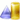

# 

 Graphical representation

__Diagram__ 

# 

 General description

|  |  |
| --- | --- |
|  Name:  |  Nary Participation  |
|  Submitted by:  | [AldoGangemi](../User/AldoGangemi "User:AldoGangemi")  |
|  Also Known As:  |  |
|  Intent:  |  To represent events with their participants, time, space, etc.  |
|  Domains:  | [General](../Community/General "Community:General")  |
|  Competency Questions:  | <li>       What are the participants in that event at this time?      </li><li>       What events had what participants in that location?      </li> |
|  Solution description:  |  ---  |
|  Reusable OWL Building Block:  | [http://www.ontologydesignpatterns.org/cp/owl/naryparticipation.owl](http://ontologydesignpatterns.org/wiki/index.php?title=Special:ClickHandler&link=http://www.ontologydesignpatterns.org/cp/owl/naryparticipation.owl&message=OWL building block&from_page_id=441&update=)  (801)  |
|  Consequences:  |  All sorts of relations denoting events with multiple participants, space-time indexing, etc. can be represented with this pattern. When objects participate at the event at different times or with different parts, more elementary nary-participation instances must be created, and made parts of the main one.  |
|  Scenarios:  |  The match lasted 95 minutes, and the winner used a new nano-carbon racquet.  |
|  Known Uses:  |  |
|  Web References:  |  |
|  Other References:  |  |
|  Examples (OWL files):  | <li><a class="external free" href="http://www.ontologydesignpatterns.org/cp/examples/naryparticipation/naryparticipationex.owl" rel="nofollow" title="http://www.ontologydesignpatterns.org/cp/examples/naryparticipation/naryparticipationex.owl">        http://www.ontologydesignpatterns.org/cp/examples/naryparticipation/naryparticipationex.owl       </a></li> |
|  Extracted From:  | <li><a class="external free" href="http://www.loa.cnr.it/ontologies/DUL.owl" rel="nofollow" title="http://www.loa.cnr.it/ontologies/DUL.owl">        http://www.loa.cnr.it/ontologies/DUL.owl       </a></li> |
|  Reengineered From:  |  |
|  Has Components:  | <li><a href="Submissions%253AParticipation.html" title="Submissions:Participation">        Submissions:Participation       </a></li><li><a href="Submissions%253ATimeInterval.html" title="Submissions:TimeInterval">        Submissions:TimeInterval       </a></li> |
|  Specialization Of:  | <li><a href="Submissions%253ASituation.html" title="Submissions:Situation">        Submissions:Situation       </a></li> |
|  Related CPs:  | <li><a href="Submissions%253ACo-participation.html" title="Submissions:Co-participation">        Submissions:Co-participation       </a></li><li><a href="Submissions%253AParticipation.html" title="Submissions:Participation">        Submissions:Participation       </a></li> |

  

# 

 Elements

_The
 __Nary Participation__ 
 Content OP locally defines the following ontology elements:_ 

__NaryParticipation__ 
 (owl:Class) The reified class of n-ary participation relations, e.g. "prepare a coffee with coffee pot".
 

_[NaryParticipation](../Submissions/Nary_Participation/NaryParticipation "Submissions:Nary Participation/NaryParticipation") 
 page_ 

__participationIncludes__ 
 (owl:ObjectProperty) The relation holding between an
 [NaryParticipation](../Submissions/Nary_Participation/NaryParticipation "Submissions:Nary Participation/NaryParticipation") 
 and any
 [Entity](../Submissions/Situation/Entity "Submissions:Situation/Entity") 
 .
 

_[participationIncludes](../Submissions/Nary_Participation/participationIncludes "Submissions:Nary Participation/participationIncludes") 
 page_ 

__isIncludedInParticipation__ 
 (owl:ObjectProperty) The relation holding between any
 [Entity](../Submissions/Situation/Entity "Submissions:Situation/Entity") 
 and a
 [NaryParticipation](../Submissions/Nary_Participation/NaryParticipation "Submissions:Nary Participation/NaryParticipation") 
 .
 

_[isIncludedInParticipation](../Submissions/Nary_Participation/isIncludedInParticipation "Submissions:Nary Participation/isIncludedInParticipation") 
 page_ 

# 

 Additional information

# 

 Scenarios

__Scenarios about Nary Participation__ 

 No scenario is added to this Content OP.
 

# 

 Reviews

__Reviews about Nary Participation__ 

 There is no review about this proposal.
This revision (revision ID
 __9105__ 
 ) takes in account the reviews: none
 

 Other info at
 [evaluation tab](http://ontologydesignpatterns.org/wiki/index.php?title=Submissions:Nary_Participation&action=evaluation "http://ontologydesignpatterns.org/wiki/index.php?title=Submissions:Nary_Participation&action=evaluation") 

  

# 

 Modeling issues

__Modeling issues about Nary Participation__ 

 There is no Modeling issue related to this proposal.
 

  

# 

 References