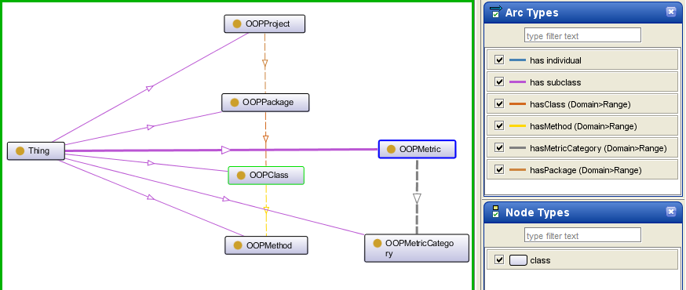

# 

 Graphical representation

__Diagram__ 

# 

 General description

|  |  |
| --- | --- |
|  Name:  |  OOPMetrics  |
|  Submitted by:  | [IonelVirgilPop](../User/IonelVirgilPop "User:IonelVirgilPop")  |
|  Also Known As:  |  |
|  Intent:  |  To represent software metrics especially for the purpose of detecting design-flaws in software systems based on these metrics. This is useful for re-engineering the software system., De a reprezenta metricile soft in special in scopul detectarii defectelor de proiectare din sistemele soft pe baza acestor metrici. Acest lucru este folositor pentru reingineria sistemului soft.  |
|  Domains:  | [Software Engineering](../Community/Software_Engineering "Community:Software Engineering")  |
|  Competency Questions:  | <li>       What are the software metrics for a particular project/package/class/method?      </li> Knowing the software metrics <li>       is there a design-flaw in the software system?      </li><li>       Care sunt metricile soft pentru un anumit proiect/pachet/clasa/metoda?      </li> Cunoscand metricile soft <li>       exista un defect de proiectare in sistemul soft?      </li> |
|  Solution description:  |  This is an ontology pattern that represents software metrics for OOP. The unit test present in the ontology pattern shows how an ontology that uses this pattern can be queried to satisfy the scenario.  |
|  Reusable OWL Building Block:  | [http://www.cs.ubbcluj.ro/~ivpop/ontologies/oopmetrics.owl](http://ontologydesignpatterns.org/wiki/index.php?title=Special:ClickHandler&link=http://www.cs.ubbcluj.ro/~ivpop/ontologies/oopmetrics.owl&message=OWL building block&from_page_id=3324&update=)  (1018)  |
|  Consequences:  |  Software anti-patterns (design-flaws) can be detected based on software metrics by using this ontology pattern., Anti-sabloanele (defectele de proiectare) soft pot fi detectate pe baza metricior soft daca se foloseste aceasta ontologie sablon.  |
|  Scenarios:  |  Find if a class (or which class) is a God Class based on it's metrics., Gaseste daca o clasa (sau care clasa) se inscrie in anti-sablonul "God Class" pe baza metricilor ei.  |
|  Known Uses:  |  |
|  Web References:  |  |
|  Other References:  |  |
|  Examples (OWL files):  |  |
|  Extracted From:  |  |
|  Reengineered From:  |  |
|  Has Components:  |  |
|  Specialization Of:  |  |
|  Related CPs:  |  |

  

# 

 Elements

_The
 __OOPMetrics__ 
 Content OP locally defines the following ontology elements:_ 

__hasInitialReleaseDate__ 
 (owl:AnnotationProperty)
 

_[hasInitialReleaseDate](../Submissions/OOPMetrics/hasInitialReleaseDate "Submissions:OOPMetrics/hasInitialReleaseDate") 
 page_ 

__hasAuthor__ 
 (owl:AnnotationProperty)
 

_[hasAuthor](../Submissions/OOPMetrics/hasAuthor "Submissions:OOPMetrics/hasAuthor") 
 page_ 

__hasMention__ 
 (owl:AnnotationProperty)
 

_[hasMention](../Submissions/OOPMetrics/hasMention "Submissions:OOPMetrics/hasMention") 
 page_ 

__hasClass__ 
 (owl:ObjectProperty) Refers to an OOPClass from an OOPPackage.
 
  

 Se refera la o OOPClass dintr-un OOPPackage.
 

_[hasClass](../Submissions/OOPMetrics/hasClass "Submissions:OOPMetrics/hasClass") 
 page_ 

__hasMethod__ 
 (owl:ObjectProperty) Refers to an OOPMethod from an OOPClass.
 
  

 Se refera la o OOPMethod dintr-o OOPClass.
 

_[hasMethod](../Submissions/OOPMetrics/hasMethod "Submissions:OOPMetrics/hasMethod") 
 page_ 

__hasMetric__ 
 (owl:ObjectProperty) Refers to a software metric that an OOPProject/OOPPackage/OOPClass/OOPMethod has.
 
  

 Se refera la o metrica soft pe care o are un/o OOPProject/OOPPackage/OOPClass/ OOPMethod.
 

_[hasMetric](../Submissions/OOPMetrics/hasMetric "Submissions:OOPMetrics/hasMetric") 
 page_ 

__hasMetricCategory__ 
 (owl:ObjectProperty) Each software metric has an OOPMetricCategory. The category to which it belongs is specified by the hasMetricCategory property.
 
  

 Fiecare metrica soft are o categorie OOPMetricCategory. Categoria de care apartine este specificata prin intermediul proprietatii hasMetricCategory.
 

_[hasMetricCategory](../Submissions/OOPMetrics/hasMetricCategory "Submissions:OOPMetrics/hasMetricCategory") 
 page_ 

__hasPackage__ 
 (owl:ObjectProperty) Refers to an OOPPackage from an OOPProject.
 
  

 Se refera la un OOPPackage dintr-un OOPProject.
 

_[hasPackage](../Submissions/OOPMetrics/hasPackage "Submissions:OOPMetrics/hasPackage") 
 page_ 

__hasFloatValue__ 
 (owl:DatatypeProperty) The real value of the software metric.
 
  

 Valoarea reala pentru metrica soft.
 

_[hasFloatValue](../Submissions/OOPMetrics/hasFloatValue "Submissions:OOPMetrics/hasFloatValue") 
 page_ 

__hasIntegerValue__ 
 (owl:DatatypeProperty) The integer value of the software metric.
 
  

 Valoarea intreaga pentru metrica soft.
 

_[hasIntegerValue](../Submissions/OOPMetrics/hasIntegerValue "Submissions:OOPMetrics/hasIntegerValue") 
 page_ 

__hasLongName__ 
 (owl:DatatypeProperty) The full name of the category of software metric, such as: "Weighted Methods Count".
 
  

 Numele complet pentru categoria de metrica soft, cum ar fi: "Weighted Methods Count".
 

_[hasLongName](../Submissions/OOPMetrics/hasLongName "Submissions:OOPMetrics/hasLongName") 
 page_ 

__hasName__ 
 (owl:DatatypeProperty) This represents the name (more precisely the acronym) of the category of software metric. Such as: "WMC" for "Weighted Methods Count", TCC for "Tight Class Cohesion", etc.
 
  

 Aceasta reprezinta numele (mai precis acronimul) pentru categoria de metrica soft. Cum ar fi: "WMC" pentru "Weighted Methods Count", TCC pentru "Tight Class Cohesion", etc.
 

_[hasName](../Submissions/OOPMetrics/hasName "Submissions:OOPMetrics/hasName") 
 page_ 

__hasTag__ 
 (owl:DatatypeProperty) A numerical value representing the category of software metric.
 
  

 O valoare numerica reprezentand categoria metricii soft.
 

_[hasTag](../Submissions/OOPMetrics/hasTag "Submissions:OOPMetrics/hasTag") 
 page_ 

__OOPClass__ 
 (owl:Class) This represents the "class" concept from object-oriented programming.
 
  

 Aceasta reprezinta conceptul "clasa" din programarea orientata obiect.
 

_[OOPClass](../Submissions/OOPMetrics/OOPClass "Submissions:OOPMetrics/OOPClass") 
 page_ 

__OOPMethod__ 
 (owl:Class) This represents the "method" concept from object-oriented programming.
 
  

 Aceasta reprezinta conceptul "metoda" din programarea orientata obiect.
 

_[OOPMethod](../Submissions/OOPMetrics/OOPMethod "Submissions:OOPMetrics/OOPMethod") 
 page_ 

__OOPMetric__ 
 (owl:Class) This represents a software metric specific to object-oriented programming.
 
  

 Aceasta reprezinta o metrica soft specifica programarii orientate obiect.
 

_[OOPMetric](../Submissions/OOPMetrics/OOPMetric "Submissions:OOPMetrics/OOPMetric") 
 page_ 

__OOPMetricCategory__ 
 (owl:Class) Each software metric belongs in an OOPMetricCategory.
 
  

 Fiecare metrica soft apartine unei categorii OOPMetricCategory.
 

_[OOPMetricCategory](../Submissions/OOPMetrics/OOPMetricCategory "Submissions:OOPMetrics/OOPMetricCategory") 
 page_ 

__OOPPackage__ 
 (owl:Class) This represents the "package" concept from object-oriented programming.
 
  

 Aceasta reprezinta conceptul "pachet" din programarea orientata obiect.
 

_[OOPPackage](../Submissions/OOPMetrics/OOPPackage "Submissions:OOPMetrics/OOPPackage") 
 page_ 

__OOPProject__ 
 (owl:Class) This represents a software project.
 
  

 Aceasta reprezinta un proiect soft.
 

_[OOPProject](../Submissions/OOPMetrics/OOPProject "Submissions:OOPMetrics/OOPProject") 
 page_ 

  

# 

 Additional information

 Note from the author to the evaluators: the title of the related article is: "An Ontology Pattern for Software Metrics", submission 21.
 

# 

 Scenarios

__Scenarios about OOPMetrics__ 

 No scenario is added to this Content OP.
 

# 

 Reviews

__Reviews about OOPMetrics__ 

|  Review article  | [Posted on](../Property/CreationDate "Property:CreationDate")  | [About revision (current is 11206)](../Property/ReviewAboutVersion "Property:ReviewAboutVersion")  |
| --- | --- | --- |
| [MariaPoveda about OOPMetrics](../Reviews/MariaPoveda_about_OOPMetrics "Reviews:MariaPoveda about OOPMetrics")  |  2456161  21 August 2012  |  11161  11,161  |
| [RinkeHoekstra about OOPMetrics](../Reviews/RinkeHoekstra_about_OOPMetrics "Reviews:RinkeHoekstra about OOPMetrics")  |  2456161  21 August 2012  |  11169  11,169  |

 This revision (revision ID
 __11206__ 
 ) takes in account the reviews:
 [MariaPoveda about OOPMetrics](../Reviews/MariaPoveda_about_OOPMetrics "Reviews:MariaPoveda about OOPMetrics") 
 ,
 [RinkeHoekstra about OOPMetrics](../Reviews/RinkeHoekstra_about_OOPMetrics "Reviews:RinkeHoekstra about OOPMetrics") 

 Other info at
 [evaluation tab](http://ontologydesignpatterns.org/wiki/index.php?title=Submissions:OOPMetrics&action=evaluation "http://ontologydesignpatterns.org/wiki/index.php?title=Submissions:OOPMetrics&action=evaluation") 

  

# 

 Modeling issues

__Modeling issues about OOPMetrics__ 

 There is no Modeling issue related to this proposal.
 

  

# 

 References

  

|  |  Submission to event [WOP:2012](../WOP/2012 "WOP:2012")  |
| --- | --- |