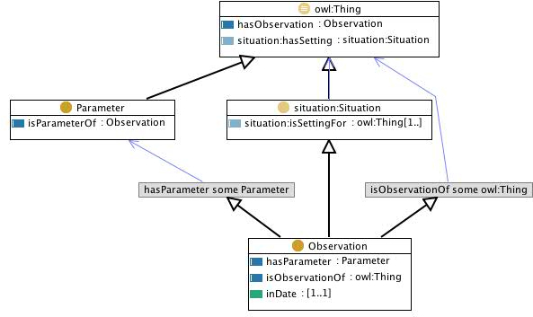
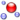

# 

 Graphical representation

__Diagram__ 

# 

 General description

|  |  |
| --- | --- |
|  Name:  |  Observation  |
|  Submitted by:  | [EvaBlomqvist](../User/EvaBlomqvist.md "User:EvaBlomqvist")  |
|  Also Known As:  |  |
|  Intent:  |  The intent of this pattern is to represent observations of things, under a set of parameters. Common parameters may be the time and place of the observation, but may be any feature that is observed concerning the specific thing being observed.  |
|  Domains:  | [General](../Community/General.md "Community:General")  , [Science](http://ontologydesignpatterns.org/wiki/Special:AddData/Domain Form/Community:Science "Community:Science (not yet written)")  |
|  Competency Questions:  | <li>       What objects have been observed? What are the observations of this object? What are the parameters under which this object was observed? What objects were observed under this parameter?      </li> |
|  Solution description:  |  ...  |
|  Reusable OWL Building Block:  | [http://www.ontologydesignpatterns.org/cp/owl/observation.owl](http://ontologydesignpatterns.org/wiki/index.php?title=Special:ClickHandler&link=http://www.ontologydesignpatterns.org/cp/owl/observation.owl&message=OWL building block&from_page_id=877&update=)  (786)  |
|  Consequences:  |  We are able to represent the parameters of observations made.  |
|  Scenarios:  |  The aquatic species 'Skipjack tuna' was observed in 2004 having the exploitation state 'fully exploited' in the climatic zone 'tropical' at the vertical distance 'pelagic'.  |
|  Known Uses:  |  |
|  Web References:  |  |
|  Other References:  |  |
|  Examples (OWL files):  |  |
|  Extracted From:  |  |
|  Reengineered From:  |  |
|  Has Components:  |  |
|  Specialization Of:  | <li><a href="../DescriptionAndSituation/DescriptionAndSituation.md" title="Submissions:Situation">        Submissions:Situation       </a></li> |
|  Related CPs:  |  |

  

# 

 Elements

_The
 __Observation__ 
 Content OP locally defines the following ontology elements:_ 

__hasObservation__ 
 (owl:ObjectProperty)
 

_[hasObservation](./Observation/hasObservation.md "Submissions:Observation/hasObservation") 
 page_ 

__hasParameter__ 
 (owl:ObjectProperty)
 

_[hasParameter](./Affordance/hasParameter.md "Submissions:Observation/hasParameter") 
 page_ 

__isObservationOf__ 
 (owl:ObjectProperty)
 

_[isObservationOf](./Observation/isObservationOf.md "Submissions:Observation/isObservationOf") 
 page_ 

__isParameterOf__ 
 (owl:ObjectProperty)
 

_[isParameterOf](./Observation/isParameterOf.md "Submissions:Observation/isParameterOf") 
 page_ 

__inDate__ 
 (owl:DatatypeProperty)
 

_[inDate](./Observation/inDate.md "Submissions:Observation/inDate") 
 page_ 

__Observation__ 
 (owl:Class) A specific situation where some thing is observed with respect ot a set of parameters.
 

_[Observation](../AquaticResourceObservation/AquaticResourceObservation.md "Submissions:Observation/Observation") 
 page_ 

__Parameter__ 
 (owl:Class) The parameters of an observation describe the context and content of the observation. For example in a medical context an observation of a patient may contain a set of symptoms, that are the parameters of that observation.
 

_[Parameter](../Parameter/Parameter.md "Submissions:Observation/Parameter") 
 page_ 

# 

 Additional information

 (type):
 [http://www.w3.org/2002/07/owl#Ontology](http://www.w3.org/2002/07/owl#Ontology "http://www.w3.org/2002/07/owl#Ontology") 

 (versionInfo): 1.0
 

 (versionInfo): Created by Eva Blomqvist
 

 (imports):
 [http://www.ontologydesignpatterns.org/cp/owl/situation.owl](http://www.ontologydesignpatterns.org/cp/owl/situation.owl "http://www.ontologydesignpatterns.org/cp/owl/situation.owl") 

# 

 Scenarios

__Scenarios about Observation__ 

 No scenario is added to this Content OP.
 

# 

 Reviews

__Reviews about Observation__ 

 There is no review about this proposal.
This revision (revision ID
 __9107__ 
 ) takes in account the reviews: none
 

 Other info at
 [evaluation tab](http://ontologydesignpatterns.org/wiki/index.php?title=Submissions:Observation&action=evaluation "http://ontologydesignpatterns.org/wiki/index.php?title=Submissions:Observation&action=evaluation") 

  

# 

 Modeling issues

__Modeling issues about Observation__ 

 There is no Modeling issue related to this proposal.
 

  

# 

 References