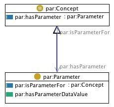

# 

 Graphical representation

__Diagram__ 

# 

 General description

|  |  |
| --- | --- |
|  Name:  |  Parameter  |
|  Submitted by:  | [AldoGangemi](../User/AldoGangemi "User:AldoGangemi")  |
|  Also Known As:  |  |
|  Intent:  |  To represent parameters to be used for a certain concept.  |
|  Domains:  | [General](../Community/General "Community:General")  |
|  Competency Questions:  |  |
|  Solution description:  |  A basic pattern to represent parameters over concepts. Implemented with simple classes and properties.  |
|  Reusable OWL Building Block:  | [http://ontologydesignpatterns.org/cp/owl/parameter.owl](http://ontologydesignpatterns.org/wiki/index.php?title=Special:ClickHandler&link=http://ontologydesignpatterns.org/cp/owl/parameter.owl&message=OWL building block&from_page_id=2202&update=)  (711)  |
|  Consequences:  |  |
|  Scenarios:  |  |
|  Known Uses:  |  |
|  Web References:  |  |
|  Other References:  |  |
|  Examples (OWL files):  |  |
|  Extracted From:  | <li><a class="external free" href="http://www.ontologydesignpatterns.org/ont/dul/DUL.owl" rel="nofollow" title="http://www.ontologydesignpatterns.org/ont/dul/DUL.owl">        http://www.ontologydesignpatterns.org/ont/dul/DUL.owl       </a></li> |
|  Reengineered From:  |  |
|  Has Components:  |  |
|  Specialization Of:  |  |
|  Related CPs:  |  |

  

# 

 Elements

_The
 __Parameter__ 
 Content OP locally defines the following ontology elements:_ 

__hasParameter__ 
 (owl:ObjectProperty) A Concept can have a Parameter that constrains the attributes that a classified Entity can have in a certain Situation, e.g. a 4WheelDriver Role definedIn the ItalianTrafficLaw has a MinimumAge parameter on the Amount 16.
 

_[hasParameter](../Submissions/Parameter/hasParameter "Submissions:Parameter/hasParameter") 
 page_ 

__isParameterFor__ 
 (owl:ObjectProperty) A Concept can have a Parameter that constrains the attributes that a classified Entity can have in a certain Situation, e.g. a 4WheelDriver Role definedIn the ItalianTrafficLaw has a MinimumAge parameter on the Amount 16.
 

_[isParameterFor](../Submissions/Parameter/isParameterFor "Submissions:Parameter/isParameterFor") 
 page_ 

__hasParameterDataValue__ 
 (owl:DatatypeProperty) Parametrizes values from a datatype. For example, a Parameter AgeForDriving hasParameterDataValue 18 on datatype xsd:int, in the Italian traffic code. In this example, AgeForDriving isDefinedIn the Norm ItalianTrafficCodeAgeDriving.
 
 More complex parametrization requires workarounds. E.g. AgeRangeForDrugUsage could parametrize data value: 14 to 50 on the datatype: xsd:int. Since complex datatypes are not allowed in OWL1.0, a solution to this can only work by creating two 'sub-parameters': MinimumAgeRangeForDrugUsage (that hasParameterDataValue 14) and MaximumAgeRangeForDrugUsage (that hasParameterDataValue 50), which are components of the main Parameter AgeRangeForDrugUsage.
 

 Ordering on subparameters can be created by using or specializing the object property 'precedes'.
 

_[hasParameterDataValue](../Submissions/Parameter/hasParameterDataValue "Submissions:Parameter/hasParameterDataValue") 
 page_ 

__Concept__ 
 (owl:Class) A concept is a SocialObject, and isDefinedIn a Description .
 
 Once defined, a Concept can be used in other descriptions.
 

 The classifies relation relates concepts to entities at some time
 

_[Concept](../Submissions/Parameter/Concept "Submissions:Parameter/Concept") 
 page_ 

__Parameter__ 
 (owl:Class) A Concept that classifies something having a certain value, e.g. 'High' can be said of people taller than 185 cm.
 
 However, in order to formally represent this constraint, we need to add an anonymous type to a parameter instance, using a property that convey the semantics of the parameter, e.g.:
 

 High rdf:type Person and (some hasHeight (Height and (oneOf isTallerThan 185) and (oneOf hasUnitOfMeasure centimeter)))
 

_[Parameter](../Submissions/Parameter/Parameter "Submissions:Parameter/Parameter") 
 page_ 

# 

 Additional information

 The parameter content ontology design pattern. This CP is extracted from the DOLCE Ultra Lite ontology. It represents parameters which are constraints or selections on observable values.
 

# 

 Scenarios

__Scenarios about Parameter__ 

 No scenario is added to this Content OP.
 

# 

 Reviews

__Reviews about Parameter__ 

 There is no review about this proposal.
This revision (revision ID
 __9108__ 
 ) takes in account the reviews: none
 

 Other info at
 [evaluation tab](http://ontologydesignpatterns.org/wiki/index.php?title=Submissions:Parameter&action=evaluation "http://ontologydesignpatterns.org/wiki/index.php?title=Submissions:Parameter&action=evaluation") 

  

# 

 Modeling issues

__Modeling issues about Parameter__ 

|  Modeling issue  | [Competency question](../Property/CompetencyQuestion "Property:CompetencyQuestion")  | [Domains](../Property/Domain "Property:Domain")  |
| --- | --- | --- |
| [Situation classification](../Community/Situation_classification "Community:Situation classification")  |  What situations satisfy a certain description? What descriptions can be (partly) satisfied by that situation? What situations (partly) satisfying a certain description can emerge out of this dataset?  |  |

  

# 

 References