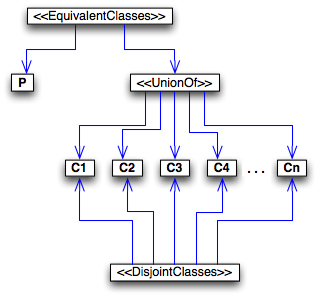

#  Graphical representation

__Diagram__

#  General information

|  |  |
| --- | --- |
|  Name |  Partition |
|  Also known as |  |
|  Author(s) |  |
|  SubmittedBy | [OlafNoppens](../User/OlafNoppens.md "User:OlafNoppens") |

  

#  Description

|  |  |
| --- | --- |
|  Motivation |  The Partition Pattern is a logical pattern that introduces axioms which model a partition of concepts. A partition is a general structure which is divided into several disjoint parts. With respect to ontologies the structure is a concept which is divided into several pair-wise disjoint concepts. This pattern reflects the simplest case where a named concept is defined as a partition of concepts. |
|  Aim |  The Partition Pattern describes how to model a partition, i.e., a named concept which is divided into several disjoint concepts. Applying this pattern to an ontology will introduce the necessary axioms. |
|  Solution description |  Let _P_ be a named concept that is the partition which is divided into several concepts _C\_i_. Then the partition is defined by introducing the following axioms (expressed in KRSS [1]):_(define-concept P (or C0 C1 ... Cn) )__(disjoint Ci Cj)_ ( 0 ≤ i,j ≤ n, i ≠ j ).Here _(disjoint C\_i C\_j)_a placeholder for the pair-wise disjointness of all _C\_i_. Note that _C\_i_ can also be arbitrary concept expressions (even if this is not allowed in the original KRSS syntax).In OWL 2 [2] the axioms can be expressed as follows (using OWL 2 Abstract Syntax):_EquivalentClasses(P, ObjectUnionOf(C1, ..., Cn))__DisjointClasses(C1, ..., Cn)_[1] Patel-Schneider, P. F., Swartout, B.: Description-Logic Knowledge Representation System Specification, 1993[2] Motik, B., Patel-Schneider, P. F., Parsia, B.: OWL 2 Structural Specification and Functional-Style Syntax. W3C Candidate Recommendation 11 June 2009. |
|  Elements |  |
|  Implementation |  |
|  Reusable component |  |
|  Component type |  |

  

#  Example

|  |  |
| --- | --- |
|  Problem example |  In an ontology about family relationship we defined concepts such as _Person_,_Aunt_ and _ParentOfSon_ which are characterized by a relationships such as _hasChild_(resp. the inverse relationship _hasParent_), _hasSibling_, '_married-with_ as well as by the gender of people (_Male_ respectively _Female_). There are a lot of similar ontologies about family relationships. _EquivalentClasses(Parent-Of-Son_ ObjectSomeValuesFrom (has-Child Male) )_EquivalentClasses(Parent-Of-Daughter_ ObjectSomeValuesFrom(has-Child Female) )_EquivalentClasses(Aunt ObjectIntersectionOf(Uncle-Or-Aunt Female))__EquivalentClasses(Uncle-Or-Aunt ObjectIntersectionOf(Person ObjectSomeValuesFrom(has-Sibling Parent)))_The concept _Gender_ is partitioned in _Male_ and _Female_. Applying this pattern results in the following axioms: _EquivalentClasses(Gender, ObjectUnionOf(Male Female))_ _DisjointClasses(Male Female)_ |
|  Pattern solution example | [http://www.informatik.uni-ulm.de/ki/Noppens/generation.owl](http://www.informatik.uni-ulm.de/ki/Noppens/generation.owl "http://www.informatik.uni-ulm.de/ki/Noppens/generation.owl") |
|  Consequences |  |

  

#  Pattern reference

|  |  |
| --- | --- |
|  Origin |  |
|  Known use |  |
|  Reference |  |
|  Related ODP |  |
|  Used in combination with |  |
|  Test |  |

  

  

#  Additional information

#  Scenarios

__Scenarios about Partition__
No scenario is added to this Content OP.

#  Reviews

__Reviews about Partition__

| Review article | [Posted on](../Property/CreationDate.md "Property:CreationDate") | [About revision (current is 9707)](../Property/ReviewAboutVersion.md "Property:ReviewAboutVersion") |
| --- | --- | --- |
| [LuigiIannone about Partition](../Reviews/LuigiIannone_about_Partition.md "Reviews:LuigiIannone about Partition") | 24550827 September 2009 | 56165,616 |
| [MartaSabou about Partition](../Reviews/MartaSabou_about_Partition.md "Reviews:MartaSabou about Partition") | 24550838 September 2009 | 56795,679 |
| [HenrikEriksson about Partition](../Reviews/HenrikEriksson_about_Partition.md "Reviews:HenrikEriksson about Partition") | 24550849 September 2009 | 57485,748 |
| [LuigiIannone about Partition 2](../Reviews/LuigiIannone_about_Partition_2.md "Reviews:LuigiIannone about Partition 2") | 245508510 September 2009 | 57505,750 |
| [RinkeHoekstra about Partition](../Community/RinkeHoekstra_about_Partition.md "Community:RinkeHoekstra about Partition") | 245513025 October 2009 | 59015,901 |

This revision (revision ID __9707__) takes in account the reviews: [Http://ontologydesignpatterns.org/wiki/Reviews:MartaSabou about Partition](http://ontologydesignpatterns.org/wiki/index.php?title=Reviews:Http://ontologydesignpatterns.org/wiki/Reviews:MartaSabou_about_Partition&action=edit&redlink=1 "Reviews:Http://ontologydesignpatterns.org/wiki/Reviews:MartaSabou about Partition (not yet written)"), [Http://ontologydesignpatterns.org/wiki/Reviews:HenrikEriksson about Partition](http://ontologydesignpatterns.org/wiki/index.php?title=Reviews:Http://ontologydesignpatterns.org/wiki/Reviews:HenrikEriksson_about_Partition&action=edit&redlink=1 "Reviews:Http://ontologydesignpatterns.org/wiki/Reviews:HenrikEriksson about Partition (not yet written)"), [Http://ontologydesignpatterns.org/wiki/Reviews:LuigiIannone about Partition 2](http://ontologydesignpatterns.org/wiki/index.php?title=Reviews:Http://ontologydesignpatterns.org/wiki/Reviews:LuigiIannone_about_Partition_2&action=edit&redlink=1 "Reviews:Http://ontologydesignpatterns.org/wiki/Reviews:LuigiIannone about Partition 2 (not yet written)")

Other info at [evaluation tab](http://ontologydesignpatterns.org/wiki/index.php?title=Submissions:Partition&action=evaluation "http://ontologydesignpatterns.org/wiki/index.php?title=Submissions:Partition&action=evaluation")

  

#  Modeling issues

__Modeling issues about Partition__

| Modeling issue | [Competency question](../Property/CompetencyQuestion.md "Property:CompetencyQuestion") | [Domains](../Property/Domain.md "Property:Domain") |
| --- | --- | --- |
| [Multiple Alternative Classification Criteria](../Community/Multiple_Alternative_Classification_Criteria.md "Community:Multiple Alternative Classification Criteria") | Allow me to retrieve all "elements" (classes/individuals) of a "domain concept" viewed by a combination of "values" (or "terms") from various "classification criteria" (or "facets"). |  |
| [View Inheritance](../View_Inheritance/View_Inheritance.md "Community:View Inheritance") | For examplein the case of the representation of the "wine" domain concept:<li> Allow me to select a bottle of wine by color region flavour and(or) ocassion. </li>In the case of the representation of the "pizza" domain concept:<li> Allow me to select a pizza based on the type of base the toppings and(or) the name.</li> |  |

  

#  References

  

|  |  Submission to event[WOP:2009](../WOP/2009.md "WOP:2009") |
| --- | --- |