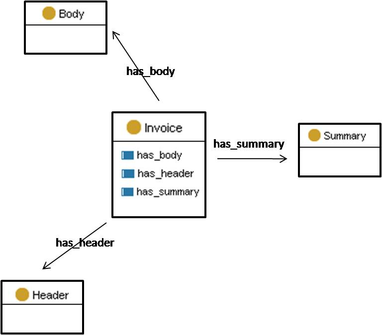

#  Graphical representation

__Diagram__

#  General description

|  |  |
| --- | --- |
|  Name: |  PharmaInnova |
|  Submitted by: | [Sandra Kohler](../User/Sandra_Kohler.md "User:Sandra Kohler") |
|  Also Known As: |  |
|  Intent: |  To describe invoices with the PharmaInnova Model. This schema can be applied to other invoice models. |
|  Domains: | [Business](../Community/Business.md "Community:Business") |
|  Competency Questions: |  |
|  Solution description: |  -- |
|  Reusable OWL Building Block: | [http://www.isoco.com/ontologies/neon/PharmaInnovaODP.owl](http://ontologydesignpatterns.org/wiki/index.php?title=Special:ClickHandler&link=http://www.isoco.com/ontologies/neon/PharmaInnovaODP.owl&message=OWL building block&from_page_id=980&update=) (772) |
|  Consequences: |  Especific models for invoices can be aligned to this pattern, which then acts as a semantic facade to different invoice management applications. This pattern is concreter and simplier, but less flexible than the invoice ODP. |
|  Scenarios: |  |
|  Known Uses: |  |
|  Web References: |  |
|  Other References: |  |
|  Examples (OWL files): | <li><a class="external free" href="http://www.isoco.com/ontologies/neon/PharmaInnovaInvoiceOntology.owl" rel="nofollow" title="http://www.isoco.com/ontologies/neon/PharmaInnovaInvoiceOntology.owl">http://www.isoco.com/ontologies/neon/PharmaInnovaInvoiceOntology.owl</a></li> |
|  Extracted From: |  |
|  Reengineered From: |  |
|  Has Components: |  |
|  Specialization Of: |  |
|  Related CPs: | <li><a href="../Invoice/Invoice.md" title="Submissions:Invoice">Submissions:Invoice</a></li> |

  

#  Elements

_The __PharmaInnova__ Content OP locally defines the following ontology elements:_

 __Header__ (owl:Class) The header usually contains important information to identify the invoice like for example the complete address and the company-identification-code. 
  _[Header](./EventProcessing/EventObjectHeader.md "Submissions:PharmaInnova/Header") page_
 __Body__ (owl:Class) The body contains all relevant invoice information like the amount of products, their net price etc. 
  _[Body](./EventProcessing/EventObjectBody.md "Submissions:PharmaInnova/Body") page_
 __Summary__ (owl:Class) Contains a summary of the most relevant invoice information like the payment terms and the total amount. 
  _[Summary](./PharmaInnova/Summary.md "Submissions:PharmaInnova/Summary") page_
 __Invoice__ (owl:Class) 
  _[Invoice](../Invoice/Invoice.md "Submissions:PharmaInnova/Invoice") page_
 __has\_summary__ (owl:ObjectProperty) 
  _[has\_summary](./PharmaInnova/has_summary.md "Submissions:PharmaInnova/has summary") page_
 __has\_header__ (owl:ObjectProperty) 
  _[has\_header](./PharmaInnova/has_header.md "Submissions:PharmaInnova/has header") page_
 __has\_body__ (owl:ObjectProperty) 
  _[has\_body](./PharmaInnova/has_body.md "Submissions:PharmaInnova/has body") page_
#  Additional information

(type): [http://www.w3.org/2002/07/owl#Ontology](http://www.w3.org/2002/07/owl#Ontology "http://www.w3.org/2002/07/owl#Ontology")

(imports): [http://www.ontologydesignpatterns.org/schemas/cpannotationschema.owl](http://www.ontologydesignpatterns.org/schemas/cpannotationschema.owl "http://www.ontologydesignpatterns.org/schemas/cpannotationschema.owl")

#  Scenarios

__Scenarios about PharmaInnova__
No scenario is added to this Content OP.

#  Reviews

__Reviews about PharmaInnova__
There is no review about this proposal.
This revision (revision ID __9111__) takes in account the reviews: none

Other info at [evaluation tab](http://ontologydesignpatterns.org/wiki/index.php?title=Submissions:PharmaInnova&action=evaluation "http://ontologydesignpatterns.org/wiki/index.php?title=Submissions:PharmaInnova&action=evaluation")

  

#  Modeling issues

__Modeling issues about PharmaInnova__
There is no Modeling issue related to this proposal.

  

#  References