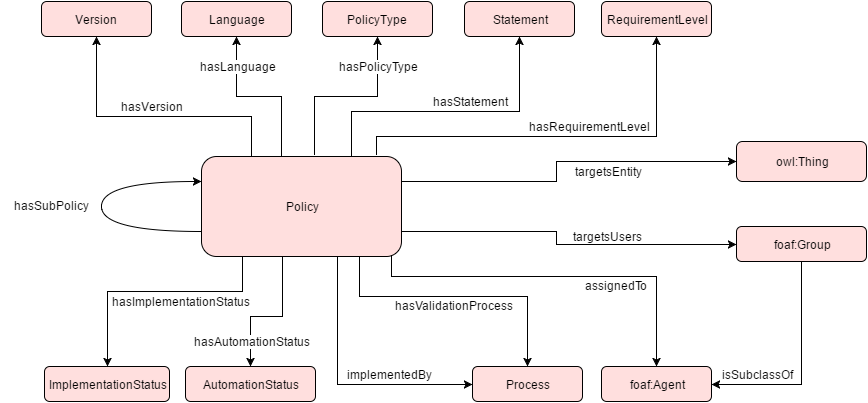

#  Graphical representation

__Diagram__

#  General description

|  |  |
| --- | --- |
|  Name: |  Policy |
|  Submitted by: | [PanagiotisMitzias](../User/PanagiotisMitzias.md "User:PanagiotisMitzias"), [FabioCorubolo](../User/FabioCorubolo.md "User:FabioCorubolo"), [EfstratiosKontopoulos](../User/EfstratiosKontopoulos.md "User:EfstratiosKontopoulos"), [MarinaRiga](../User/MarinaRiga.md "User:MarinaRiga") |
|  Also Known As: |  |
|  Intent: |  The pattern intends to model policies, their characteristics and their associated entities, such as processes and agents. This pattern has been developed by [MKLab](http://mklab.iti.gr/ "http://mklab.iti.gr/") at CERTH/ITI and the University of Liverpool for the [PERICLES](http://www.pericles-project.eu/ "http://www.pericles-project.eu/") FP7 project. |
|  Domains: | [General](../Community/General.md "Community:General") |
|  Competency Questions: | <li>
<i>What are the main entities associated with a policy?</i> A policy is usually associated with:<ul><li>super/sub-policies</li><li>processes</li><li>agents</li><li>other entities</li></ul>
</li>* _What are the main attributes of a policy?_ They are:	+ version+ language+ policy type+ requirement level+ implementation status+ automation status* _Where is a policy described?_ Statements are detailed text (formal or non- formal) definitions of the policy contents. |
|  Solution description: |  The pattern’s main entity is a policy. Appropriate object properties connect the policy with significant attributes and other entities. |
|  Reusable OWL Building Block: | [http://mklab.iti.gr/pericles/Policy\_ODP.owl](http://ontologydesignpatterns.org/wiki/index.php?title=Special:ClickHandler&link=http://mklab.iti.gr/pericles/Policy_ODP.owl&message=OWL building block&from_page_id=4273&update=) (565) |
|  Consequences: |  The Policy ODP is expected to facilitate the representation of the policy notion, which can be exploited in various domains. A well-established, comprehensible pattern will prove to be advantageous. |
|  Scenarios: | <li>The policy has two subpolicies.</li><li>The policy is implemented by a certain process.</li><li>The policy is validated by a certain process.</li><li>The policy is assigned to John Smith.</li><li>The policy is fully automated.</li> |
|  Known Uses: |  |
|  Web References: |  |
|  Other References: |  |
|  Examples (OWL files): |  |
|  Extracted From: |  |
|  Reengineered From: |  |
|  Has Components: |  |
|  Specialization Of: |  |
|  Related CPs: |  |

  

#  Elements

_The __Policy__ Content OP locally defines the following ontology elements:_

 __assignedTo__ (owl:ObjectProperty) Associates a policy to the agent that is responsible for the application of the policy (person or role). 
  _[assignedTo](./Policy/assignedTo.md "Submissions:Policy/assignedTo") page_
 __hasAutomationStatus__ (owl:ObjectProperty) Associates a policy with an automation level. 
  _[hasAutomationStatus](./Policy/hasAutomationStatus.md "Submissions:Policy/hasAutomationStatus") page_
 __hasImplementationStatus__ (owl:ObjectProperty) Associates a policy with an implementation level. 
  _[hasImplementationStatus](./Policy/hasImplementationStatus.md "Submissions:Policy/hasImplementationStatus") page_
 __hasLanguage__ (owl:ObjectProperty) Associates a policy with the language used for the policy definition. 
  _[hasLanguage](./HistoricalMap/hasLanguage.md "Submissions:Policy/hasLanguage") page_
 __hasPolicyType__ (owl:ObjectProperty) Associates a policy with a policy type. 
  _[hasPolicyType](./Policy/hasPolicyType.md "Submissions:Policy/hasPolicyType") page_
 __hasRequirementLevel__ (owl:ObjectProperty) Associates a policy with an requirement level. 
  _[hasRequirementLevel](./Policy/hasRequirementLevel.md "Submissions:Policy/hasRequirementLevel") page_
 __hasStatement__ (owl:ObjectProperty) Associates a policy with a statement, which is a detailed definition of the policy contents. 
  _[hasStatement](./Policy/hasStatement.md "Submissions:Policy/hasStatement") page_
 __hasSubPolicy__ (owl:ObjectProperty) Associates a policy to another policy that is contained in the initial. 
  _[hasSubPolicy](./Policy/hasSubPolicy.md "Submissions:Policy/hasSubPolicy") page_
 __hasValidationProcess__ (owl:ObjectProperty) Associates a policy with a process that is used to validate the policy. 
  _[hasValidationProcess](./Policy/hasValidationProcess.md "Submissions:Policy/hasValidationProcess") page_
 __hasVersion__ (owl:ObjectProperty) Defines a policy's version. 
  _[hasVersion](./Policy/hasVersion.md "Submissions:Policy/hasVersion") page_
 __implementedBy__ (owl:ObjectProperty) Associates a policy with a process that is used to implement the policy. 
  _[implementedBy](./Policy/implementedBy.md "Submissions:Policy/implementedBy") page_
 __targetsEntity__ (owl:ObjectProperty) Associates a policy with an entity that is subject to the policy. 
  _[targetsEntity](./Policy/targetsEntity.md "Submissions:Policy/targetsEntity") page_
 __targetsUsers__ (owl:ObjectProperty) Associates a policy to the user community the policy has been designed for. 
  _[targetsUsers](./Policy/targetsUsers.md "Submissions:Policy/targetsUsers") page_
 __AutomationStatus__ (owl:Class) The level of automation of a policy. Specifies if a policy implementation requires human intervention. E.g. manual, automated with human intervention, automated with human validation, fully automated, etc. 
  _[AutomationStatus](./Policy/AutomationStatus.md "Submissions:Policy/AutomationStatus") page_
 __Descriptor__ (owl:Class) The various elements describing a policy. 
  _[Descriptor](./DigitalVideo/Descriptor.md "Submissions:Policy/Descriptor") page_
 __ImplementationStatus__ (owl:Class) The level of implementation of a policy. E.g. implemented, partially implemented, unimplemented, not-implementable, etc. 
  _[ImplementationStatus](./Policy/hasImplementationStatus.md "Submissions:Policy/ImplementationStatus") page_
 __Language__ (owl:Class) The language used for the policy definition. E.g. natural language, ReAL, SPIN, etc. 
  _[Language](./HistoricalMap/hasLanguage.md "Submissions:Policy/Language") page_
 __Policy__ (owl:Class) A deliberate system of principles to guide decisions and achieve rational outcomes. A policy is a statement of intent, and is implemented as a procedure or protocol. 
  _[Policy](./Policy.md "Submissions:Policy/Policy") page_
 __PolicyType__ (owl:Class) The type of policy. Not all policies are equal; mandatory ones must be implemented to satisfy law or other requirements, others are aspirational, and most are met with the best possible effort. E.g. mandatory, legal requirement, aspirational, business driven, etc. 
  _[PolicyType](./Policy/hasPolicyType.md "Submissions:Policy/PolicyType") page_
 __Process__ (owl:Class) A sequence of interdependent and linked procedures which, at every stage, consume one or more resources (time, energy, machines, money) to convert inputs (data, material, parts, etc.) into outputs. 
  _[Process](./AOS_AGROVOC_Concept_Server_fundation_ontology_model/hasGoalOrProcess.md "Submissions:Policy/Process") page_
 __RequirementLevel__ (owl:Class) The level of a policy's compliance. E.g. must, must not, should, shoud not, may, etc. 
  _[RequirementLevel](./Policy/hasRequirementLevel.md "Submissions:Policy/RequirementLevel") page_
 __Statement__ (owl:Class) Detailed definition of the policy contents. 
  _[Statement](./Policy/hasStatement.md "Submissions:Policy/Statement") page_
 __Version__ (owl:Class) A policy's version 
  _[Version](./Policy/hasVersion.md "Submissions:Policy/Version") page_
#  Additional information

#  Scenarios

__Scenarios about Policy__
No scenario is added to this Content OP.

#  Reviews

__Reviews about Policy__
There is no review about this proposal.
This revision (revision ID __13090__) takes in account the reviews: none

Other info at [evaluation tab](http://ontologydesignpatterns.org/wiki/index.php?title=Submissions:Policy&action=evaluation "http://ontologydesignpatterns.org/wiki/index.php?title=Submissions:Policy&action=evaluation")

  

#  Modeling issues

__Modeling issues about Policy__
There is no Modeling issue related to this proposal.

  

#  References