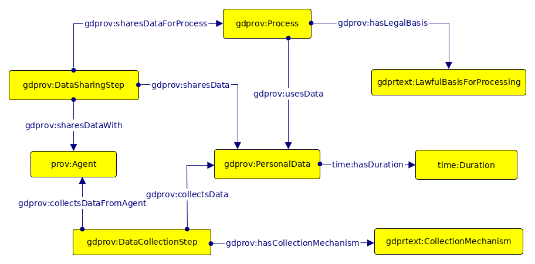

# 

 Graphical representation

__Diagram__ 

# 

 General description

|  |  |
| --- | --- |
|  Name:  |  PrivacyPolicyPersonalData  |
|  Submitted by:  | [HarshvardhanJ.Pandit](../User/HarshvardhanJ.Pandit "User:HarshvardhanJ.Pandit")  |
|  Also Known As:  |  |
|  Intent:  |  Provides a model for personal data information within privacy policies  |
|  Domains:  |  |
|  Competency Questions:  | <li>       What personal data is collected? e.g. email      </li><li>       Does the data have a category? e.g. contact information      </li><li>       What was its source? e.g. user      </li><li>       How is it collected? e.g. given by user or automated      </li><li>       What is it used for? e.g. creating an account and authentication and verification      </li><li>       How long is it retained for? e.g. 90days after account deletion      </li><li>       Who is it shared with? e.g. ‘partners’      </li><li>       What is the legal basis? e.g. given consent or legitimate use      </li><li>       What processes/purposes was the data shared for? e.g. analytics or marketing      </li><li>       What is the legal type of third party? e.g. processor or controller or authority      </li> |
|  Solution description:  |  Model the information using provenance-based ontology to show information such as collection, sharing, storage of personal data  |
|  Reusable OWL Building Block:  | [http://openscience.adaptcentre.ie/ontologies/privacypolicy.owl](http://ontologydesignpatterns.org/wiki/index.php?title=Special:ClickHandler&link=http://openscience.adaptcentre.ie/ontologies/privacypolicy.owl&message=OWL building block&from_page_id=4470&update=)  (519)  |
|  Consequences:  |  |
|  Scenarios:  |  |
|  Known Uses:  |  |
|  Web References:  |  |
|  Other References:  |  |
|  Examples (OWL files):  |  |
|  Extracted From:  |  |
|  Reengineered From:  |  |
|  Has Components:  |  |
|  Specialization Of:  |  |
|  Related CPs:  |  |

  

# 

 Elements

_The
 __PrivacyPolicyPersonalData__ 
 Content OP locally defines the following ontology elements:_ 

 Documentation:
 [http://openscience.adaptcentre.ie/ontologies/privacy-policy-odp/docs/index-en.html](http://openscience.adaptcentre.ie/ontologies/privacy-policy-odp/docs/index-en.html "http://openscience.adaptcentre.ie/ontologies/privacy-policy-odp/docs/index-en.html") 

# 

 Scenarios

__Scenarios about PrivacyPolicyPersonalData__ 

 No scenario is added to this Content OP.
 

# 

 Reviews

__Reviews about PrivacyPolicyPersonalData__ 

 There is no review about this proposal.
This revision (revision ID
 __13501__ 
 ) takes in account the reviews: none
 

 Other info at
 [evaluation tab](http://ontologydesignpatterns.org/wiki/index.php?title=Submissions:PrivacyPolicyPersonalData&action=evaluation "http://ontologydesignpatterns.org/wiki/index.php?title=Submissions:PrivacyPolicyPersonalData&action=evaluation") 

  

# 

 Modeling issues

__Modeling issues about PrivacyPolicyPersonalData__ 

 There is no Modeling issue related to this proposal.
 

  

# 

 References