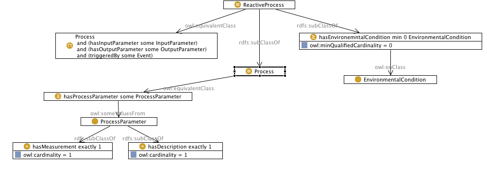

# 

 Graphical representation

__Diagram__ 

# 

 General description

|  |  |
| --- | --- |
|  Name:  |  Reactor pattern  |
|  Submitted by:  | [MonikaSolanki](../User/MonikaSolanki.md "User:MonikaSolanki")  |
|  Also Known As:  |  |
|  Intent:  |  The remit of the reactor pattern is to enable the modelling of reactive processes that consume inputs and produce outputs under specific environmental conditions and on being triggered by certain events.  |
|  Domains:  |  |
|  Competency Questions:  | <li>       1. What are the inputs consumed by a certain process?      </li><li>       2. What environmental conditions need to hold for the process to get activated?      </li><li>       3. What are the outputs produced by the process?      </li><li>       4. Which event triggers a specific process?      </li><li>       5. What is the measurement criteria for a specific parameter?      </li> |
|  Solution description:  |  The reactor pattern provides a building block for the ontological modelling of reactive processes. The pattern can be used across domains in scenarios where a reactor is used to run processes that consume inputs to produce outputs under controlled environmental conditions and when triggered by certain events. As an example, the pattern has been applied to the algal biomass domain to model the reactive process of algae cultivation.  |
|  Reusable OWL Building Block:  | [http://windermere.aston.ac.uk/~monika/ontologies/Reactor.owl](http://ontologydesignpatterns.org/wiki/index.php?title=Special:ClickHandler&link=http://windermere.aston.ac.uk/~monika/ontologies/Reactor.owl&message=OWL building block&from_page_id=3357&update=)  (863)  |
|  Consequences:  |  The main advantage of this pattern is that its provides ontological  modelling capabilities for the inputs, outputs and environmentalconditions that govern reactive processes across several domains,independent of modelling details of the actual reactor involved. Thiseffectively caters for exposing a black box view of the process, whichis very desirable when querying the model for consumption andproduction logistics of the process.  |
|  Scenarios:  |  As an exemplifier for the reactor pattern, we present a use case fromthe domain of algal biomass. We employ the reactor pattern in anontology OntoMDL. The ontology models a process for algal biomasscultivation. OntoMDL implements the Minimum DescriptiveLanguage(MDL) standard prescribed by the AlgalBiomass Organisation(ABO) for algal operation. The set of descriptivemetrics recommended by MDL as inputs to the process are carbon, water, total infrastructure area, total energy, nutrients, consumables andlabour. Possible outputs from the process are algal constituentproducts, indirect algal products, uncaptured gas emission, liquidwaste output, solid waste output. Some environmental conditions thatmust hold for the algae to be harvested are, (1)The water must be in a temperature range that will support the specific algal species being grown.(2)The pH range for most cultured algal species should be between 7 and 9, with the optimum range being 8.2-8.7.The event that triggers of the algae cultivation is the addition of the source culture to the growing containers or reactors.  |
|  Known Uses:  |  |
|  Web References:  |  |
|  Other References:  |  |
|  Examples (OWL files):  |  |
|  Extracted From:  |  |
|  Reengineered From:  |  |
|  Has Components:  |  |
|  Specialization Of:  |  |
|  Related CPs:  |  |

  

# 

 Elements

_The
 __Reactor pattern__ 
 Content OP locally defines the following ontology elements:_ 

__definesCondition__ 
 (owl:ObjectProperty)
 

_[definesCondition](./Reactor_pattern/definesCondition.md "Submissions:Reactor pattern/definesCondition") 
 page_ 

__hasEnvironemntalCondition__ 
 (owl:ObjectProperty)
 

_[hasEnvironemntalCondition](./Reactor_pattern/hasEnvironemntalCondition.md "Submissions:Reactor pattern/hasEnvironemntalCondition") 
 page_ 

__hasInputParameter__ 
 (owl:ObjectProperty)
 

_[hasInputParameter](./Reactor_pattern/hasInputParameter.md "Submissions:Reactor pattern/hasInputParameter") 
 page_ 

__hasMeasurement__ 
 (owl:ObjectProperty)
 

_[hasMeasurement](./Reactor_pattern/hasMeasurement.md "Submissions:Reactor pattern/hasMeasurement") 
 page_ 

__hasOutputParameter__ 
 (owl:ObjectProperty)
 

_[hasOutputParameter](./Reactor_pattern/hasOutputParameter.md "Submissions:Reactor pattern/hasOutputParameter") 
 page_ 

__hasProcessParameter__ 
 (owl:ObjectProperty)
 

_[hasProcessParameter](./Reactor_pattern/hasProcessParameter.md "Submissions:Reactor pattern/hasProcessParameter") 
 page_ 

__triggeredBy__ 
 (owl:ObjectProperty)
 

_[triggeredBy](./Reactor_pattern/triggeredBy.md "Submissions:Reactor pattern/triggeredBy") 
 page_ 

__hasDescription__ 
 (owl:DatatypeProperty)
 

_[hasDescription](./Reactor_pattern/hasDescription.md "Submissions:Reactor pattern/hasDescription") 
 page_ 

__EnvironmentalCondition__ 
 (owl:Class) An entity that represents the environmental condition
 

_[EnvironmentalCondition](./Reactor_pattern/EnvironmentalCondition.md "Submissions:Reactor pattern/EnvironmentalCondition") 
 page_ 

__Event__ 
 (owl:Class) An entity representing the event that triggers the process
 

_[Event](../CommunicationEvent/CommunicationEvent.md "Submissions:Reactor pattern/Event") 
 page_ 

__InputParameter__ 
 (owl:Class) An entity representing the input to a process
 

_[InputParameter](./Reactor_pattern/hasInputParameter.md "Submissions:Reactor pattern/InputParameter") 
 page_ 

__OutputParameter__ 
 (owl:Class) An entity representing the output to a process
 

_[OutputParameter](./Reactor_pattern/hasOutputParameter.md "Submissions:Reactor pattern/OutputParameter") 
 page_ 

__Process__ 
 (owl:Class) An entity representing a placeholder for a process.
 

_[Process](./AOS_AGROVOC_Concept_Server_fundation_ontology_model/hasGoalOrProcess.md "Submissions:Reactor pattern/Process") 
 page_ 

__ProcessParameter__ 
 (owl:Class) An overarching entity representing the parameters defined for the process
 

_[ProcessParameter](./Reactor_pattern/hasProcessParameter.md "Submissions:Reactor pattern/ProcessParameter") 
 page_ 

__ReactiveProcess__ 
 (owl:Class) An entity representing a reactive process
 

_[ReactiveProcess](./Reactor_pattern/ReactiveProcess.md "Submissions:Reactor pattern/ReactiveProcess") 
 page_ 

# 

 Additional information

 The Reactor Pattern enables the modelling of processes that consume inputs and produce outputs under specific environmental conditions and on being triggered by certain events. Reactor pattern is a content ontology design pattern and is especially targeted towards modelling reactive processes with a black box view of the process.
 

# 

 Scenarios

__Scenarios about Reactor pattern__ 

 No scenario is added to this Content OP.
 

# 

 Reviews

__Reviews about Reactor pattern__ 

|  Review article  | [Posted on](../Property/CreationDate.md "Property:CreationDate")  | [About revision (current is 11175)](../Property/ReviewAboutVersion.md "Property:ReviewAboutVersion")  |
| --- | --- | --- |
| [AlessandroAdamou about Reactor pattern](../Reviews/AlessandroAdamou_about_Reactor_pattern.md "Reviews:AlessandroAdamou about Reactor pattern")  |  2456164  24 August 2012  |  11155  11,155  |
| [AndreaNuzzolese about Reactor pattern](../Reviews/AndreaNuzzolese_about_Reactor_pattern.md "Reviews:AndreaNuzzolese about Reactor pattern")  |  2456169  29 August 2012  |  11175  11,175  |
| [VojtechSvatek about Reactor pattern](../Reviews/VojtechSvatek_about_Reactor_pattern.md "Reviews:VojtechSvatek about Reactor pattern")  |  2456171  31 August 2012  |  11175  11,175  |
| [IonelVirgilPop about Reactor pattern](../Community/IonelVirgilPop_about_Reactor_pattern.md "Community:IonelVirgilPop about Reactor pattern")  |  2456164  24 August 2012  |  11175  11,175  |

 This revision (revision ID
 __11175__ 
 ) takes in account the reviews: none
 

 Other info at
 [evaluation tab](http://ontologydesignpatterns.org/wiki/index.php?title=Submissions:Reactor_pattern&action=evaluation "http://ontologydesignpatterns.org/wiki/index.php?title=Submissions:Reactor_pattern&action=evaluation") 

  

# 

 Modeling issues

__Modeling issues about Reactor pattern__ 

 There is no Modeling issue related to this proposal.
 

  

# 

 References

  

|  |  Submission to event [WOP:2012](../WOP/2012.md "WOP:2012")  |
| --- | --- |