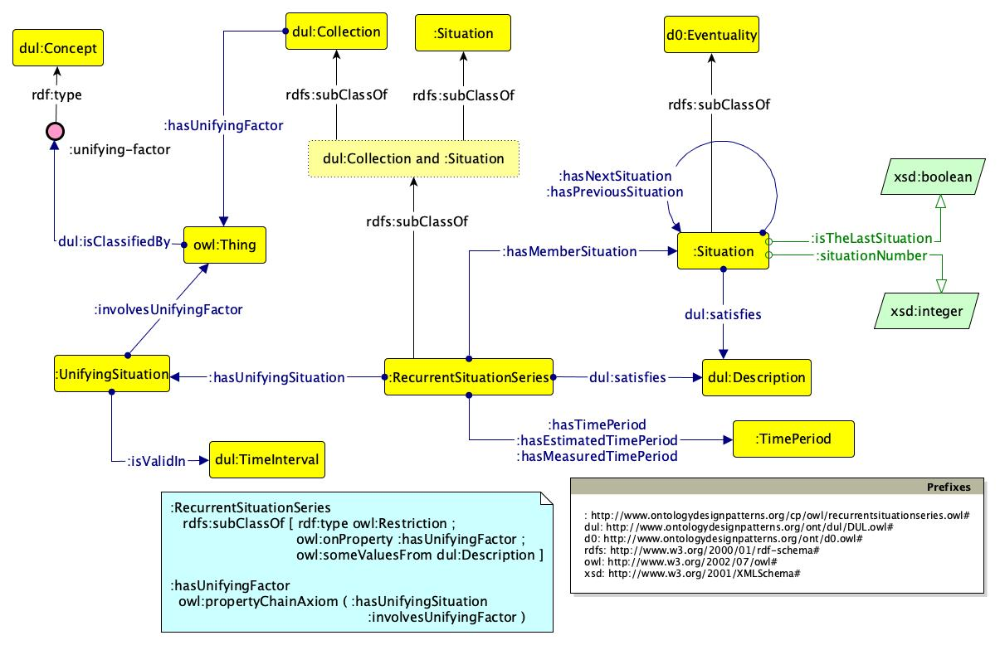

# 

 Graphical representation

__Diagram__ 

# 

 General description

|  |  |
| --- | --- |
|  Name:  |  RecurrentSituationSeries  |
|  Submitted by:  | [ValentinaAnitaCarriero](../User/ValentinaAnitaCarriero "User:ValentinaAnitaCarriero")  |
|  Also Known As:  |  |
|  Intent:  |  To represent recurrent situation series as situations and collections of consecutive situations, with a regular time period between situations and unifying factors.  |
|  Domains:  | [General](../Community/General "Community:General")  |
|  Competency Questions:  | <li>       What are the situations of a recurrent situation series?      </li><li>       Which is the time period elapsing between two situations of a recurrent situation series?      </li><li>       When is the next situation of a recurrent situation series scheduled?      </li><li>       What are the unifying criteria shared by all the situations in a recurrent situation series?      </li><li>       Which are the unifying situations shared by a (subset of) the situations member of a recurrent situation series?      </li><li>       When is a unifying situation valid?      </li><li>       Which is the (immediate) next situation in a recurrent situation series?      </li><li>       Which is the (immediate) previous situation in a recurrent situation series?      </li> |
|  Solution description:  |  A recurrent situation series is modelled as an intersection of a collection and a situation. Indeed, a recurrent situation series is seen as a collection, since it contains entities that share one or more common properties and are unified conceptually (unifying factors). These entities are member of the collection, and are all consecutive situations. At the same time, a recurrent situation series is a situation, intended as a relational context in which the contextualised things are based on a frame: a recurrent situation series is similar to a plan that defines how the things involved in that plan (i.e. the specific events) shall be carried out, e.g. where the situations shall be located, in which time of the year, etc.  |
|  Reusable OWL Building Block:  | [http://www.ontologydesignpatterns.org/cp/owl/recurrentsituationseries.owl](http://ontologydesignpatterns.org/wiki/index.php?title=Special:ClickHandler&link=http://www.ontologydesignpatterns.org/cp/owl/recurrentsituationseries.owl&message=OWL building block&from_page_id=4700&update=)  (221)  |
|  Consequences:  |  A series of recurrent situations, its unifying factors and the recurrent time period can be modeled.  |
|  Scenarios:  |  Umbria Jazz is a collection of situations, which all take place in July and in the Italian region of Umbria, and has the musical genre jazz as a topic. Its situations recur at regular time periods, i.e. annually.  |
|  Known Uses:  |  |
|  Web References:  |  |
|  Other References:  |  |
|  Examples (OWL files):  |  |
|  Extracted From:  |  |
|  Reengineered From:  |  |
|  Has Components:  |  |
|  Specialization Of:  |  |
|  Related CPs:  | <li><a href="Submissions%253AClassification.html" title="Submissions:Classification">        Submissions:Classification       </a></li><li><a href="Submissions%253ACollection.html" title="Submissions:Collection">        Submissions:Collection       </a></li><li><a href="Submissions%253ADescription.html" title="Submissions:Description">        Submissions:Description       </a></li><li><a class="new" href="http://ontologydesignpatterns.org/wiki/index.php?title=Submissions:Recurrent_Event_Series&amp;action=edit&amp;redlink=1" title="Submissions:Recurrent Event Series (not yet written)">        Submissions:Recurrent Event Series       </a></li><li><a href="Submissions%253ASequence.html" title="Submissions:Sequence">        Submissions:Sequence       </a></li><li><a href="Submissions%253ASituation.html" title="Submissions:Situation">        Submissions:Situation       </a></li> |

  

# 

 Elements

_The
 __RecurrentSituationSeries__ 
 Content OP locally defines the following ontology elements:_ 

__hasEstimatedTimePeriod__ 
 (owl:ObjectProperty) This property relates a recurrent situation series to an estimated time period.
 

_[hasEstimatedTimePeriod](../Submissions/RecurrentSituationSeries/hasEstimatedTimePeriod "Submissions:RecurrentSituationSeries/hasEstimatedTimePeriod") 
 page_ 

__hasImmediateNextSituation__ 
 (owl:ObjectProperty) This property relates a situation member of a recurrent situation series to the immediate next situation member of the same recurrent situation series.
 

_[hasImmediateNextSituation](../Submissions/RecurrentSituationSeries/hasImmediateNextSituation "Submissions:RecurrentSituationSeries/hasImmediateNextSituation") 
 page_ 

__hasImmediatePreviousSituation__ 
 (owl:ObjectProperty) This property relates a situation member of a recurrent situation series to the immediate previous situation member of the same recurrent situation series.
 

_[hasImmediatePreviousSituation](../Submissions/RecurrentSituationSeries/hasImmediatePreviousSituation "Submissions:RecurrentSituationSeries/hasImmediatePreviousSituation") 
 page_ 

__hasMeasuredTimePeriod__ 
 (owl:ObjectProperty) This property relates a recurrent situation series to a measured time period.
 

_[hasMeasuredTimePeriod](../Submissions/RecurrentSituationSeries/hasMeasuredTimePeriod "Submissions:RecurrentSituationSeries/hasMeasuredTimePeriod") 
 page_ 

__hasMemberSituation__ 
 (owl:ObjectProperty) This property relates a recurrent situation series to a situation that is member of it.
 

_[hasMemberSituation](../Submissions/RecurrentSituationSeries/hasMemberSituation "Submissions:RecurrentSituationSeries/hasMemberSituation") 
 page_ 

__hasNextSituation__ 
 (owl:ObjectProperty) This property relates a situation member of a recurrent situation series to a next situation member of the same recurrent situation series.
 

_[hasNextSituation](../Submissions/RecurrentSituationSeries/hasNextSituation "Submissions:RecurrentSituationSeries/hasNextSituation") 
 page_ 

__hasPreviousSituation__ 
 (owl:ObjectProperty) This property relates a situation member of a recurrent situation series to a previous situation member of the same recurrent situation series.
 

_[hasPreviousSituation](../Submissions/RecurrentSituationSeries/hasPreviousSituation "Submissions:RecurrentSituationSeries/hasPreviousSituation") 
 page_ 

__hasTimePeriod__ 
 (owl:ObjectProperty) This property relates a recurrent situation series to a time period.
 

_[hasTimePeriod](../Submissions/RecurrentSituationSeries/hasTimePeriod "Submissions:RecurrentSituationSeries/hasTimePeriod") 
 page_ 

__hasTimePeriodBeforeNextSituation__ 
 (owl:ObjectProperty) This property relates a situation member of a recurrent situation series to the time period elapsing before its next situation.
 

_[hasTimePeriodBeforeNextSituation](../Submissions/RecurrentSituationSeries/hasTimePeriodBeforeNextSituation "Submissions:RecurrentSituationSeries/hasTimePeriodBeforeNextSituation") 
 page_ 

__hasUnifyingFactor__ 
 (owl:ObjectProperty) This property relates a collection to a unifying factor.
 

_[hasUnifyingFactor](../Submissions/RecurrentSituationSeries/hasUnifyingFactor "Submissions:RecurrentSituationSeries/hasUnifyingFactor") 
 page_ 

__hasUnifyingSituation__ 
 (owl:ObjectProperty) This property relates a recurrent situation series to a unifying situation.
 

_[hasUnifyingSituation](../Submissions/RecurrentSituationSeries/hasUnifyingSituation "Submissions:RecurrentSituationSeries/hasUnifyingSituation") 
 page_ 

__involvesUnifyingFactor__ 
 (owl:ObjectProperty) This property relates a unifying situation to the involved unifying factor.
 

_[involvesUnifyingFactor](../Submissions/RecurrentSituationSeries/involvesUnifyingFactor "Submissions:RecurrentSituationSeries/involvesUnifyingFactor") 
 page_ 

__isEstimatedTimePeriodOf__ 
 (owl:ObjectProperty) This property relates an estimated time period to a recurrent situation series.
 

_[isEstimatedTimePeriodOf](../Submissions/RecurrentSituationSeries/isEstimatedTimePeriodOf "Submissions:RecurrentSituationSeries/isEstimatedTimePeriodOf") 
 page_ 

__isInvolvedInUnifyingSituation__ 
 (owl:ObjectProperty) This property relates a unifying factor to the unifying situation it is involved in.
 

_[isInvolvedInUnifyingSituation](../Submissions/RecurrentSituationSeries/isInvolvedInUnifyingSituation "Submissions:RecurrentSituationSeries/isInvolvedInUnifyingSituation") 
 page_ 

__isLocallyInconsistentWith__ 
 (owl:ObjectProperty) This property relates two entities that are considered locally inconsistent.
 

_[isLocallyInconsistentWith](../Submissions/RecurrentSituationSeries/isLocallyInconsistentWith "Submissions:RecurrentSituationSeries/isLocallyInconsistentWith") 
 page_ 

__isMeasuredTimePeriodOf__ 
 (owl:ObjectProperty) This property relates a measured time period to a recurrent situation series.
 

_[isMeasuredTimePeriodOf](../Submissions/RecurrentSituationSeries/isMeasuredTimePeriodOf "Submissions:RecurrentSituationSeries/isMeasuredTimePeriodOf") 
 page_ 

__isSituationMemberOf__ 
 (owl:ObjectProperty) This property relates a situation that is member of a recurrent situation series to the recurrent situation series.
 

_[isSituationMemberOf](../Submissions/RecurrentSituationSeries/isSituationMemberOf "Submissions:RecurrentSituationSeries/isSituationMemberOf") 
 page_ 

__isTimePeriodBeforeNextSituationOf__ 
 (owl:ObjectProperty) This property relates a time period, elapsing before the next situation of a situation member of a recurrent situation series, to one of the member situations.
 

_[isTimePeriodBeforeNextSituationOf](../Submissions/RecurrentSituationSeries/isTimePeriodBeforeNextSituationOf "Submissions:RecurrentSituationSeries/isTimePeriodBeforeNextSituationOf") 
 page_ 

__isTimePeriodOf__ 
 (owl:ObjectProperty) This property relates a time period to a recurrent situation series having that time period.
 

_[isTimePeriodOf](../Submissions/RecurrentSituationSeries/isTimePeriodOf "Submissions:RecurrentSituationSeries/isTimePeriodOf") 
 page_ 

__isUnifyingFactorOf__ 
 (owl:ObjectProperty) This property relates a unifying factor to the collection that is unified by that factor.
 

_[isUnifyingFactorOf](../Submissions/RecurrentSituationSeries/isUnifyingFactorOf "Submissions:RecurrentSituationSeries/isUnifyingFactorOf") 
 page_ 

__isUnifyingSituationOf__ 
 (owl:ObjectProperty) This property relates a unifying situation to the recurrent situation series it unifies.
 

_[isUnifyingSituationOf](../Submissions/RecurrentSituationSeries/isUnifyingSituationOf "Submissions:RecurrentSituationSeries/isUnifyingSituationOf") 
 page_ 

__isValidIn__ 
 (owl:ObjectProperty) This property relates a unifying situation to its temporal validity.
 

_[isValidIn](../Submissions/RecurrentSituationSeries/isValidIn "Submissions:RecurrentSituationSeries/isValidIn") 
 page_ 

__isTheLastSituation__ 
 (owl:DatatypeProperty) This property defines if a situation that is member of a recurrent situation series is the last one or not.
 

_[isTheLastSituation](../Submissions/RecurrentSituationSeries/isTheLastSituation "Submissions:RecurrentSituationSeries/isTheLastSituation") 
 page_ 

__situationNumber__ 
 (owl:DatatypeProperty) This property represents the number of the situation in the recurrent situation series (the first situation, the second situation, etc.)
 

_[situationNumber](../Submissions/RecurrentSituationSeries/situationNumber "Submissions:RecurrentSituationSeries/situationNumber") 
 page_ 

__RecurrentSituationSeries__ 
 (owl:Class) Recurrent situation series is modeled as an intersection of the classes Collection and Situation. Indeed, a recurrent situation is seen as a collection, since it contains entities that share one or more common properties and are unified conceptually. These entities are member of the collection, and are all consecutive situations, in such a manner that each situation has either a previous situation, or a next situation, or both, unless the series has never been instantiated. At the same time, a recurrent situation is a situation, intended as a relational context in which the contextualized things are based on a frame: a recurrent situation is similar to a plan that defines how the things involved in that plan (i.e. the specific situations) shall be carried out, e.g. where the situations shall be located, in which time of the year, etc.
 

_[RecurrentSituationSeries](../Submissions/RecurrentSituationSeries/RecurrentSituationSeries "Submissions:RecurrentSituationSeries/RecurrentSituationSeries") 
 page_ 

__Situation__ 
 (owl:Class) This class represents a Situation.
 

_[Situation](../Submissions/RecurrentSituationSeries/Situation "Submissions:RecurrentSituationSeries/Situation") 
 page_ 

__TimePeriod__ 
 (owl:Class) This class represents a Time Period (e.g. 1 week).
 

_[TimePeriod](../Submissions/RecurrentSituationSeries/TimePeriod "Submissions:RecurrentSituationSeries/TimePeriod") 
 page_ 

__UnifyingFactor__ 
 (owl:Class) A Unifying Factor is a concept, which classifies an element or property occurring in each situation member of a recurrent situation series, which unifies the collection and makes all the situations attributable to a homogeneous collection.
 

_[UnifyingFactor](../Submissions/RecurrentSituationSeries/UnifyingFactor "Submissions:RecurrentSituationSeries/UnifyingFactor") 
 page_ 

__UnifyingSituation__ 
 (owl:Class) A Unifying Situation is a situation involving a unifying factor, i.e. a concept classifying an element or property occurring in each situation member of a recurrent situation series, which unifies the collection and makes all the situations attributable to a homogeneous collection, and is valid at a specific time interval.
 

_[UnifyingSituation](../Submissions/RecurrentSituationSeries/UnifyingSituation "Submissions:RecurrentSituationSeries/UnifyingSituation") 
 page_ 

# 

 Additional information

 A pattern for recurrent situation series. This pattern is a new version of the recurrent event series ODP (
 [http://www.ontologydesignpatterns.org/cp/owl/recurrenteventseries.owl](http://www.ontologydesignpatterns.org/cp/owl/recurrenteventseries.owl "http://www.ontologydesignpatterns.org/cp/owl/recurrenteventseries.owl") 
 ), based on new analysis which led to terminological and modelling changes.
 

# 

 Scenarios

__Scenarios about RecurrentSituationSeries__ 

 No scenario is added to this Content OP.
 

# 

 Reviews

__Reviews about RecurrentSituationSeries__ 

 There is no review about this proposal.
This revision (revision ID
 __13945__ 
 ) takes in account the reviews: none
 

 Other info at
 [evaluation tab](http://ontologydesignpatterns.org/wiki/index.php?title=Submissions:RecurrentSituationSeries&action=evaluation "http://ontologydesignpatterns.org/wiki/index.php?title=Submissions:RecurrentSituationSeries&action=evaluation") 

  

# 

 Modeling issues

__Modeling issues about RecurrentSituationSeries__ 

 There is no Modeling issue related to this proposal.
 

  

# 

 References