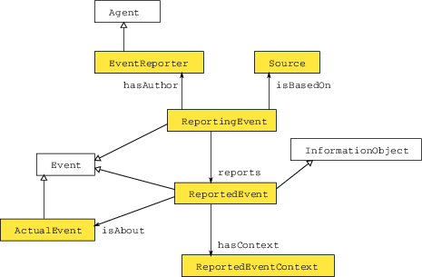

# 

 Graphical representation

__Diagram__ 

# 

 General description

|  |  |
| --- | --- |
|  Name:  |  ReportingEvent  |
|  Submitted by:  | [EwaKowalczuk](../User/EwaKowalczuk.md "User:EwaKowalczuk")  |
|  Also Known As:  |  |
|  Intent:  |  The intent of the pattern is to allow for modelling situations in which the knowledge about an event cannot be treated as certain. It is particularly useful for cases in which two or more agents provide different, contradictory information about the same event.  It can be also used for modelling situation in which a single agent provided contradictory information about the same event in different points in time. In general the pattern allows for stating different circumstances of an act of the information provision.  |
|  Domains:  | [General](../Community/General.md "Community:General")  , [Event Processing](../Community/Event_Processing.md "Community:Event Processing")  |
|  Competency Questions:  | <li>       What characteristics (date/participants/cause etc.) is an actual event said to have?      </li><li>       Which agent made a statement about an actual event?      </li><li>       On which sources these statements were based?      </li><li>       What were circumstances of providing information about an actual event?      </li> |
|  Solution description:  |  There are in total 3 different types of events included in the pattern. The most important one is the ActualEvent, which is the physical event -- event that actually happened or is said to have happened. All the circumstances of the event (contexts) are not directly linked to the ActualEvent. They are attached to the ReportedEvent, which constitutes a view of the actual event included in a particular description/report/statement.  By making the ReportedEvent an Event, we can use all properties that could be used in case of an ordinary event, like place, time interval, cause and consequences. They are grouped in a class ReportedEventContext and are attached by hasContext property or its specialisations.  As ReportedEvent provides an information about the ActualEvent entity, it can be viewed as InformationObject. It is connected to an ActualEvent using the isAbout property.  The third event included in our pattern is the act of reporting the actual event -- the ReportingEvent. Its result is an ReportedEvent (linked using property reports). By modelling the act of reporting as an event, we can expose its different circumstances, for example the timestamp at which the particular reporting took place. The ReportingEvent can be also viewed as an activity, performed by a certain agent (person or organisation) -- EventReporter, utilising defined sources.  |
|  Reusable OWL Building Block:  | [http://semantic.cs.put.poznan.pl/ontologies/reportingevent.owl](http://ontologydesignpatterns.org/wiki/index.php?title=Special:ClickHandler&link=http://semantic.cs.put.poznan.pl/ontologies/reportingevent.owl&message=OWL building block&from_page_id=4061&update=)  (572)  |
|  Consequences:  |  The pattern is rather complex and should only be used if the circumstances of the events are expected to be uncertain (to differ in different event reports).  |
|  Scenarios:  |  Two History professors have different opinion about the same actual event. The exemplary actual event is baptism of prince Mieszko I. The baptism exact place is a subject to historical debate. According to professor Hanna Kóčka-Krenz the likely place was Poznań. She bases her claim on Poznań excavations that she conducted. However the late professor Labuda pointed to Lednica Holm. He also based his claims on the local excavations but also on historical annals.  |
|  Known Uses:  |  |
|  Web References:  |  |
|  Other References:  |  |
|  Examples (OWL files):  |  |
|  Extracted From:  |  |
|  Reengineered From:  |  |
|  Has Components:  | <li><a href="../IntensionExtension/IntensionExtension.md" title="Submissions:IntensionExtension">        Submissions:IntensionExtension       </a></li><li><a href="../DescriptionAndSituation/DescriptionAndSituation.md" title="Submissions:Situation">        Submissions:Situation       </a></li> |
|  Specialization Of:  |  |
|  Related CPs:  | <li><a href="../Types_of_entities/Types_of_entities.md" title="Submissions:Types of entities">        Submissions:Types of entities       </a></li><li><a href="../IntensionExtension/IntensionExtension.md" title="Submissions:IntensionExtension">        Submissions:IntensionExtension       </a></li><li><a href="../DescriptionAndSituation/DescriptionAndSituation.md" title="Submissions:Situation">        Submissions:Situation       </a></li> |

  

# 

 Elements

_The
 __ReportingEvent__ 
 Content OP locally defines the following ontology elements:_ 

# 

 Additional information

# 

 Scenarios

__Scenarios about ReportingEvent__ 

 No scenario is added to this Content OP.
 

# 

 Reviews

__Reviews about ReportingEvent__ 

 There is no review about this proposal.
This revision (revision ID
 __12848__ 
 ) takes in account the reviews: none
 

 Other info at
 [evaluation tab](http://ontologydesignpatterns.org/wiki/index.php?title=Submissions:ReportingEvent&action=evaluation "http://ontologydesignpatterns.org/wiki/index.php?title=Submissions:ReportingEvent&action=evaluation") 

  

# 

 Modeling issues

__Modeling issues about ReportingEvent__ 

 There is no Modeling issue related to this proposal.
 

  

# 

 References

  

|  |  Submission to event [WOP:2016](../WOP/2016.1.md "WOP:2016")  |
| --- | --- |