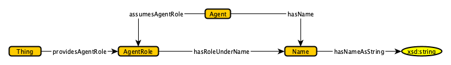

#  Graphical representation

__Diagram__

#  General description

|  |  |
| --- | --- |
|  Name: |  Trajectory |
|  Submitted by: | [RushrukhRayan](../User/RushrukhRayan.md "User:RushrukhRayan") |
|  Also Known As: |  |
|  Intent: | An ontology design pattern for modeling Names as part of Roles, to capture scenarios where an Agent performs different Roles using different Names associated with the different Roles. Examples of an Agent performing a Role using different Names are rather ubiq- uitous, e.g., authors who write under different pseudonyms, or different legal names for citizens of more than one country. |
|  Domains: | [General](../Community/General.md "Community:General") |
|  Competency Questions: | <li> Under what pseudonym did the author C. S. Lewis published a collection of poems, Spirit in Bondage?</li><li> What alternative did C. S. Lewis used to assume the role of a book writer? </li><li> Show the trajectories of rivers which cross national parks</li> |
|  Solution description: |  The pattern is a modified merger of a standard Agent Role and a standard Name pattern stub |
|  Reusable OWL Building Block: | [/RoleDependentNames.owl](RoleDependentNames.owl) |
|  Consequences: |  |
|  Scenarios: | An author adopting different names to publish books, Name changes (e.g. - after marriage) |
|  Known Uses: |  |
|  Web References: |  |
|  Other References: |  |
|  Examples (OWL files): |  |
|  Extracted From: |  |
|  Reengineered From: |  |
|  Has Components: |  |
|  Specialization Of: |  |
|  Related CPs: |  |