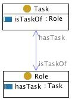

#  Graphical representation

__Diagram__

#  General description

|  |  |
| --- | --- |
|  Name: |  role task |
|  Submitted by: | [ValentinaPresutti](../User/ValentinaPresutti.md "User:ValentinaPresutti") |
|  Also Known As: |  task role |
|  Intent: |  To represent the assignment of tasks to roles |
|  Domains: | [Organization](../Community/Organization.md "Community:Organization"), [Management](../Community/Management.md "Community:Management"), [Scheduling](../Community/Scheduling.md "Community:Scheduling") |
|  Competency Questions: | <li> What roles are this task of?</li><li> What tasks do have this role?</li> |
|  Solution description: |  This pattern is basic, and is used to connect intensional descriptions of actions (tasks) and objects (roles). |
|  Reusable OWL Building Block: | [http://www.ontologydesignpatterns.org/cp/owl/taskrole.owl](http://ontologydesignpatterns.org/wiki/index.php?title=Special:ClickHandler&link=http://www.ontologydesignpatterns.org/cp/owl/taskrole.owl&message=OWL building block&from_page_id=445&update=) (730) |
|  Consequences: |  This pattern allows to put roles in the domain of discourse. It does not allow to model time indexed task assignement. |
|  Scenarios: |  Students have the duty of giving exams |
|  Known Uses: |  |
|  Web References: |  |
|  Other References: |  |
|  Examples (OWL files): | <li><a class="external free" href="http://www.ontologydesignpatterns.org/cp/examples/taskrole/ex1.owl" rel="nofollow" title="http://www.ontologydesignpatterns.org/cp/examples/taskrole/ex1.owl">http://www.ontologydesignpatterns.org/cp/examples/taskrole/ex1.owl</a></li> |
|  Extracted From: | <li><a class="external free" href="http://www.ontologydesignpatterns.org/ont/dul/DUL.owl" rel="nofollow" title="http://www.ontologydesignpatterns.org/ont/dul/DUL.owl">http://www.ontologydesignpatterns.org/ont/dul/DUL.owl</a></li> |
|  Reengineered From: |  |
|  Has Components: |  |
|  Specialization Of: |  |
|  Related CPs: | <li><a href="../AgentRole/AgentRole.md" title="Submissions:AgentRole">Submissions:AgentRole</a></li><li><a href="../Description/Description.md" title="Submissions:Description">Submissions:Description</a></li><li><a href="../Objectrole/Objectrole.md" title="Submissions:Objectrole">Submissions:Objectrole</a></li> |

  

#  Elements

_The __Role task__ Content OP locally defines the following ontology elements:_

 __role__ (owl:Class) A concept that classifies an object. For example, the role developer classifies a person, the role server classifies a computer machine. A hasTask only Tasks. It is disjoint with Task. 

  _[Role](../AgentRole/AgentRole.md "Submissions:Role task/Role") page_

 __has task__ (owl:ObjectProperty) A relation between roles and tasks, e.g. 'students have the duty of giving exams' (i.e. the Role 'student' hasTask the Task 'giving exams'). It is the inverse of  [isTaskOf](./Role_task/isTaskOf.md "Submissions:Role task/isTaskOf"). 

  _[hasTask](./Affordance/hasTask.md "Submissions:Role task/hasTask") page_

 __Task__ (owl:Class) A piece of work to be done or undertaken. A Task is assigned to only  [Roles](../AgentRole/AgentRole.md "Submissions:Role task/Role") through the property  [isTaskOf](./Role_task/isTaskOf.md "Submissions:Role task/isTaskOf"). 

  _[Task](./Affordance/hasTask.md "Submissions:Role task/Task") page_

 __is task ok__ (owl:ObjectProperty) A relation between  [roles](../AgentRole/AgentRole.md "Submissions:Role task/Role") and  [tasks](./Affordance/hasTask.md "Submissions:Role task/Task"), e.g. 'students have the duty of giving exams' (i.e. the Role 'student' hasTask the Task 'giving exams'). It is the inverse of  [hasTask](./Affordance/hasTask.md "Submissions:Role task/hasTask"). 

  _[isTaskOf](./Role_task/isTaskOf.md "Submissions:Role task/isTaskOf") page_
#  Additional information

This CP is typically used in composition with the  [agent role](../AgentRole/AgentRole.md "Submissions:AgentRole") CP, or  [object role](../Objectrole/Objectrole.md "Submissions:Objectrole") CP. It can be also used with the  [description](../Description/Description.md "Submissions:Description") CP, when used for representing e.g., plans, workflows.

#  Scenarios

__Scenarios about Role task__
No scenario is added to this Content OP.

#  Reviews

__Reviews about Role task__
There is no review about this proposal.
This revision (revision ID __9119__) takes in account the reviews: none

Other info at [evaluation tab](http://ontologydesignpatterns.org/wiki/index.php?title=Submissions:Role_task&action=evaluation "http://ontologydesignpatterns.org/wiki/index.php?title=Submissions:Role_task&action=evaluation")

  

#  Modeling issues

__Modeling issues about Role task__
There is no Modeling issue related to this proposal.

  

#  References