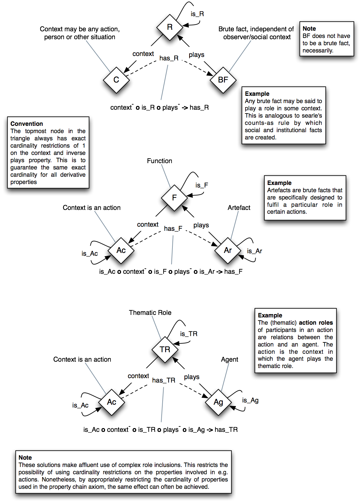

# 

 Graphical representation

__Diagram__ 

# 

 General description

|  |  |
| --- | --- |
|  Name:  |  Roles (OWL 2)  |
|  Submitted by:  | [Rinke Hoekstra](http://ontologydesignpatterns.org/wiki/index.php?title=User:Rinke_Hoekstra&action=edit&redlink=1 "User:Rinke Hoekstra (not yet written)")  |
|  Also Known As:  |  Roles, Functions, Actions and Agents (OWL 2)  |
|  Intent:  |  Capture the relational nature of roles using OWL 2 property chains, using the [Social Reality (OWL 2)](http://ontologydesignpatterns.org/wiki/index.php?title=Community:Social_Reality_%28OWL_2%29&action=edit&redlink=1 "Community:Social Reality (OWL 2) (not yet written)")  pattern. Using this pattern the role-as-relation and role-as-class approach can coexist peacefully inside a single ontology.  |
|  Domains:  |  |
|  Competency Questions:  |  |
|  Solution description:  |  Extend the [Social Reality (OWL 2)](http://ontologydesignpatterns.org/wiki/index.php?title=Community:Social_Reality_%28OWL_2%29&action=edit&redlink=1 "Community:Social Reality (OWL 2) (not yet written)")  pattern with classes for roles, functions, agents and actions. Create a new subproperty "plays" for the counts-as relation. We create new property chains to traverse the context and plays relation, that allow us to infer the role-as-relation from the role-as-class description.  Imports the [Social Reality (OWL 2)](http://ontologydesignpatterns.org/wiki/index.php?title=Community:Social_Reality_%28OWL_2%29&action=edit&redlink=1 "Community:Social Reality (OWL 2) (not yet written)")  pattern from [[1]](http://purl.org/net/social-reality "http://purl.org/net/social-reality")  .  |
|  Reusable OWL Building Block:  | [http://purl.org/net/roles](http://ontologydesignpatterns.org/wiki/index.php?title=Special:ClickHandler&link=http://purl.org/net/roles&message=OWL building block&from_page_id=3019&update=)  (860)  |
|  Consequences:  |  |
|  Scenarios:  |  |
|  Known Uses:  |  |
|  Web References:  |  |
|  Other References:  |  |
|  Examples (OWL files):  |  |
|  Extracted From:  |  |
|  Reengineered From:  |  |
|  Has Components:  |  |
|  Specialization Of:  |  |
|  Related CPs:  |  |

  

# 

 Elements

_The
 __Roles (OWL 2)__ 
 Content OP locally defines the following ontology elements:_ 

# 

 Additional information

 This pattern is made available under the CC-BY licence (
 [http://creativecommons.org/licenses/by/2.0/](http://creativecommons.org/licenses/by/2.0/ "http://creativecommons.org/licenses/by/2.0/") 
 ). Under this licence the pattern can be freely reused but reusers should include an attribution to the original author (Rinke Hoekstra)
 

 In your academic publications, please refer to this pattern by citing:
 

 Rinke Hoekstra. Representing social reality in OWL 2. In Evren Sirin and Kendall Clark, editors, Proceedings of OWLED 2010, June 2010.
 

 and/or
 

 Rinke Hoekstra. Ontology Representation – Design Patterns and Ontologies that Make Sense, volume 197 of Frontiers of Artificial Intelligence and Applications. IOS Press, Amsterdam, June 2009.
 

  

# 

 Scenarios

__Scenarios about Roles (OWL 2)__ 

 No scenario is added to this Content OP.
 

# 

 Reviews

__Reviews about Roles (OWL 2)__ 

 There is no review about this proposal.
This revision (revision ID
 __10279__ 
 ) takes in account the reviews: none
 

 Other info at
 [evaluation tab](http://ontologydesignpatterns.org/wiki/index.php?title=Submissions:Roles_%28OWL_2%29&action=evaluation "http://ontologydesignpatterns.org/wiki/index.php?title=Submissions:Roles_%28OWL_2%29&action=evaluation") 

  

# 

 Modeling issues

__Modeling issues about Roles (OWL 2)__ 

 There is no Modeling issue related to this proposal.
 

  

# 

 References