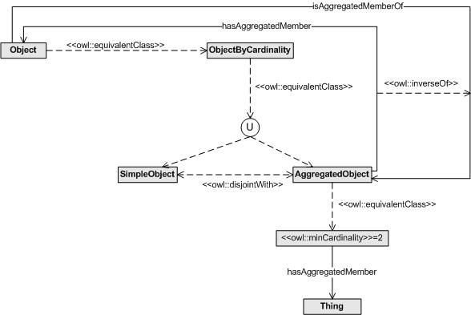

# 

 Graphical representation

__Diagram__ 

# 

 General description

|  |  |
| --- | --- |
|  Name:  |  SimpleOrAggregated  |
|  Submitted by:  | [MariaPoveda](../User/MariaPoveda.md "User:MariaPoveda")  , [MariCarmenDeFigueroa](../User/MariCarmenDeFigueroa.md "User:MariCarmenDeFigueroa")  |
|  Also Known As:  |  |
|  Intent:  |  The goal of this pattern is to represent objects that can be simple or aggregated (that is, several objects gathered in another object acting as a whole).  The main difference between the aggregation relation and other mereological relationships (such as part-of or componency) is that the aggregated object and its aggregated members should belong to the same concept. For example, a turbine is part of an engine, whereas an aggregated provider is formed by providers.  |
|  Domains:  | [Parts and Collections](../Community/Parts_and_Collections.md "Community:Parts and Collections")  |
|  Competency Questions:  | <li>       What elements are aggregated members of this object?      </li><li>       What is this object aggregated member of?      </li> |
|  Solution description:  |  The class "ObjectByCardinality" has been created to classify simple and aggregated objects into its subclasses "SimpleObject" and "AggregatedObject", respectively. These subclasses are disjoint among them.  The aggregation relationship between objects means that objects can be composed by other objects. This relationship is represented by the transtive property "hasAggregatedMember" and its inverse "isAggregatedMemberOf". These properties have as subproperties the non transitive properties "hasDirectAggregatedMember" and its inverse "isDirectAggregatedMemberOf", respectively. By means of this structure of properties, we provide a mechanism (a) to represent transitive aggregation relationships (that is, if A has B as aggregated member and B has C as aggregated member then A has C as aggregated member) and (b) to link each aggregated member just to the next level (that is, A has B as direct aggregated member).  Finally, the class "AggregatedObject" has been defined as equivalent to those things that have some values for the property "hasAggregatedMember". This modelling allows the automatic classification of aggregated objects in this class when a reasoner is applied.  |
|  Reusable OWL Building Block:  | [http://delicias.dia.fi.upm.es/ontologies/SimpleOrAggregated.owl](http://ontologydesignpatterns.org/wiki/index.php?title=Special:ClickHandler&link=http://delicias.dia.fi.upm.es/ontologies/SimpleOrAggregated.owl&message=OWL building block&from_page_id=2898&update=)  (838)  |
|  Consequences:  |  This Content OP allows designers to represent both simple individuals of a given concept (that is, an individual that is made up of itself) and aggregated individuals of a given concept (that is, an individual that is made up of several individuals of the same concept).  In summary, this pattern allows to represent both simple objects and aggregated objects and their members.In addition, this pattern can be used to detect the following contradictory situation by means of applying a reasoner: 'to instantiate the relationship "hasAggregatedMember" for an Object that belongs to "SimpleObject"'. This situation represents a consistency error and it is detected when a resoner is applied due to the following modelling decisions included in the pattern: (a) "AggregatedObject" class represents the "hasAggregatedMember" domain and (b) "AggregatedObject" is disjoint with "SimpleObject".  |
|  Scenarios:  |  A service provider can be simple or be an aggregate of a set of service providers. A context source can be simple or be an aggregate of a set of context sources. A computing or storage resource can be simple or be an aggregate of a set of computing or storage resources.  |
|  Known Uses:  |  |
|  Web References:  |  |
|  Other References:  |  |
|  Examples (OWL files):  |  |
|  Extracted From:  |  |
|  Reengineered From:  |  |
|  Has Components:  |  |
|  Specialization Of:  |  |
|  Related CPs:  |  |

  

# 

 Elements

_The
 __SimpleOrAggregated__ 
 Content OP locally defines the following ontology elements:_ 

__hasAggregatedMember__ 
 (owl:ObjectProperty)
 

_[hasAggregatedMember](./SimpleOrAggregated/hasAggregatedMember.md "Submissions:SimpleOrAggregated/hasAggregatedMember") 
 page_ 

__isAggregatedMemberOf__ 
 (owl:ObjectProperty)
 

_[isAggregatedMemberOf](./SimpleOrAggregated/isAggregatedMemberOf.md "Submissions:SimpleOrAggregated/isAggregatedMemberOf") 
 page_ 

__AggregatedObject__ 
 (owl:Class) An object that is an aggregation of two or more objects.
 
  

 Un objeto resultante de la agregación de dos o más objetos.
 

_[AggregatedObject](./SimpleOrAggregated/AggregatedObject.md "Submissions:SimpleOrAggregated/AggregatedObject") 
 page_ 

__Object__ 
 (owl:Class) Any physical, social, or mental object, or a substance.
 
  

 Cualquier objeto físico, social o mental o sustancia.
 

_[Object](../Object/Object.md "Submissions:SimpleOrAggregated/Object") 
 page_ 

__ObjectByCardinality__ 
 (owl:Class)
 

_[ObjectByCardinality](./SimpleOrAggregated/ObjectByCardinality.md "Submissions:SimpleOrAggregated/ObjectByCardinality") 
 page_ 

__SimpleObject__ 
 (owl:Class) A simple object, that is, an object that has no aggregated objects.
 
  

 Un objeto simple, es decir, un objeto que no tiene objetos agregados.
 

_[SimpleObject](./SimpleOrAggregated/SimpleObject.md "Submissions:SimpleOrAggregated/SimpleObject") 
 page_ 

# 

 Additional information

# 

 Scenarios

__Scenarios about SimpleOrAggregated__ 

* Modelling simple and aggregated service providers within the mIO! ontology network. Service providers are also organized by types. [>>>](./AgentRole/Scenario_1.md "http://ontologydesignpatterns.org/wiki/Submissions:SimpleOrAggregated/Scenario_1")* Modelling simple and aggregated context sources within the mIO! ontology network. [>>>](./Literal_Reification/Scenario_2.md "http://ontologydesignpatterns.org/wiki/Submissions:SimpleOrAggregated/Scenario_2")* Modelling simple and aggregated resources. These resources are also organized by types, specifically, they can be computing or storage resources. [>>>](./SimpleOrAggregated/Scenario_3.md "http://ontologydesignpatterns.org/wiki/Submissions:SimpleOrAggregated/Scenario_3")

# 

 Reviews

__Reviews about SimpleOrAggregated__ 

|  Review article  | [Posted on](../Property/CreationDate.md "Property:CreationDate")  | [About revision (current is 10170)](../Property/ReviewAboutVersion.md "Property:ReviewAboutVersion")  |
| --- | --- | --- |
| [CatherineRoussey about SimpleOrAggregated](../Reviews/CatherineRoussey_about_SimpleOrAggregated.md "Reviews:CatherineRoussey about SimpleOrAggregated")  |  2455450  10 September 2010  |  10064  10,064  |
| [GerdGroener about SimpleOrAggregated](../Reviews/GerdGroener_about_SimpleOrAggregated.md "Reviews:GerdGroener about SimpleOrAggregated")  |  2455450  10 September 2010  |  10097  10,097  |
| [VojtechSvatek about SimpleOrAggregated](../Reviews/VojtechSvatek_about_SimpleOrAggregated.md "Reviews:VojtechSvatek about SimpleOrAggregated")  |  2455456  16 September 2010  |  10097  10,097  |

 This revision (revision ID
 __10170__ 
 ) takes in account the reviews: none
 

 Other info at
 [evaluation tab](http://ontologydesignpatterns.org/wiki/index.php?title=Submissions:SimpleOrAggregated&action=evaluation "http://ontologydesignpatterns.org/wiki/index.php?title=Submissions:SimpleOrAggregated&action=evaluation") 

  

# 

 Modeling issues

__Modeling issues about SimpleOrAggregated__ 

 There is no Modeling issue related to this proposal.
 

  

# 

 References

  

|  |  Submission to event [WOP:2010](../WOP/2010.md "WOP:2010")  |
| --- | --- |