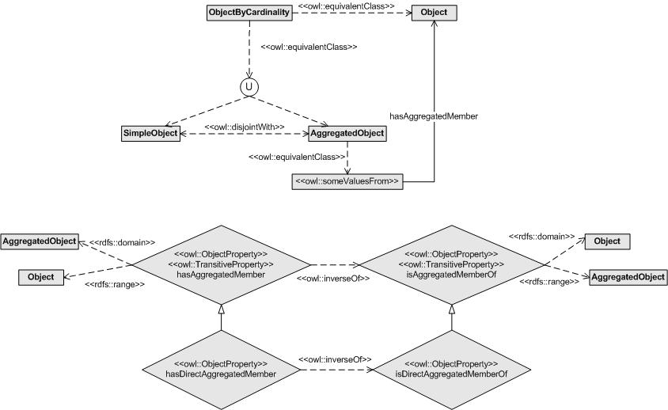

# 

 Graphical representation

__Diagram__ 

# 

 General description

|  |  |
| --- | --- |
|  Name:  |  SimpleOrAggregated  |
|  Submitted by:  | [MariaPoveda](../User/MariaPoveda "User:MariaPoveda")  , [MariCarmenDeFigueroa](../User/MariCarmenDeFigueroa "User:MariCarmenDeFigueroa")  |
|  Also Known As:  |  |
|  Intent:  |  The goal of this pattern is to represent in a non-transitive fashion objects that can be simple or aggregated (that is, several objects gathered in another object acting as a whole).  |
|  Domains:  | [Parts and Collections](../Community/Parts_and_Collections "Community:Parts and Collections")  |
|  Competency Questions:  | <li>       What elements are aggregated members of this object?      </li><li>       What is this object aggregated member of?      </li> |
|  Solution description:  |  The class "ObjectByCardinality" has been created to classify simple and aggregated objects into its subclasses "SimpleObject" and "AggregatedObject", respectively. These subclasses are disjoint among them.  The relationship of aggregation between objects is represented by means of the "hasAggregatedMember" property and its inverse "isAggregatedMemberOf".  Finally, the class "AggregatedObject" has been defined as equivalent to those things that have at least two values for the property "hasAggregatedMember" with the aim of allowing the automatic classification of aggregated objects in this class when a reasoner is applied.  |
|  Reusable OWL Building Block:  | [http://delicias.dia.fi.upm.es/ontologies/SimpleOrAggregated.owl](http://ontologydesignpatterns.org/wiki/index.php?title=Special:ClickHandler&link=http://delicias.dia.fi.upm.es/ontologies/SimpleOrAggregated.owl&message=OWL building block&from_page_id=2898&update=)  (838)  |
|  Consequences:  |  This Content OP allows designers to represent simple individuals of a given concept (that is, an individual that is made up of itself) and aggregated individuals of a given concept (that is, an individual that is made up of several individuals of the same concept).  In summary, this pattern allows to represent both simple objects and aggregated objects and their members.In addition, this pattern can be used to detect the following contradictory situation by means of applying a reasoner: 'to instanciate the relationship "hasAggregatedMember" for an Object that belongs to "SimpleObject"'. This situation represents a consistency error and it is detected when a resoner is applied due to the following modelling decisions included in the pattern: (a) "AggregatedObject" class represents the "hasAggregatedMember" domain and (b) it is disjoint with "SimpleObject".  |
|  Scenarios:  |  A service provider can be simple or be an aggregate of a set of service providers.  A context source can be simple or be an aggregate of a set of context sources.  A computing or storage resource can be simple or be an aggregate of a set of computing or storage resources.  |
|  Known Uses:  |  |
|  Web References:  |  |
|  Other References:  |  |
|  Examples (OWL files):  |  |
|  Extracted From:  |  |
|  Reengineered From:  |  |
|  Has Components:  |  |
|  Specialization Of:  |  |
|  Related CPs:  |  |

  

# 

 Elements

_The
 __SimpleOrAggregated__ 
 Content OP locally defines the following ontology elements:_ 

__hasAggregatedMember__ 
 (owl:ObjectProperty)
 

_[hasAggregatedMember](../Submissions/SimpleOrAggregated/hasAggregatedMember "Submissions:SimpleOrAggregated/hasAggregatedMember") 
 page_ 

__isAggregatedMemberOf__ 
 (owl:ObjectProperty)
 

_[isAggregatedMemberOf](../Submissions/SimpleOrAggregated/isAggregatedMemberOf "Submissions:SimpleOrAggregated/isAggregatedMemberOf") 
 page_ 

__AggregatedObject__ 
 (owl:Class) An object that is an aggregation of two or more objects.
 
  

 Un objeto resultante de la agregación de dos o más objetos.
 

_[AggregatedObject](../Submissions/SimpleOrAggregated/AggregatedObject "Submissions:SimpleOrAggregated/AggregatedObject") 
 page_ 

__Object__ 
 (owl:Class) Any physical, social, or mental object, or a substance.
 
  

 Cualquier objeto físico, social o mental o sustancia.
 

_[Object](../Submissions/SimpleOrAggregated/Object "Submissions:SimpleOrAggregated/Object") 
 page_ 

__ObjectByCardinality__ 
 (owl:Class)
 

_[ObjectByCardinality](../Submissions/SimpleOrAggregated/ObjectByCardinality "Submissions:SimpleOrAggregated/ObjectByCardinality") 
 page_ 

__SimpleObject__ 
 (owl:Class) A simple object, that is, an object that has no aggregated objects.
 
  

 Un objeto simple, es decir, un objeto que no tiene objetos agregados.
 

_[SimpleObject](../Submissions/SimpleOrAggregated/SimpleObject "Submissions:SimpleOrAggregated/SimpleObject") 
 page_ 

# 

 Additional information

# 

 Scenarios

__Scenarios about SimpleOrAggregated__ 

* Modelling simple and aggregated service providers within the mIO! ontology network. Service providers are also organized by types. [>>>](../Submissions/SimpleOrAggregated/Scenario_1 "http://ontologydesignpatterns.org/wiki/Submissions:SimpleOrAggregated/Scenario_1")* Modelling simple and aggregated context sources within the mIO! ontology network. [>>>](../Submissions/SimpleOrAggregated/Scenario_2 "http://ontologydesignpatterns.org/wiki/Submissions:SimpleOrAggregated/Scenario_2")* Modelling simple and aggregated resources. These resources are also organized by types, specifically, they can be computing or storage resources. [>>>](../Submissions/SimpleOrAggregated/Scenario_3 "http://ontologydesignpatterns.org/wiki/Submissions:SimpleOrAggregated/Scenario_3")

# 

 Reviews

__Reviews about SimpleOrAggregated__ 

|  Review article  | [Posted on](../Property/CreationDate "Property:CreationDate")  | [About revision (current is 10064)](../Property/ReviewAboutVersion "Property:ReviewAboutVersion")  |
| --- | --- | --- |
| [CatherineRoussey about SimpleOrAggregated](../Reviews/CatherineRoussey_about_SimpleOrAggregated "Reviews:CatherineRoussey about SimpleOrAggregated")  |  2455450  10 September 2010  |  10064  10,064  |
| [GerdGroener about SimpleOrAggregated](../Reviews/GerdGroener_about_SimpleOrAggregated "Reviews:GerdGroener about SimpleOrAggregated")  |  2455450  10 September 2010  |  10097  10,097  |
| [VojtechSvatek about SimpleOrAggregated](../Reviews/VojtechSvatek_about_SimpleOrAggregated "Reviews:VojtechSvatek about SimpleOrAggregated")  |  2455456  16 September 2010  |  10097  10,097  |

 This revision (revision ID
 __10064__ 
 ) takes in account the reviews: none
 

 Other info at
 [evaluation tab](http://ontologydesignpatterns.org/wiki/index.php?title=Submissions:SimpleOrAggregated&action=evaluation "http://ontologydesignpatterns.org/wiki/index.php?title=Submissions:SimpleOrAggregated&action=evaluation") 

  

# 

 Modeling issues

__Modeling issues about SimpleOrAggregated__ 

 There is no Modeling issue related to this proposal.
 

  

# 

 References

  

|  |  Submission to event [WOP:2010](../WOP/2010 "WOP:2010")  |
| --- | --- |