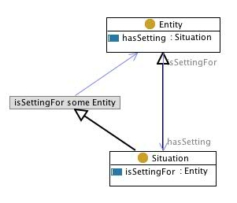

# 

 Graphical representation

__Diagram__ 

# 

 General description

|  |  |
| --- | --- |
|  Name:  |  Situation  |
|  Submitted by:  | [AldoGangemi](../User/AldoGangemi.md "User:AldoGangemi")  |
|  Also Known As:  |  situation  |
|  Intent:  |  To represent contexts or situations, and the things that are contextualized.  |
|  Domains:  | [General](../Community/General.md "Community:General")  |
|  Competency Questions:  | <li>       What is the context or situation of something? What are the things present in this context or situation?      </li> |
|  Solution description:  |  -  |
|  Reusable OWL Building Block:  | [http://www.ontologydesignpatterns.org/cp/owl/situation.owl](http://ontologydesignpatterns.org/wiki/index.php?title=Special:ClickHandler&link=http://www.ontologydesignpatterns.org/cp/owl/situation.owl&message=OWL building block&from_page_id=110&update=)  (1046)  |
|  Consequences:  |  We can contextualize things that have something in common, or are associated: a same place, time, view, causal link, systemic dependence, etc.  We can also reify n-ary relations as situations.  |
|  Scenarios:  |  The lecture was held in January 1921 by Bela Fleck, with some physicians in the audience making questions, in a very relaxed athmosphere.  |
|  Known Uses:  |  |
|  Web References:  |  |
|  Other References:  |  |
|  Examples (OWL files):  |  |
|  Extracted From:  | <li><a class="external free" href="http://www.ontologydesignpatterns.org/ont/dul/DUL.owl" rel="nofollow" title="http://www.ontologydesignpatterns.org/ont/dul/DUL.owl">        http://www.ontologydesignpatterns.org/ont/dul/DUL.owl       </a></li> |
|  Reengineered From:  |  |
|  Has Components:  |  |
|  Specialization Of:  |  |
|  Related CPs:  |  |

  

# 

 Elements

_The
 __Situation__ 
 Content OP locally defines the following ontology elements:_ 

__hasSetting__ 
 (owl:ObjectProperty) A relation between entities and situations, e.g. 'this morning I've prepared my coffee with a new fantastic Arabica' (i.e.: (an amount of) a new fantastic Arabica hasSetting the preparation of my coffee this morning).
 

_[hasSetting](./Situation/hasSetting.md "Submissions:Situation/hasSetting") 
 page_ 

__isSettingFor__ 
 (owl:ObjectProperty)
 

_[isSettingFor](./Situation/isSettingFor.md "Submissions:Situation/isSettingFor") 
 page_ 

__Situation__ 
 (owl:Class) A view on a set of entities. It can be seen as a 'relational context', reifying a relation.
 
 For example, a PlanExecution is a context including some actions executed by agents according to certain parameters and expected tasks to be achieved from a Plan; a DiagnosedSituation is a context of observed entities that is interpreted on the basis of a Diagnosis, etc.
 

 Situation is also able to represent reified n-ary relations, where isSettingFor is the top-level relation for all binary projections of the n-ary relation. If used in a transformation pattern for n-ary relations, the designer should take care of:
 

 - creating only one situation for each instance of an n-ary relation, otherwise the 'identification constraint' (Calvanese et al., IJCAI 2001) could be violated
 

 - adding an 'exact cardinality' restriction corresponding to the arity of the n-ary relation, otherwise the designer would actually represent a polymorphic relation.
 

_[Situation](../DescriptionAndSituation/DescriptionAndSituation.md "Submissions:Situation/Situation") 
 page_ 

# 

 Additional information

 (type):
 [http://www.w3.org/2002/07/owl#Ontology](http://www.w3.org/2002/07/owl#Ontology "http://www.w3.org/2002/07/owl#Ontology") 

 (versionInfo): Created by Aldo Gangemi and Valentina Presutti
 

 (imports):
 [http://www.ontologydesignpatterns.org/schemas/cpannotationschema.owl](http://www.ontologydesignpatterns.org/schemas/cpannotationschema.owl "http://www.ontologydesignpatterns.org/schemas/cpannotationschema.owl") 

# 

 Scenarios

__Scenarios about Situation__ 

* I prepared a coffee with my heater, 300 ml of water, and an Arabica coffee mix. [>>>](./AgentRole/Scenario_1.md "http://ontologydesignpatterns.org/wiki/Submissions:Situation/Scenario_1")

# 

 Reviews

__Reviews about Situation__ 

 There is no review about this proposal.
This revision (revision ID
 __9122__ 
 ) takes in account the reviews: none
 

 Other info at
 [evaluation tab](http://ontologydesignpatterns.org/wiki/index.php?title=Submissions:Situation&action=evaluation "http://ontologydesignpatterns.org/wiki/index.php?title=Submissions:Situation&action=evaluation") 

  

# 

 Modeling issues

__Modeling issues about Situation__ 

|  Modeling issue  | [Competency question](../Property/CompetencyQuestion.md "Property:CompetencyQuestion")  | [Domains](../Property/Domain.md "Property:Domain")  |
| --- | --- | --- |
| [Situation classification](../Community/Situation_classification.md "Community:Situation classification")  |  What situations satisfy a certain description? What descriptions can be (partly) satisfied by that situation? What situations (partly) satisfying a certain description can emerge out of this dataset?  |  |

  

# 

 References