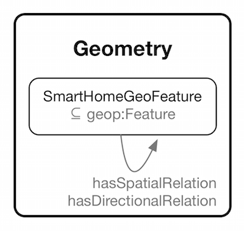

#  Graphical representation

__Diagram__

#  General description

|  |  |
| --- | --- |
|  Name: |  SmartHome\_Geometry |
|  Submitted by: | [MarjanAlirezaie](../User/MarjanAlirezaie.md "User:MarjanAlirezaie") |
|  Also Known As: |  |
|  Intent: |  To represent geospatial relations between objects. |
|  Domains: |  |
|  Competency Questions: | <li> What are the spatial entities (objects with geometry) in a smart home environment?</li> |
|  Solution description: |  TBD |
|  Reusable OWL Building Block: | [http://ecareathome-ontology.mpi.aass.oru.se/patterns/SmartHome\_Geometry.owl](http://ontologydesignpatterns.org/wiki/index.php?title=Special:ClickHandler&link=http://ecareathome-ontology.mpi.aass.oru.se/patterns/SmartHome_Geometry.owl&message=OWL building block&from_page_id=4260&update=) (497) |
|  Consequences: |  |
|  Scenarios: |  |
|  Known Uses: |  |
|  Web References: |  |
|  Other References: |  |
|  Examples (OWL files): |  |
|  Extracted From: |  |
|  Reengineered From: |  |
|  Has Components: |  |
|  Specialization Of: |  |
|  Related CPs: |  |

  

#  Elements

_The __SmartHome Geometry__ Content OP locally defines the following ontology elements:_

 __eastOf__ (owl:ObjectProperty) 
  _[eastOf](./SmartHome_Geometry/eastOf.md "Submissions:SmartHome Geometry/eastOf") page_
 __hasDirectionalRelation__ (owl:ObjectProperty) 
  _[hasDirectionalRelation](./SmartHome_Geometry/hasDirectionalRelation.md "Submissions:SmartHome Geometry/hasDirectionalRelation") page_
 __hasSpatialRelation__ (owl:ObjectProperty) 
  _[hasSpatialRelation](./SmartHome_Geometry/hasSpatialRelation.md "Submissions:SmartHome Geometry/hasSpatialRelation") page_
 __northEastOf__ (owl:ObjectProperty) 
  _[northEastOf](./SmartHome_Geometry/northEastOf.md "Submissions:SmartHome Geometry/northEastOf") page_
 __northOf__ (owl:ObjectProperty) 
  _[northOf](./SmartHome_Geometry/northOf.md "Submissions:SmartHome Geometry/northOf") page_
 __northWestOf__ (owl:ObjectProperty) 
  _[northWestOf](./SmartHome_Geometry/northWestOf.md "Submissions:SmartHome Geometry/northWestOf") page_
 __southEastOf__ (owl:ObjectProperty) 
  _[southEastOf](./SmartHome_Geometry/southEastOf.md "Submissions:SmartHome Geometry/southEastOf") page_
 __southOf__ (owl:ObjectProperty) 
  _[southOf](./SmartHome_Geometry/southOf.md "Submissions:SmartHome Geometry/southOf") page_
 __southWestOf__ (owl:ObjectProperty) 
  _[southWestOf](./SmartHome_Geometry/southWestOf.md "Submissions:SmartHome Geometry/southWestOf") page_
 __westOf__ (owl:ObjectProperty) 
  _[westOf](./SmartHome_Geometry/westOf.md "Submissions:SmartHome Geometry/westOf") page_
 __SmartHomeGeoFeature__ (owl:Class) 
  _[SmartHomeGeoFeature](./SmartHome_Geometry/SmartHomeGeoFeature.md "Submissions:SmartHome Geometry/SmartHomeGeoFeature") page_
#  Additional information

#  Scenarios

__Scenarios about SmartHome Geometry__
No scenario is added to this Content OP.

#  Reviews

__Reviews about SmartHome Geometry__
There is no review about this proposal.
This revision (revision ID __13129__) takes in account the reviews: none

Other info at [evaluation tab](http://ontologydesignpatterns.org/wiki/index.php?title=Submissions:SmartHome_Geometry&action=evaluation "http://ontologydesignpatterns.org/wiki/index.php?title=Submissions:SmartHome_Geometry&action=evaluation")

  

#  Modeling issues

__Modeling issues about SmartHome Geometry__
There is no Modeling issue related to this proposal.

  

#  References