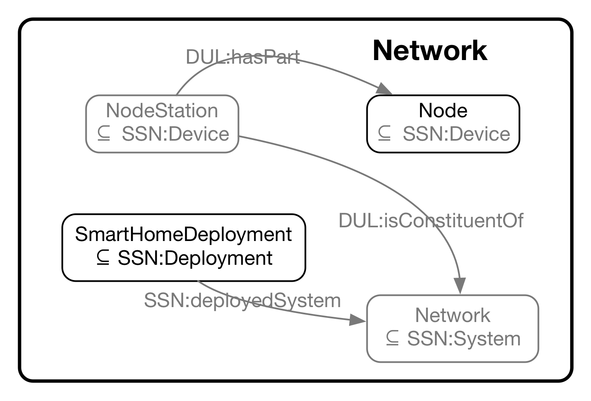

#  Graphical representation

__Diagram__

#  General description

|  |  |
| --- | --- |
|  Name: |  SmartHome\_Network |
|  Submitted by: | [MarjanAlirezaie](../User/MarjanAlirezaie.md "User:MarjanAlirezaie") |
|  Also Known As: |  |
|  Intent: |  This pattern relies on both the SSN ontology and DUL in order to represent sensors and other techniqually needed objects to deploy a network in a smart home environment.The concept of Network is modeled in this pattern as a System ([http://purl.oclc.org/NET/ssnx/ssn#System](http://purl.oclc.org/NET/ssnx/ssn#System "http://purl.oclc.org/NET/ssnx/ssn#System")) whose constituents are NodeStations (subclass of Node which is in turn subsumed by the class [http://purl.oclc.org/NET/ssnx/ssn#Device](http://purl.oclc.org/NET/ssnx/ssn#Device "http://purl.oclc.org/NET/ssnx/ssn#Device")). Another subsumee of the Device class is the class Node describing more details about the content of each node station. Depending on their roles, nodes of a network are devided into types of node senders (whcih observe a phenomenon and send the data) and receivers (which receive the observation data). |
|  Domains: |  |
|  Competency Questions: | <li> What are the nodes that are sending data to a given receiver?</li><li> What is the receiving node of the given set of sending nodes?</li><li> Which types of nodes are available in a network?</li> |
|  Solution description: |  TBD |
|  Reusable OWL Building Block: | [http://ecareathome-ontology.mpi.aass.oru.se/patterns/SmartHome\_Network.owl](http://ontologydesignpatterns.org/wiki/index.php?title=Special:ClickHandler&link=http://ecareathome-ontology.mpi.aass.oru.se/patterns/SmartHome_Network.owl&message=OWL building block&from_page_id=4249&update=) (530) |
|  Consequences: |  |
|  Scenarios: |  |
|  Known Uses: |  |
|  Web References: |  |
|  Other References: |  |
|  Examples (OWL files): |  |
|  Extracted From: |  |
|  Reengineered From: |  |
|  Has Components: |  |
|  Specialization Of: |  |
|  Related CPs: |  |

  

#  Elements

_The __SmartHome Network__ Content OP locally defines the following ontology elements:_

 __receivesDataFrom__ (owl:ObjectProperty) 
  _[receivesDataFrom](./SmartHome_Network/receivesDataFrom.md "Submissions:SmartHome Network/receivesDataFrom") page_
 __sendsDataTo__ (owl:ObjectProperty) 
  _[sendsDataTo](./SmartHome_Network/sendsDataTo.md "Submissions:SmartHome Network/sendsDataTo") page_
 __DataReceiverNode__ (owl:Class) 
  _[DataReceiverNode](./SmartHome_Network/DataReceiverNode.md "Submissions:SmartHome Network/DataReceiverNode") page_
 __DataSenderNode__ (owl:Class) 
  _[DataSenderNode](./SmartHome_Network/DataSenderNode.md "Submissions:SmartHome Network/DataSenderNode") page_
 __Network__ (owl:Class) A network which is a collection of Nodes 
  _[Network](./SmartHome_Network.md "Submissions:SmartHome Network/Network") page_
 __Node__ (owl:Class) 
  _[Node](./SmartHome_Network/DataReceiverNode.md "Submissions:SmartHome Network/Node") page_
 __NodeStation__ (owl:Class) 
  _[NodeStation](./SmartHome_Network/NodeStation.md "Submissions:SmartHome Network/NodeStation") page_
 __ReceiverNodeStation__ (owl:Class) 
  _[ReceiverNodeStation](./SmartHome_Network/ReceiverNodeStation.md "Submissions:SmartHome Network/ReceiverNodeStation") page_
 __SenderNodeStation__ (owl:Class) 
  _[SenderNodeStation](./SmartHome_Network/SenderNodeStation.md "Submissions:SmartHome Network/SenderNodeStation") page_
 __SmartHomeDeployment__ (owl:Class) 
  _[SmartHomeDeployment](./SmartHome_Network/SmartHomeDeployment.md "Submissions:SmartHome Network/SmartHomeDeployment") page_
#  Additional information

#  Scenarios

__Scenarios about SmartHome Network__
No scenario is added to this Content OP.

#  Reviews

__Reviews about SmartHome Network__
There is no review about this proposal.
This revision (revision ID __13121__) takes in account the reviews: none

Other info at [evaluation tab](http://ontologydesignpatterns.org/wiki/index.php?title=Submissions:SmartHome_Network&action=evaluation "http://ontologydesignpatterns.org/wiki/index.php?title=Submissions:SmartHome_Network&action=evaluation")

  

#  Modeling issues

__Modeling issues about SmartHome Network__
There is no Modeling issue related to this proposal.

  

#  References