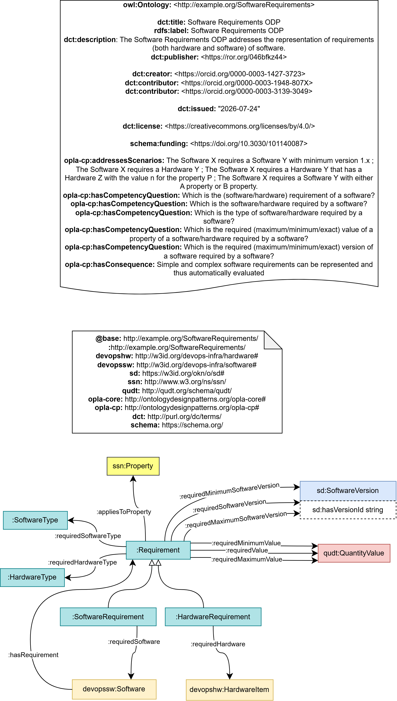

# SoftwareRequirements Ontology Design Pattern

## Description

The SoftwareRequirements ODP models software requirements, intended as an explicit descriptions of a condition that a software component, or the environment in which it is executed, has to satisfy. 

The pattern distinguishes between software and hardware requirements, supports requirements over specific resources or resource types, and allows one to express exact, minimum, and maximum required values, including software version intervals. 

|  |  |
| --- | --- |
|  name: |  SoftwareRequirements |
|  submitted by: | Valentina Anita Carriero [(valecarriero)](https://github.com/valecarriero) |
|  has competency questions: |  Which is the (software/hardware) requirement of a software? Which is the software/hardware required by a software? Which is the type of software/hardware required by a software? Which is the required (maximum/minimum/exact) value of a property of a software/hardware required by a software? Which is the required (maximum/minimum/exact) version of a software required by a software? |
|  reusable OWL building block: | [SoftwareRequirements.ttl](SoftwareRequirements.ttl) |
|  has consequence: | Simple and complex software requirements can be represented and thus automatically evaluated |
|  addresses scenarios: | The Software X requires a Software Y with minimum version 1.x ; The Software X requires a Hardware Y ; The Software X requires a Hardware Y that has a Hardware Z with the value n for the property P ; The Software X requires a Software Y with either A property or B property. |

## Schema Diagram

