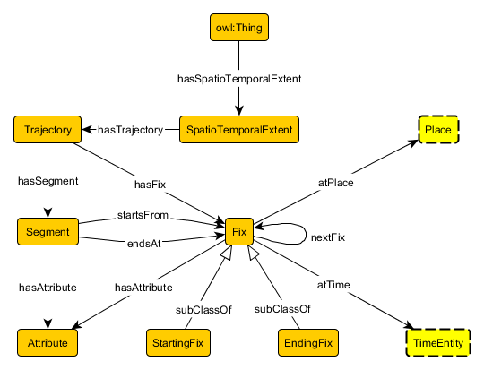

# 

 Graphical representation

__Diagram__ 

# 

 General description

|  |  |
| --- | --- |
|  Name:  |  SpatioTemporalExtent  |
|  Submitted by:  | [AdilaKrisnadhi](../User/AdilaKrisnadhi "User:AdilaKrisnadhi")  |
|  Also Known As:  |  |
|  Intent:  |  This pattern models a spatiotemporal extent, i.e., a combination of spatial and temporal extent as a set of generalized trajectories which cannot have temporal overlap. This pattern reuses semantic trajectory pattern as component.  |
|  Domains:  | [Earth Science or Geoscience](../Community/Earth_Science_or_Geoscience "Community:Earth Science or Geoscience")  , [General](../Community/General "Community:General")  |
|  Competency Questions:  | <li>       Where is Poland located in 1700?      </li><li>       List all places and time in which the 1990 World Chess Championship Match take place.      </li><li>       Where and when did the oceanographic cruise A01132 go?      </li> |
|  Solution description:  |  See Adila Krisnadhi, Pascal Hitzler, Krzysztof Janowicz. A Spatiotemporal Extent Pattern based on Semantic Trajectories. Under review for WOP 2016.  |
|  Reusable OWL Building Block:  | [http://krisnadhi.github.io/onto/spatiotemporalextent.owl](http://ontologydesignpatterns.org/wiki/index.php?title=Special:ClickHandler&link=http://krisnadhi.github.io/onto/spatiotemporalextent.owl&message=OWL building block&from_page_id=4141&update=)  (607)  |
|  Consequences:  |  |
|  Scenarios:  |  The World Chess Championship Match 1990 was held in two parts: New York (October 8 to November 7) and Lyons - France (November 26 to December 30).The Renaissance occured in different places at different times.A hurricane moves through the spacetime.  |
|  Known Uses:  |  |
|  Web References:  |  |
|  Other References:  |  |
|  Examples (OWL files):  |  |
|  Extracted From:  |  |
|  Reengineered From:  |  |
|  Has Components:  | <li><a href="Submissions%253ATrajectory.html" title="Submissions:Trajectory">        Submissions:Trajectory       </a></li> |
|  Specialization Of:  |  |
|  Related CPs:  | <li><a href="Submissions%253ATrajectory.html" title="Submissions:Trajectory">        Submissions:Trajectory       </a></li> |

  

# 

 Elements

_The
 __SpatioTemporalExtent__ 
 Content OP locally defines the following ontology elements:_ 

__hasSpatioTemporalExtent__ 
 (owl:ObjectProperty) Property relating anything (thus the domain is trivially owl:Thing and the range is unscoped) to a SpatioTemporalExtent.
 

_[hasSpatioTemporalExtent](../Submissions/SpatioTemporalExtent/hasSpatioTemporalExtent "Submissions:SpatioTemporalExtent/hasSpatioTemporalExtent") 
 page_ 

__hasTrajectory__ 
 (owl:ObjectProperty) Set to be equivalent to trj:hasTrajectory from the Trajectory pattern, this property relates anything (including SpatioTemporalExtent) to Trajectory.
 

_[hasTrajectory](../Submissions/SpatioTemporalExtent/hasTrajectory "Submissions:SpatioTemporalExtent/hasTrajectory") 
 page_ 

__SpatioTemporalExtent__ 
 (owl:Class) The class that represents the notion of spatiotemporal extent. A spatiotemporal extent is realized as a collection of generalized trajectories that have no temporal overlap.
 

_[SpatioTemporalExtent](../Submissions/SpatioTemporalExtent/SpatioTemporalExtent "Submissions:SpatioTemporalExtent/SpatioTemporalExtent") 
 page_ 

__Trajectory__ 
 (owl:Class) The hook to the Trajectory pattern, which acts as a component of the Spatiotemporal Extent pattern.
 

_[Trajectory](../Submissions/SpatioTemporalExtent/Trajectory "Submissions:SpatioTemporalExtent/Trajectory") 
 page_ 

# 

 Additional information

# 

 Scenarios

__Scenarios about SpatioTemporalExtent__ 

 No scenario is added to this Content OP.
 

# 

 Reviews

__Reviews about SpatioTemporalExtent__ 

 There is no review about this proposal.
This revision (revision ID
 __12771__ 
 ) takes in account the reviews: none
 

 Other info at
 [evaluation tab](http://ontologydesignpatterns.org/wiki/index.php?title=Submissions:SpatioTemporalExtent&action=evaluation "http://ontologydesignpatterns.org/wiki/index.php?title=Submissions:SpatioTemporalExtent&action=evaluation") 

  

# 

 Modeling issues

__Modeling issues about SpatioTemporalExtent__ 

 There is no Modeling issue related to this proposal.
 

  

# 

 References