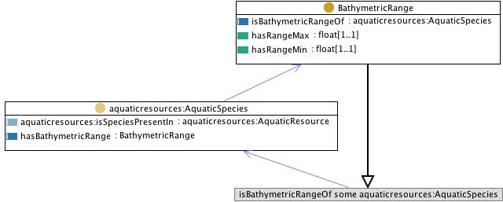

#  Graphical representation

__Diagram__

#  General description

|  |  |
| --- | --- |
|  Name: |  SpeciesBathymetry |
|  Submitted by: | [AldoGangemi](../User/AldoGangemi.md "User:AldoGangemi") |
|  Also Known As: |  |
|  Intent: |  to represent species together with their typical environment in terms of bathymetric range and water area |
|  Domains: |  |
|  Competency Questions: | <li> what species have what (typical) bathymetric range in what water area? where can species be typical found for a certain water area?</li> |
|  Solution description: |  --- |
|  Reusable OWL Building Block: | [http://www.ontologydesignpatterns.org/cp/owl/fsdas/speciesbathymetry.owl](http://ontologydesignpatterns.org/wiki/index.php?title=Special:ClickHandler&link=http://www.ontologydesignpatterns.org/cp/owl/fsdas/speciesbathymetry.owl&message=OWL building block&from_page_id=887&update=) (629) |
|  Consequences: |  The pattern allows to represent species with a typical bathymetric range and a typical water area where the exemplars (from an AquaticResource) can be found. However, there is no direct relation between the bathymetric range and the water area; in principle, it is possible that there are no places in the water area that provide the conditions for that bathymetric range.In order to represent a condition on the bathymetric range to be realized in the water area, the situation pattern should be reused and specialized, as in the speciesconditions.owl pattern. |
|  Scenarios: |  give me the species found below 200 metres for water area '24' |
|  Known Uses: |  |
|  Web References: |  |
|  Other References: |  |
|  Examples (OWL files): |  |
|  Extracted From: |  |
|  Reengineered From: |  |
|  Has Components: |  |
|  Specialization Of: |  |
|  Related CPs: |  |

  

#  Elements

_The __SpeciesBathymetry__ Content OP locally defines the following ontology elements:_

 __BathymetricRange__ (owl:Class) This class contains the set of bathymetric ranges. Bathymetry is numeric depth information about the ranges in which an aquatic species is found.
It can be mapped to fi:Bathymetry. 

  _[BathymetricRange](./SpeciesBathymetry/BathymetricRange.md "Submissions:SpeciesBathymetry/BathymetricRange") page_
 __hasBathymetricRange__ (owl:ObjectProperty) has bathymetric range 
  _[hasBathymetricRange](./SpeciesBathymetry/hasBathymetricRange.md "Submissions:SpeciesBathymetry/hasBathymetricRange") page_
 __isBathymetricRangeOf__ (owl:ObjectProperty) is bathymetric range of 
  _[isBathymetricRangeOf](./SpeciesBathymetry/isBathymetricRangeOf.md "Submissions:SpeciesBathymetry/isBathymetricRangeOf") page_
 __hasRangeMin__ (owl:DatatypeProperty) 
  _[hasRangeMin](./SpeciesBathymetry/hasRangeMin.md "Submissions:SpeciesBathymetry/hasRangeMin") page_
 __hasRangeMax__ (owl:DatatypeProperty) 
  _[hasRangeMax](./SpeciesBathymetry/hasRangeMax.md "Submissions:SpeciesBathymetry/hasRangeMax") page_
#  Additional information

This pattern encodes a FSDAS competency question, with an indication to use some AquaticSpecies class, and some hasBathymetricRange property, with range BathymetricRange.

(type): [http://www.w3.org/2002/07/owl#Ontology](http://www.w3.org/2002/07/owl#Ontology "http://www.w3.org/2002/07/owl#Ontology")

(versionInfo): Created by Aldo Gangemi

(imports): [http://www.ontologydesignpatterns.org/cp/owl/fsdas/aquaticresources.owl](http://www.ontologydesignpatterns.org/cp/owl/fsdas/aquaticresources.owl "http://www.ontologydesignpatterns.org/cp/owl/fsdas/aquaticresources.owl")

(imports): [http://www.ontologydesignpatterns.org/schemas/cpannotationschema.owl](http://www.ontologydesignpatterns.org/schemas/cpannotationschema.owl "http://www.ontologydesignpatterns.org/schemas/cpannotationschema.owl")

(comment): This pattern encodes a FSDAS competency question, with an indication to use some AquaticSpecies class, and some hasBathymetricRange property, with range BathymetricRange.

(versionInfo): 1.0

#  Scenarios

__Scenarios about SpeciesBathymetry__
No scenario is added to this Content OP.

#  Reviews

__Reviews about SpeciesBathymetry__

| Review article | [Posted on](../Property/CreationDate.md "Property:CreationDate") | [About revision (current is 9123)](../Property/ReviewAboutVersion.md "Property:ReviewAboutVersion") |
| --- | --- | --- |
| [AldoGangemi about SpeciesBathymetry](../Community/AldoGangemi_about_SpeciesBathymetry.md "Community:AldoGangemi about SpeciesBathymetry") | 245490211 March 2009 | 36753,675 |

This revision (revision ID __9123__) takes in account the reviews: none

Other info at [evaluation tab](http://ontologydesignpatterns.org/wiki/index.php?title=Submissions:SpeciesBathymetry&action=evaluation "http://ontologydesignpatterns.org/wiki/index.php?title=Submissions:SpeciesBathymetry&action=evaluation")

  

#  Modeling issues

__Modeling issues about SpeciesBathymetry__
There is no Modeling issue related to this proposal.

  

#  References