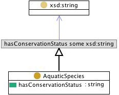

# 

 Graphical representation

__Diagram__ 

# 

 General description

|  |  |
| --- | --- |
|  Name:  |  SpeciesConservation  |
|  Submitted by:  | [EvaBlomqvist](../User/EvaBlomqvist.md "User:EvaBlomqvist")  |
|  Also Known As:  |  |
|  Intent:  |  This pattern intend to represent a description of the conservation status of aquatic species.  |
|  Domains:  |  |
|  Competency Questions:  | <li>       What is the conservation status of this species? What are the species with a specific conservation status? What species' conservation status contain a specific string?      </li> |
|  Solution description:  |  --  |
|  Reusable OWL Building Block:  | [http://www.ontologydesignpatterns.org/cp/owl/fsdas/speciesconservation.owl](http://ontologydesignpatterns.org/wiki/index.php?title=Special:ClickHandler&link=http://www.ontologydesignpatterns.org/cp/owl/fsdas/speciesconservation.owl&message=OWL building block&from_page_id=907&update=)  (613)  |
|  Consequences:  |  The conservation status is simply represented as a string, there are no restrictions on how to express the status, thereby an additional convention on how to express this in natural language could be needed if a uniform naming of status levels is desired.  |
|  Scenarios:  |  Give me the species for which conservation status contains 'Vulnerable'; Give me the species for which conservation status is 'vulnerable'; Give me the conservation status for species 'Ostrica gigas  |
|  Known Uses:  |  |
|  Web References:  |  |
|  Other References:  |  |
|  Examples (OWL files):  |  |
|  Extracted From:  |  |
|  Reengineered From:  |  |
|  Has Components:  |  |
|  Specialization Of:  |  |
|  Related CPs:  |  |

  

# 

 Elements

_The
 __SpeciesConservation__ 
 Content OP locally defines the following ontology elements:_ 

__AquaticSpecies__ 
 (owl:Class) Aquatic species are conceptual entities that are characterized together with resources and water areas.
 
 Mappable to fi:Species, fi:SpeciesRef, fi:SpeciesFeature, etc.
 

 It has related axioms from FIGIS Schema that are included in the classes linked to the fi:Species class, such as fi:SpeciesRef (holding association with fi:AqResRef, which holds association with fi:WaterAreaRef).
 

_[AquaticSpecies](./AquaticResources/AquaticSpecies.md "Submissions:SpeciesConservation/AquaticSpecies") 
 page_ 

__hasConservationStatus__ 
 (owl:DatatypeProperty)
 

_[hasConservationStatus](./SpeciesConservation/hasConservationStatus.md "Submissions:SpeciesConservation/hasConservationStatus") 
 page_ 

# 

 Additional information

 (type):
 [http://www.w3.org/2002/07/owl#Ontology](http://www.w3.org/2002/07/owl#Ontology "http://www.w3.org/2002/07/owl#Ontology") 

# 

 Scenarios

__Scenarios about SpeciesConservation__ 

 No scenario is added to this Content OP.
 

# 

 Reviews

__Reviews about SpeciesConservation__ 

 There is no review about this proposal.
This revision (revision ID
 __9125__ 
 ) takes in account the reviews: none
 

 Other info at
 [evaluation tab](http://ontologydesignpatterns.org/wiki/index.php?title=Submissions:SpeciesConservation&action=evaluation "http://ontologydesignpatterns.org/wiki/index.php?title=Submissions:SpeciesConservation&action=evaluation") 

  

# 

 Modeling issues

__Modeling issues about SpeciesConservation__ 

 There is no Modeling issue related to this proposal.
 

  

# 

 References