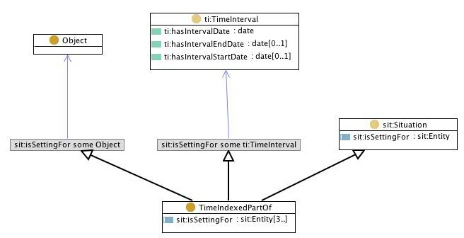

# 

 Graphical representation

__Diagram__ 

# 

 General description

|  |  |
| --- | --- |
|  Name:  |  time indexed part of  |
|  Submitted by:  | [ValentinaPresutti](../User/ValentinaPresutti.md "User:ValentinaPresutti")  |
|  Also Known As:  |  temporary part of  |
|  Intent:  |  To represent objects that have temporary parts.  |
|  Domains:  | [Parts and Collections](../Community/Parts_and_Collections.md "Community:Parts and Collections")  |
|  Competency Questions:  | <li>       When was this object part of this other one?      </li><li>       Which object was this one part of at a certain time?      </li><li>       What are the parts of this object at a certain time?      </li> |
|  Solution description:  |  -\*-  |
|  Reusable OWL Building Block:  | [http://www.ontologydesignpatterns.org/cp/owl/timeindexedpartof.owl](http://ontologydesignpatterns.org/wiki/index.php?title=Special:ClickHandler&link=http://www.ontologydesignpatterns.org/cp/owl/timeindexedpartof.owl&message=OWL building block&from_page_id=280&update=)  (715)  |
|  Consequences:  |  This Content OP allows designers to represent part-whole relations with a temporal index (holding at a certain time).  |
|  Scenarios:  |  My Toyota Yaris mounted Michelin pneumatics in 2007, but in 2008 it mounts Pirelli pneumatics.  |
|  Known Uses:  |  |
|  Web References:  |  |
|  Other References:  |  |
|  Examples (OWL files):  | <li><a class="external free" href="http://www.ontologydesignpatterns.org/cp/examples/timeindexedpartof/yarispneumatics.owl" rel="nofollow" title="http://www.ontologydesignpatterns.org/cp/examples/timeindexedpartof/yarispneumatics.owl">        http://www.ontologydesignpatterns.org/cp/examples/timeindexedpartof/yarispneumatics.owl       </a></li> |
|  Extracted From:  | <li><a class="external free" href="http://www.loa-cnr.it/ontologies/DUL.owl" rel="nofollow" title="http://www.loa-cnr.it/ontologies/DUL.owl">        http://www.loa-cnr.it/ontologies/DUL.owl       </a></li> |
|  Reengineered From:  |  |
|  Has Components:  | <li><a href="./TimeIndexedPartOf.md" title="Submissions:PartOf">        Submissions:PartOf       </a></li><li><a href="../SmartHome_TimeInterval/SmartHome_TimeInterval.md" title="Submissions:TimeInterval">        Submissions:TimeInterval       </a></li> |
|  Specialization Of:  | <li><a href="../DescriptionAndSituation/DescriptionAndSituation.md" title="Submissions:Situation">        Submissions:Situation       </a></li> |
|  Related CPs:  |  |

  

# 

 Elements

_The
 __TimeIndexedPartOf__ 
 Content OP locally defines the following ontology elements:_ 

__Object__ 
 (owl:Class) Any physical, social, or mental object, or a substance
 

_[Object](../Object/Object.md "Submissions:TimeIndexedPartOf/Object") 
 page_ 

__Time Indexed Part Of__ 
 (owl:Class) A
 [situation](../DescriptionAndSituation/DescriptionAndSituation.md "Submissions:Situation/Situation") 
 that includes at least two
 [Objects](../Object/Object.md "Submissions:TimeIndexedPartOf/Object") 
 , one having the role of whole object, the other(s) being a part(s) of it, and one
 [time interval](../SmartHome_TimeInterval/SmartHome_TimeInterval.md "Submissions:TimeInterval/TimeInterval") 
 .
 

_[TimeIndexedPartOf](./TimeIndexedPartOf.md "Submissions:TimeIndexedPartOf/TimeIndexedPartOf") 
 page_ 

__at time__ 
 (owl:ObjectProperty) A relation between a temporary part-of situation and the time it occurs at. It is a subproperty of
 [is setting for](./Situation/isSettingFor.md "Submissions:Situation/isSettingFor") 
 , its domain is the class of
 [time indexed part of situations](./TimeIndexedPartOf.md "Submissions:TimeIndexedPartOf/TimeIndexedPartOf") 
 , its range is the class
 [time interval](../SmartHome_TimeInterval/SmartHome_TimeInterval.md "Submissions:TimeInterval/TimeInterval") 
 .
 

_[atTime](./Pollution/atTime.md "Submissions:TimeIndexedPartOf/atTime") 
 page_ 

__is time of__ 
 (owl:ObjectProperty) The inverse of the
 [at time](./Pollution/atTime.md "Submissions:TimeIndexedPartOf/atTime") 
 object property.
 

_[isTimeOf](./TimeIndexedPartOf/isTimeOf.md "Submissions:TimeIndexedPartOf/isTimeOf") 
 page_ 

__includes whole object__ 
 (owl:ObjectProperty) A relation between a temporary part-of situation and the whole object involved. It is a subproperty of
 [is setting for](./Situation/isSettingFor.md "Submissions:Situation/isSettingFor") 
 , its domain is the class of
 [time indexed part of situations](./TimeIndexedPartOf.md "Submissions:TimeIndexedPartOf/TimeIndexedPartOf") 
 , its range is the class
 [object](../Object/Object.md "Submissions:TimeIndexedPartOf/Object") 
 .
 

_[includesWholeObject](./TimeIndexedPartOf/includesWholeObject.md "Submissions:TimeIndexedPartOf/includesWholeObject") 
 page_ 

__is whole object of__ 
 (owl:ObjectProperty) The inverse of the
 [includes whole object](./TimeIndexedPartOf/includesWholeObject.md "Submissions:TimeIndexedPartOf/includesWholeObject") 
 property.
 

_[isWholeObjectOf](./TimeIndexedPartOf/isWholeObjectOf.md "Submissions:TimeIndexedPartOf/isWholeObjectOf") 
 page_ 

__includes part object__ 
 (owl:ObjectProperty) A relation between a temporary part-of situation and the part(s) involved. It is a subproperty of
 [is setting for](./Situation/isSettingFor.md "Submissions:Situation/isSettingFor") 
 , its domain is the class of
 [time indexed part of situations](./TimeIndexedPartOf.md "Submissions:TimeIndexedPartOf/TimeIndexedPartOf") 
 , its range is the class
 [object](../Object/Object.md "Submissions:TimeIndexedPartOf/Object") 
 .
 

_[includesPartObject](./TimeIndexedPartOf/includesPartObject.md "Submissions:TimeIndexedPartOf/includesPartObject") 
 page_ 

__is part object of__ 
 (owl:ObjectProperty) The inverse of the
 [includes part object](./TimeIndexedPartOf/includesPartObject.md "Submissions:TimeIndexedPartOf/includesPartObject") 
 property.
 

_[isPartObjectOf](./TimeIndexedPartOf/isPartObjectOf.md "Submissions:TimeIndexedPartOf/isPartObjectOf") 
 page_ 

# 

 Additional information

 This Content OP locally defines the above elements, it also includes the elements of
 [situation](../DescriptionAndSituation/DescriptionAndSituation.md "Submissions:Situation") 
 ,
 [time interval](../SmartHome_TimeInterval/SmartHome_TimeInterval.md "Submissions:TimeInterval") 
 , and
 [part of](./TimeIndexedPartOf.md "Submissions:PartOf") 
 Content OPs.
 

# 

 Scenarios

__Scenarios about TimeIndexedPartOf__ 

 No scenario is added to this Content OP.
 

# 

 Reviews

__Reviews about TimeIndexedPartOf__ 

 There is no review about this proposal.
This revision (revision ID
 __9133__ 
 ) takes in account the reviews: none
 

 Other info at
 [evaluation tab](http://ontologydesignpatterns.org/wiki/index.php?title=Submissions:TimeIndexedPartOf&action=evaluation "http://ontologydesignpatterns.org/wiki/index.php?title=Submissions:TimeIndexedPartOf&action=evaluation") 

  

# 

 Modeling issues

__Modeling issues about TimeIndexedPartOf__ 

 There is no Modeling issue related to this proposal.
 

  

# 

 References