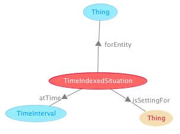

# 

 Graphical representation

__Diagram__ 

# 

 General description

|  |  |
| --- | --- |
|  Name:  |  TimeIndexedSituation  |
|  Submitted by:  | [AldoGangemi](../User/AldoGangemi "User:AldoGangemi")  |
|  Also Known As:  |  |
|  Intent:  |  To represent time indexed situations.  |
|  Domains:  | [General](../Community/General "Community:General")  |
|  Competency Questions:  | <li>       At what time did a certain situation occur?      </li><li>       What situations occurred at a certain time?      </li> |
|  Solution description:  |  This pattern adds a time specification (the [Time interval](../Submissions/TimeInterval "Submissions:TimeInterval")  pattern) to the [Situation](../Submissions/Situation "Submissions:Situation")  pattern, in order to provide a handy solution to many cases.  |
|  Reusable OWL Building Block:  | [http://ontologydesignpatterns.org/cp/owl/timeindexedsituation.owl](http://ontologydesignpatterns.org/wiki/index.php?title=Special:ClickHandler&link=http://ontologydesignpatterns.org/cp/owl/timeindexedsituation.owl&message=OWL building block&from_page_id=2150&update=)  (847)  |
|  Consequences:  |  We can represent situations that have an explicit time parameter.  In principle, this can be done already with the Situation pattern, but this provides a handy composition with the TimeInterval pattern.  |
|  Scenarios:  |  Mustafa's address in 2005 was in Brussels  |
|  Known Uses:  |  |
|  Web References:  |  |
|  Other References:  |  |
|  Examples (OWL files):  |  |
|  Extracted From:  |  |
|  Reengineered From:  |  |
|  Has Components:  | <li><a href="../Submissions/TimeInterval" title="Submissions:TimeInterval">        Submissions:TimeInterval       </a></li> |
|  Specialization Of:  | <li><a href="../Submissions/Situation" title="Submissions:Situation">        Submissions:Situation       </a></li> |
|  Related CPs:  | <li><a href="Submissions%253ATime_indexed_participation.html" title="Submissions:Time indexed participation">        Submissions:Time indexed participation       </a></li><li><a href="Submissions%253ATimeIndexedClassification.html" title="Submissions:TimeIndexedClassification">        Submissions:TimeIndexedClassification       </a></li> |

  

# 

 Elements

_The
 __TimeIndexedSituation__ 
 Content OP locally defines the following ontology elements:_ 

__atTime__ 
 (owl:ObjectProperty)
 

_[atTime](../Submissions/TimeIndexedSituation/atTime "Submissions:TimeIndexedSituation/atTime") 
 page_ 

__forEntity__ 
 (owl:ObjectProperty)
 

_[forEntity](../Submissions/TimeIndexedSituation/forEntity "Submissions:TimeIndexedSituation/forEntity") 
 page_ 

__hasTimeIndexedSetting__ 
 (owl:ObjectProperty)
 

_[hasTimeIndexedSetting](../Submissions/TimeIndexedSituation/hasTimeIndexedSetting "Submissions:TimeIndexedSituation/hasTimeIndexedSetting") 
 page_ 

__isTimeIndexFor__ 
 (owl:ObjectProperty)
 

_[isTimeIndexFor](../Submissions/TimeIndexedSituation/isTimeIndexFor "Submissions:TimeIndexedSituation/isTimeIndexFor") 
 page_ 

__TimeIndexedSituation__ 
 (owl:Class) A Situation that is explicitly indexed at some time for at least one entity.
 

_[TimeIndexedSituation](../Submissions/TimeIndexedSituation/TimeIndexedSituation "Submissions:TimeIndexedSituation/TimeIndexedSituation") 
 page_ 

# 

 Additional information

 A generic pattern usable for all situations that require a temporal indexing.
 

# 

 Scenarios

__Scenarios about TimeIndexedSituation__ 

 No scenario is added to this Content OP.
 

# 

 Reviews

__Reviews about TimeIndexedSituation__ 

 There is no review about this proposal.
This revision (revision ID
 __9135__ 
 ) takes in account the reviews: none
 

 Other info at
 [evaluation tab](http://ontologydesignpatterns.org/wiki/index.php?title=Submissions:TimeIndexedSituation&action=evaluation "http://ontologydesignpatterns.org/wiki/index.php?title=Submissions:TimeIndexedSituation&action=evaluation") 

  

# 

 Modeling issues

__Modeling issues about TimeIndexedSituation__ 

 There is no Modeling issue related to this proposal.
 

  

# 

 References