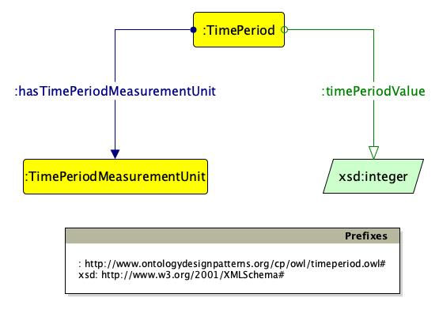

# 

 Graphical representation

__Diagram__ 

# 

 General description

|  |  |
| --- | --- |
|  Name:  |  TimePeriod  |
|  Submitted by:  | [ValentinaAnitaCarriero](../User/ValentinaAnitaCarriero "User:ValentinaAnitaCarriero")  |
|  Also Known As:  |  |
|  Intent:  |  To represent time periods between events.  |
|  Domains:  | [Time](../Community/Time "Community:Time")  |
|  Competency Questions:  | <li>       Which is the measurement unit of a time period?      </li><li>       Which is the value of a time period?      </li> |
|  Solution description:  |  A time period is modelled as a n-ary relation with a measurement unit and a numerical value.  |
|  Reusable OWL Building Block:  | [http://www.ontologydesignpatterns.org/cp/owl/timeperiod.owl](http://ontologydesignpatterns.org/wiki/index.php?title=Special:ClickHandler&link=http://www.ontologydesignpatterns.org/cp/owl/timeperiod.owl&message=OWL building block&from_page_id=4564&update=)  (380)  |
|  Consequences:  |  The measurement unit and the numerical value of a time period (e.g. 1 year) can be modelled.  |
|  Scenarios:  |  A time period of 1 year elapses between two consecutive editions of Umbria Jazz Festival.  |
|  Known Uses:  |  |
|  Web References:  |  |
|  Other References:  |  |
|  Examples (OWL files):  |  |
|  Extracted From:  |  |
|  Reengineered From:  |  |
|  Has Components:  |  |
|  Specialization Of:  |  |
|  Related CPs:  |  |

  

# 

 Elements

_The
 __TimePeriod__ 
 Content OP locally defines the following ontology elements:_ 

# 

 Additional information

# 

 Scenarios

__Scenarios about TimePeriod__ 

 No scenario is added to this Content OP.
 

# 

 Reviews

__Reviews about TimePeriod__ 

 There is no review about this proposal.
This revision (revision ID
 __13663__ 
 ) takes in account the reviews: none
 

 Other info at
 [evaluation tab](http://ontologydesignpatterns.org/wiki/index.php?title=Submissions:TimePeriod&action=evaluation "http://ontologydesignpatterns.org/wiki/index.php?title=Submissions:TimePeriod&action=evaluation") 

  

# 

 Modeling issues

__Modeling issues about TimePeriod__ 

 There is no Modeling issue related to this proposal.
 

  

# 

 References