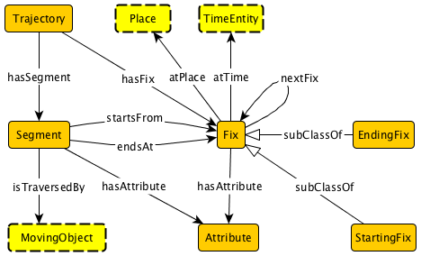

#  Graphical representation

__Diagram__

#  General description

|  |  |
| --- | --- |
|  Name: |  Trajectory |
|  Submitted by: | [AdilaKrisnadhi](../User/AdilaKrisnadhi.md "User:AdilaKrisnadhi") |
|  Also Known As: |  |
|  Intent: |  The pattern provides a model of trajectory, which is understood as a sequence of spatiotemporal points. The model generalizing the Semantic Trajectory pattern from [Hu, et al., COSIT 2013] by employing the notion of place, instead of location/geo-coordinate, to represent the spatial extent of the trajectory. This pattern is suitable for a variety of trajectory datasets and easily extendible by by aligning to or matching with existing trajectory ontologies, foundational ontologies, or other domain specific vocabularies. |
|  Domains: | [General](../Community/General.md "Community:General"), [Earth Science or Geoscience](../Community/Earth_Science_or_Geoscience.md "Community:Earth Science or Geoscience") |
|  Competency Questions: | <li> Show the birds which stop at x and y</li><li> Show the birds which move at a ground speed of 0.4 m/s</li><li> Show the trajectories of rivers which cross national parks</li><li> Where are the ports at which the oceanographic cruise A3221 stopped after leaving Woods Hole?</li><li> List the places and times that represent the spatiotemporal extent of the 1990 World Chess Championship event</li> |
|  Solution description: |  This pattern is reengineered from [Hu, et al., COSIT 2013] with changes as described in the intent of the pattern. |
|  Reusable OWL Building Block: | [http://krisnadhi.github.io/onto/trajectory.owl](http://ontologydesignpatterns.org/wiki/index.php?title=Special:ClickHandler&link=http://krisnadhi.github.io/onto/trajectory.owl&message=OWL building block&from_page_id=4147&update=) (611) |
|  Consequences: |  Unlike the original version of Semantic Trajectory, this pattern omits the hook to the data source for fixes (which was a subclass of ssn:Device) because instead of location/geo-coordinate, the notion of place is employed to capture the spatial extent. Nevertheless, it should be relatively straightforward to extend this version if the user wishes to attach data source information to the fixes. |
|  Scenarios: |  Mike's trip to the GeoVoCamp 2012 from his home integrating data from GPS device, vehicle information, and personal information.A toucan flies through the air as recorded by researchers in the MoveBank.The 1990 World Chess Championship event that was held in two locations at two different times. |
|  Known Uses: |  |
|  Web References: |  |
|  Other References: |  |
|  Examples (OWL files): |  |
|  Extracted From: |  |
|  Reengineered From: | <li> Yingjie Hu; Krzysztof Janowicz; David Carral; Simon Scheider; Werner Kuhn; Gary Berg-Cross; Pascal Hitzler; Mike Dean; Dave Kolas: A Geo-ontology Design Pattern for Semantic Trajectories. In International Conference on Spatial Information Theory (COSIT) 2013) 438-456</li> |
|  Has Components: |  |
|  Specialization Of: |  |
|  Related CPs: | <li><a href="../Place/Place.md" title="Submissions:Place">Submissions:Place</a></li><li><a class="new" href="http://ontologydesignpatterns.org/wiki/index.php?title=Submissions:Time&amp;action=edit&amp;redlink=1" title="Submissions:Time (not yet written)">Submissions:Time</a></li><li><a class="new" href="http://ontologydesignpatterns.org/wiki/index.php?title=Submissions:MovingObject&amp;action=edit&amp;redlink=1" title="Submissions:MovingObject (not yet written)">Submissions:MovingObject</a></li> |

  

#  Elements

_The __Trajectory__ Content OP locally defines the following ontology elements:_

 __atPlace__ (owl:ObjectProperty) Connects anything (including fixes in this pattern) to Place. 
  _[atPlace](./Pollution/atPlace.md "Submissions:Trajectory/atPlace") page_
 __atTime__ (owl:ObjectProperty) Connects anything (including fixes in this pattern) to TimeEntity 
  _[atTime](./Pollution/atTime.md "Submissions:Trajectory/atTime") page_
 __endsAt__ (owl:ObjectProperty) Connects a segment to the fix it ends at. 
  _[endsAt](./Pollution/endsAt.md "Submissions:Trajectory/endsAt") page_
 __hasAttribute__ (owl:ObjectProperty) Connects a fix or a segment to an additional information as represented by an instance of Attribute. 
  _[hasAttribute](./Trajectory/hasAttribute.md "Submissions:Trajectory/hasAttribute") page_
 __hasFix__ (owl:ObjectProperty) Relating the trajectory to each of its fixes. 
  _[hasFix](./Trajectory/hasFix.md "Submissions:Trajectory/hasFix") page_
 __hasSegment__ (owl:ObjectProperty) Relating the trajectory to each of its segments. 
  _[hasSegment](./Pollution/hasSegment.md "Submissions:Trajectory/hasSegment") page_
 __hasTrajectory__ (owl:ObjectProperty) Anything that has a trajectory can use this property to connect it to the trajectory instance. 
  _[hasTrajectory](./Pollution/hasTrajectory.md "Submissions:Trajectory/hasTrajectory") page_
 __nextFix__ (owl:ObjectProperty) Relates one fix to the immediately following fix in the sequence. 
  _[nextFix](./Trajectory/nextFix.md "Submissions:Trajectory/nextFix") page_
 __startsFrom__ (owl:ObjectProperty) Connects a segment to the fix it starts from. 
  _[startsFrom](./Pollution/startsFrom.md "Submissions:Trajectory/startsFrom") page_
 __traversedBy__ (owl:ObjectProperty) Connect a segment to the moving object that traverses it. 
  _[traversedBy](./Trajectory/traversedBy.md "Submissions:Trajectory/traversedBy") page_
 __Attribute__ (owl:Class) Captures additional information that enriches some fix or segment. 
  _[Attribute](./Trajectory/Attribute.md "Submissions:Trajectory/Attribute") page_
 __EndingFix__ (owl:Class) The last fix in a particular sequence of fixes. 
  _[EndingFix](./Trajectory/EndingFix.md "Submissions:Trajectory/EndingFix") page_
 __Fix__ (owl:Class) Describes a fix, which is an adorned spatiotemporal point. A sequence of fixes form the trajectory. 
  _[Fix](./Trajectory/EndingFix.md "Submissions:Trajectory/Fix") page_
 __MovingObject__ (owl:Class) This is the hook to an ontology/pattern that describes the moving object, if any, which moves along the trajectory. 
  _[MovingObject](./Trajectory/MovingObject.md "Submissions:Trajectory/MovingObject") page_
 __Place__ (owl:Class) This is the hook to other pattern/ontology that describes the notion of place, which is more general than just a location/geo-coordinate. 
  _[Place](../Place/Place.md "Submissions:Trajectory/Place") page_
 __Segment__ (owl:Class) The Segment class captures the "connection" between two consecutive fixes. That is, a segment starts from a fix and ends at another fix. If the pattern is used to model the trajectory of some moving object, each segment is traversed by that moving object. Additional information about a segment can be attached as attributes. 
  _[Segment](./Pollution/hasSegment.md "Submissions:Trajectory/Segment") page_
 __StartingFix__ (owl:Class) The first fix in a particular sequence of fixes. 
  _[StartingFix](./Trajectory/StartingFix.md "Submissions:Trajectory/StartingFix") page_
 __TimeEntity__ (owl:Class) The hook to class/pattern/ontology that models time, this class provides the temporal extent of the trajectory. One example of time model is the W3C Time Ontology. 
  _[TimeEntity](./Pollution/TimeEntity.md "Submissions:Trajectory/TimeEntity") page_
 __Trajectory__ (owl:Class) Represents the notion of trajectory, this is the main class that can be hooked with other patterns that use the Trajectory pattern. Trajectory in this model is understood as a sequence of fixes connected by segments. There is exactly one starting fix and exactly one ending fix. Each fix has a temporal extent and a place (which is more general than just a location). 
  _[Trajectory](./Trajectory.md "Submissions:Trajectory/Trajectory") page_
#  Additional information

#  Scenarios

__Scenarios about Trajectory__
No scenario is added to this Content OP.

#  Reviews

__Reviews about Trajectory__
There is no review about this proposal.
This revision (revision ID __12794__) takes in account the reviews: none

Other info at [evaluation tab](http://ontologydesignpatterns.org/wiki/index.php?title=Submissions:Trajectory&action=evaluation "http://ontologydesignpatterns.org/wiki/index.php?title=Submissions:Trajectory&action=evaluation")

  

#  Modeling issues

__Modeling issues about Trajectory__
There is no Modeling issue related to this proposal.

  

#  References